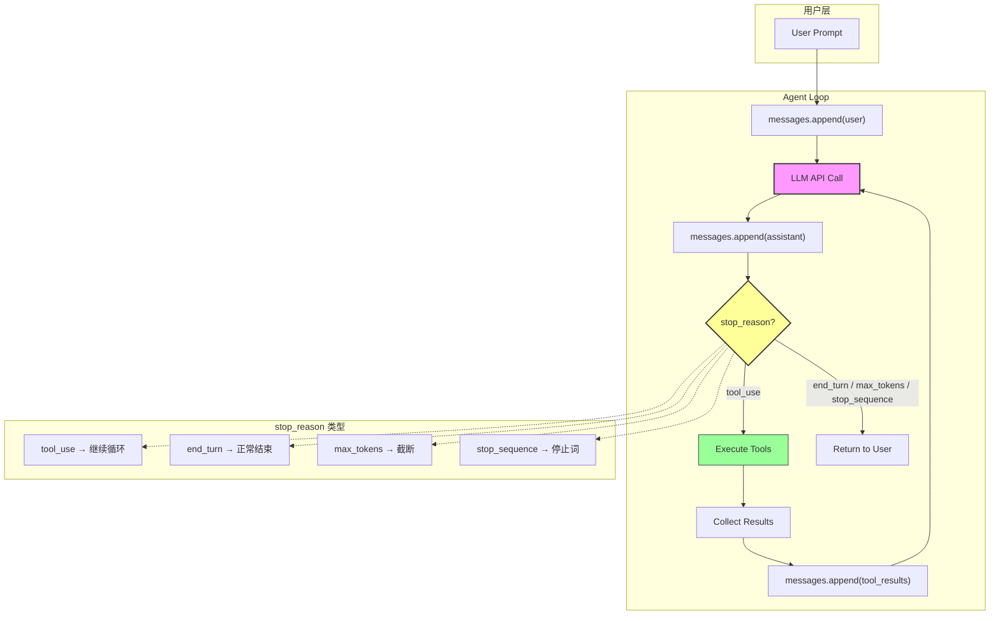

# L01: Agent Loop 流程图



## 流程说明

| 步骤 | 代码对应 | 说明 |
|------|----------|------|
| 1 | `messages.append({"role": "user"})` | 用户输入作为第一条消息 |
| 2 | `client.messages.create(...)` | 调用 LLM API |
| 3 | `messages.append({"role": "assistant"})` | 追加模型响应 |
| 4 | `if response.stop_reason != "tool_use"` | **唯一退出条件** |
| 5-7 | 工具执行 → 收集结果 → 追加 | 构造 tool_result 消息 |
| 8 | `return` | 循环结束，返回给用户 |

## 核心洞察

```
循环没有智能。
循环只做一件事：执行模型的要求，把结果喂回去。
决策权完全在模型。
```