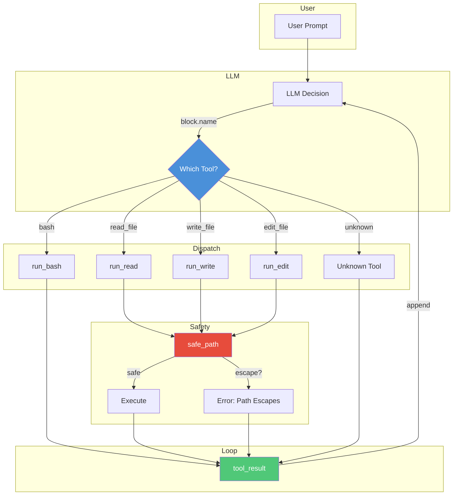
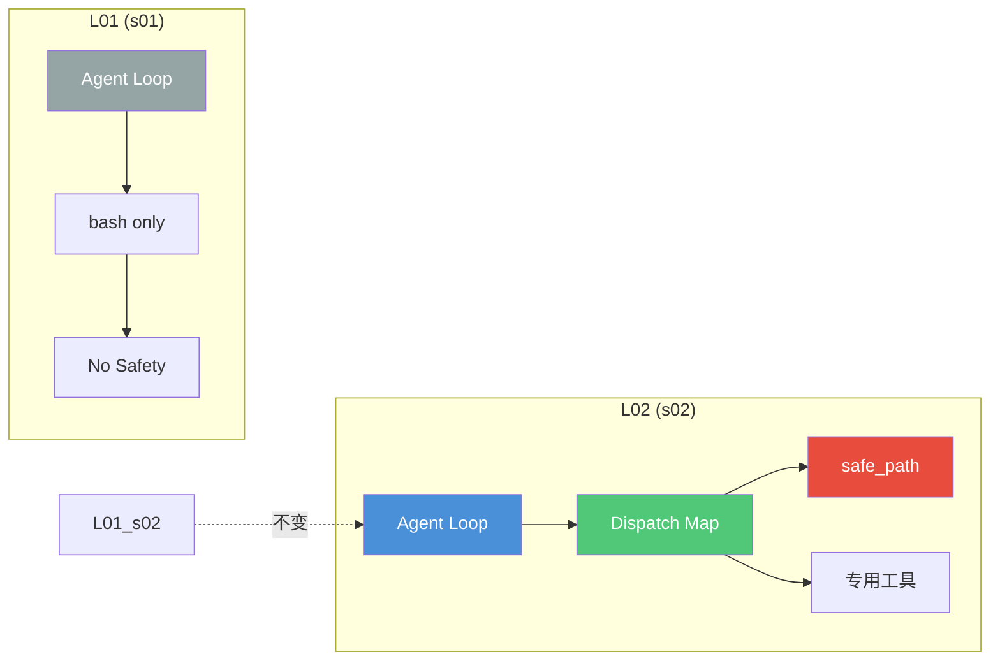
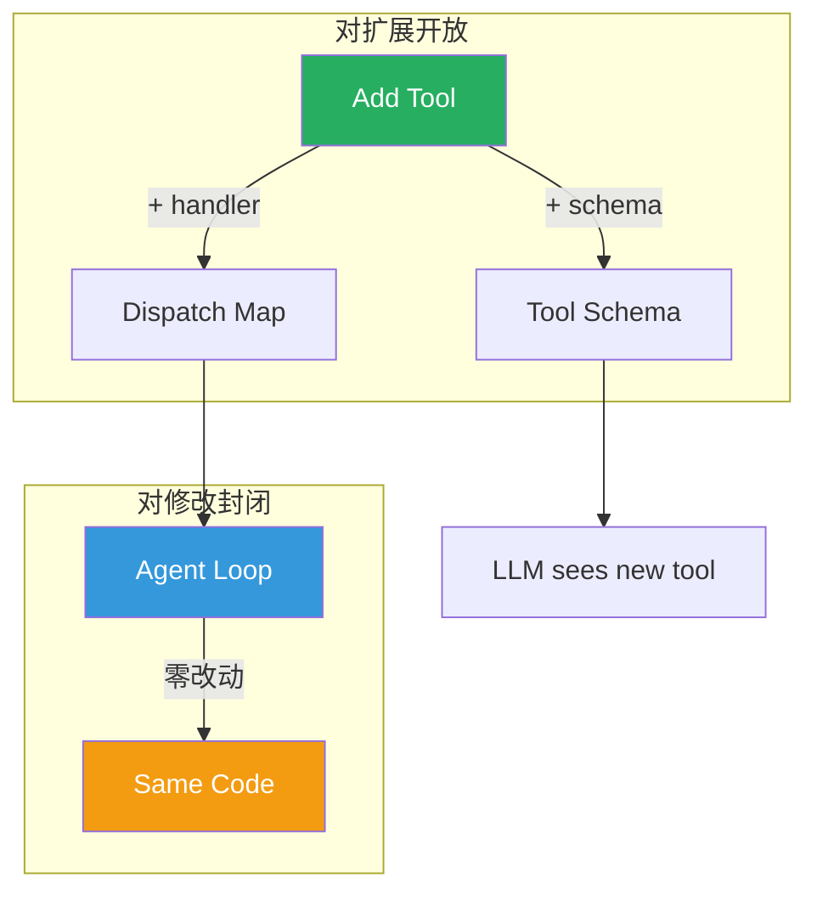
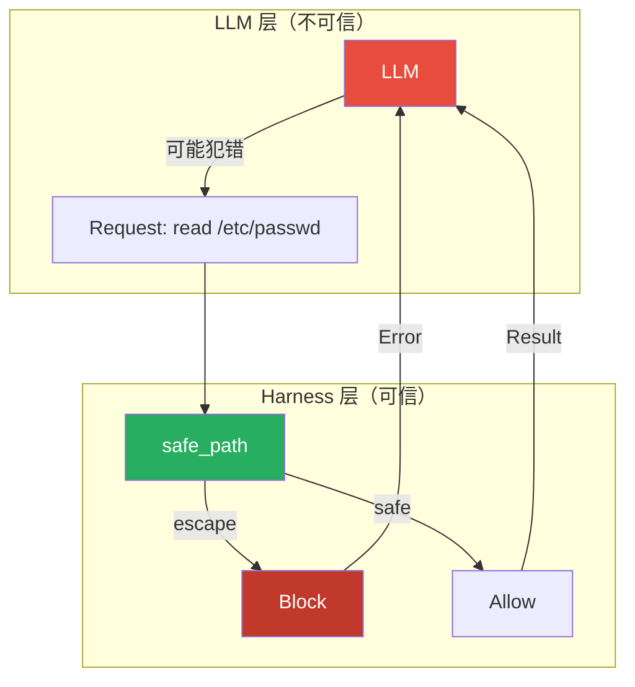

# L02: Tool Use - 流程图

## 核心流程：Tool Dispatch

```mermaid
flowchart TB
    subgraph User
        U[User Prompt]
    end

    subgraph LLM
        L[LLM Decision]
        L --> |block.name| D{Which Tool?}
    end

    subgraph Dispatch
        D --> |bash| B[run_bash]
        D --> |read_file| R[run_read]
        D --> |write_file| W[run_write]
        D --> |edit_file| E[run_edit]
        D --> |unknown| X[Unknown Tool]
    end

    subgraph Safety
        R --> SP[safe_path]
        W --> SP
        E --> SP
        SP --> |escape?| ERR[Error: Path Escapes]
        SP --> |safe| OK[Execute]
    end

    subgraph Loop
        B --> TR[tool_result]
        OK --> TR
        ERR --> TR
        X --> TR
        TR --> |append| L
    end

    U --> L

    style D fill:#4a90d9,color:#fff
    style SP fill:#e74c3c,color:#fff
    style TR fill:#50c878,color:#fff
```

## 与 L01 的对比

```mermaid
flowchart LR
    subgraph L01_s01["L01 (s01)"]
        A1[Agent Loop] --> B1[bash only]
        B1 --> C1[No Safety]
    end

    subgraph L02_s02["L02 (s02)"]
        A2[Agent Loop] --> B2[Dispatch Map]
        B2 --> C2[safe_path]
        B2 --> D2[专用工具]
    end

    L01_s02 -.->|不变| A2

    style A1 fill:#95a5a6,color:#fff
    style A2 fill:#4a90d9,color:#fff
    style B2 fill:#50c878,color:#fff
    style C2 fill:#e74c3c,color:#fff
```

## 开闭原则示意

```mermaid
flowchart TB
    subgraph Open["对扩展开放"]
        ADD[Add Tool] --> |+ handler| DM[Dispatch Map]
        ADD --> |+ schema| TS[Tool Schema]
    end

    subgraph Closed["对修改封闭"]
        LOOP[Agent Loop] --> |零改动| SAME[Same Code]
    end

    DM --> LOOP
    TS --> LLM[LLM sees new tool]

    style ADD fill:#27ae60,color:#fff
    style LOOP fill:#3498db,color:#fff
    style SAME fill:#f39c12,color:#fff
```

## 信任边界

```mermaid
flowchart TB
    subgraph LLM_Layer["LLM 层（不可信）"]
        LLM[LLM] --> |可能犯错| REQ[Request: read /etc/passwd]
    end

    subgraph Harness_Layer["Harness 层（可信）"]
        REQ --> SAFE[safe_path]
        SAFE --> |escape| BLOCK[Block]
        SAFE --> |safe| ALLOW[Allow]
    end

    BLOCK --> |Error| LLM
    ALLOW --> |Result| LLM

    style LLM fill:#e74c3c,color:#fff
    style SAFE fill:#27ae60,color:#fff
    style BLOCK fill:#c0392b,color:#fff
```