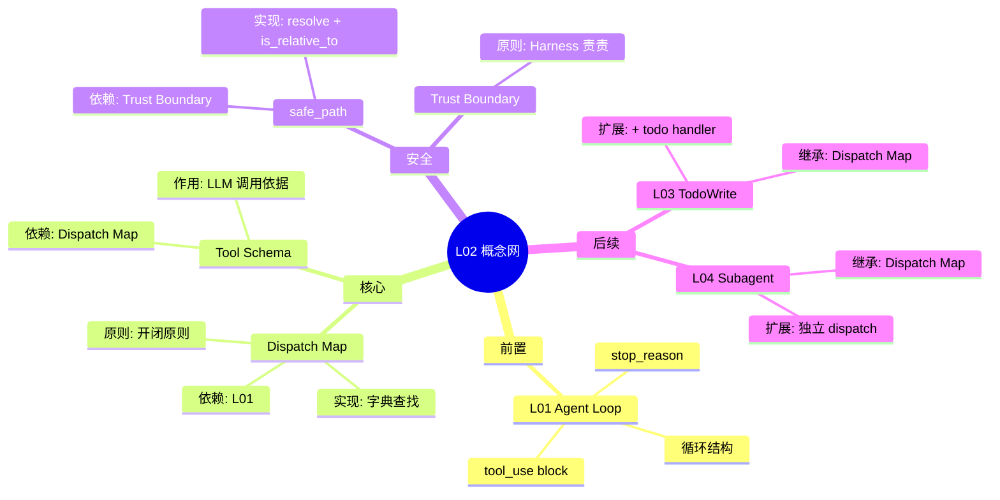

# L02: Tool Use - 思维导图

## 核心概念层级

```mermaid
mindmap
  root((Tool Use))
    核心机制
      Dispatch Map
        字典分发
        name -> handler
        开闭原则
      Tool Schema
        name
        description
        input_schema
      循环不变
        L01 基础
        零改动扩展
    安全机制
      safe_path
        resolve 解析
        is_relative_to 检查
        防止逃逸
      Trust Boundary
        Harness 不信任 LLM
        安全护栏
        错误拦截
      专用工具优先
        减少攻击面
        bash 危险
        约束范围
    设计原则
      开闭原则
        对扩展开放
        对修改封闭
      信任边界原则
        LLM 可犯错
        Harness 拦截
      减少攻击面原则
        专用工具
        沙箱约束
    与 L01 关系
      继承
        Agent Loop
        stop_reason
        messages[]
      扩展
        Dispatch Map
        专用工具
        安全护栏
```

## 概念依赖网络



## 对比记忆图

```mermaid
mindmap
  root((s01 vs s02))
    s01 bash only
      1 工具
      无安全
      硬编码
    s02 工具分发
      4 工具
      safe_path
      Dispatch Map
    不变
      Agent Loop
      stop_reason
      messages[]
    变化
      + Dispatch Map
      + safe_path
      + 专用工具
```