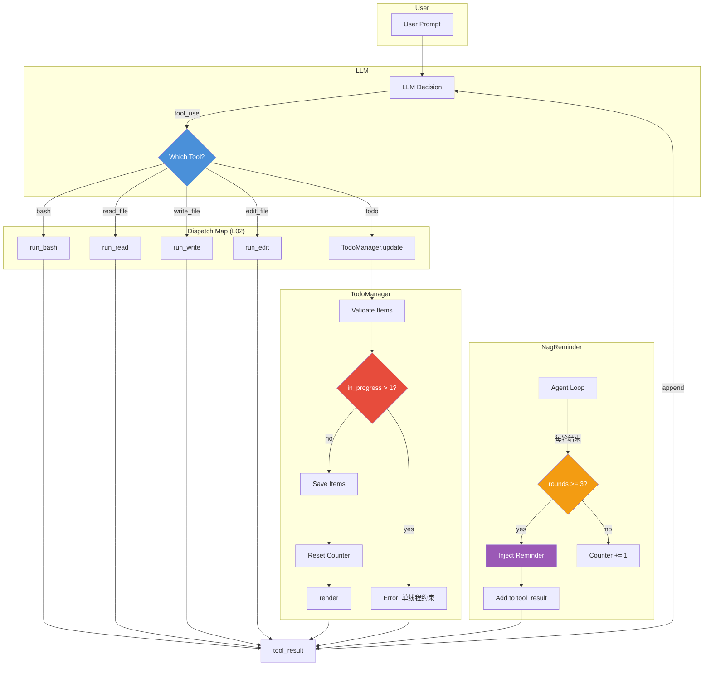
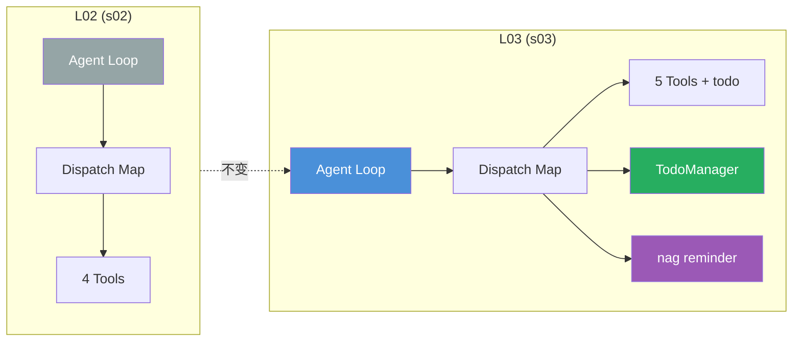
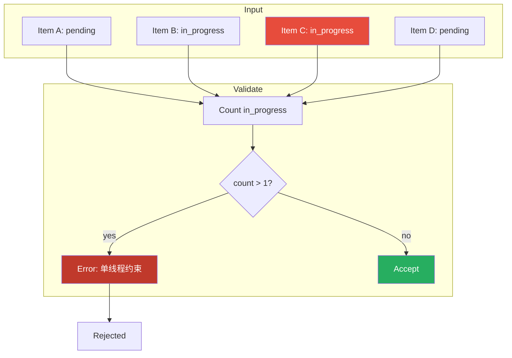
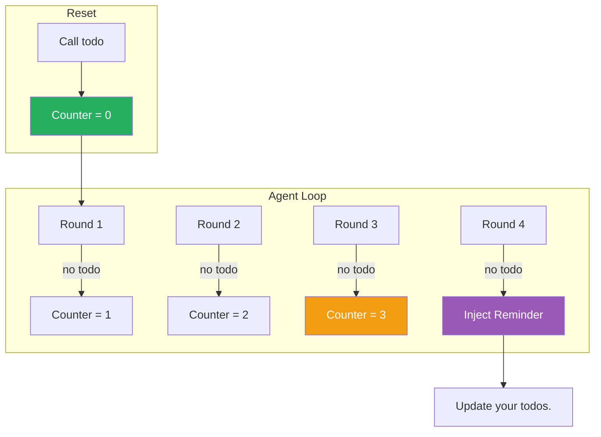
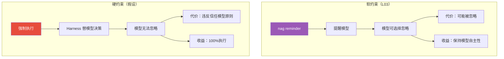

# L03: TodoWrite - 流程图

## 核心流程：TodoManager

```mermaid
flowchart TB
    subgraph User
        U[User Prompt]
    end

    subgraph LLM
        L[LLM Decision]
        L --> |tool_use| D{Which Tool?}
    end

    subgraph Dispatch["Dispatch Map (L02)"]
        D --> |bash| B[run_bash]
        D --> |read_file| R[run_read]
        D --> |write_file| W[run_write]
        D --> |edit_file| E[run_edit]
        D --> |todo| T[TodoManager.update]
    end

    subgraph TodoManager
        T --> V[Validate Items]
        V --> C{in_progress > 1?}
        C --> |yes| ERR[Error: 单线程约束]
        C --> |no| SAVE[Save Items]
        SAVE --> RESET[Reset Counter]
        RESET --> RENDER[render]
    end

    subgraph NagReminder
        LOOP[Agent Loop] --> |每轮结束| CHECK{rounds >= 3?}
        CHECK --> |yes| NAG[Inject Reminder]
        CHECK --> |no| INC[Counter += 1]
        NAG --> MSG[Add to tool_result]
    end

    U --> L
    B --> TR[tool_result]
    R --> TR
    W --> TR
    E --> TR
    RENDER --> TR
    ERR --> TR
    MSG --> TR
    TR --> |append| L

    style D fill:#4a90d9,color:#fff
    style C fill:#e74c3c,color:#fff
    style CHECK fill:#f39c12,color:#fff
    style NAG fill:#9b59b6,color:#fff
```

## 与 L02 的对比

```mermaid
flowchart LR
    subgraph L02_s02["L02 (s02)"]
        A2[Agent Loop] --> B2[Dispatch Map]
        B2 --> C2[4 Tools]
    end

    subgraph L03_s03["L03 (s03)"]
        A3[Agent Loop] --> B3[Dispatch Map]
        B3 --> C3[5 Tools + todo]
        B3 --> D3[TodoManager]
        B3 --> E3[nag reminder]
    end

    L02_s02 -.->|不变| A3

    style A2 fill:#95a5a6,color:#fff
    style A3 fill:#4a90d9,color:#fff
    style D3 fill:#27ae60,color:#fff
    style E3 fill:#9b59b6,color:#fff
```

## 单线程约束示意

```mermaid
flowchart TB
    subgraph Input
        I1[Item A: pending]
        I2[Item B: in_progress]
        I3[Item C: in_progress]
        I4[Item D: pending]
    end

    subgraph Validate
        V[Count in_progress]
        V --> C{count > 1?}
        C --> |yes| ERR[Error: 单线程约束]
        C --> |no| OK[Accept]
    end

    I1 --> V
    I2 --> V
    I3 --> V
    I4 --> V

    ERR --> X[Rejected]

    style I3 fill:#e74c3c,color:#fff
    style ERR fill:#c0392b,color:#fff
    style OK fill:#27ae60,color:#fff
```

## Nag Reminder 机制

```mermaid
flowchart TB
    subgraph Loop["Agent Loop"]
        R1[Round 1] --> |no todo| C1[Counter = 1]
        R2[Round 2] --> |no todo| C2[Counter = 2]
        R3[Round 3] --> |no todo| C3[Counter = 3]
        R4[Round 4] --> |no todo| NAG[Inject Reminder]
    end

    subgraph Reset
        TODO[Call todo] --> SET[Counter = 0]
    end

    NAG --> MSG["<reminder>Update your todos.</reminder>"]
    SET --> R1

    style C3 fill:#f39c12,color:#fff
    style NAG fill:#9b59b6,color:#fff
    style SET fill:#27ae60,color:#fff
```

## 软约束 vs 硬约束

```mermaid
flowchart TB
    subgraph Soft["软约束（L03）"]
        S1[nag reminder]
        S1 --> S2[提醒模型]
        S2 --> S3[模型可选择忽略]
        S3 --> S4[代价：可能被忽略]
        S3 --> S5[收益：保持模型自主性]
    end

    subgraph Hard["硬约束（假设）"]
        H1[强制执行]
        H1 --> H2[Harness 替模型决策]
        H2 --> H3[模型无法忽略]
        H3 --> H4[代价：违反信任模型原则]
        H3 --> H5[收益：100%执行]
    end

    style S1 fill:#9b59b6,color:#fff
    style H1 fill:#e74c3c,color:#fff
```