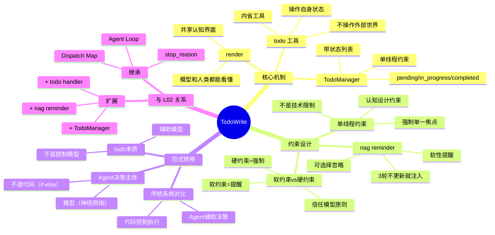
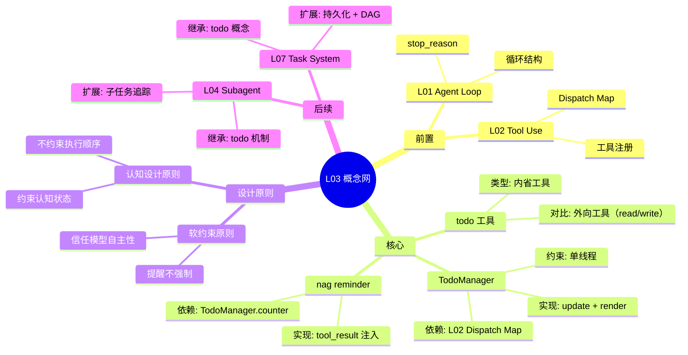
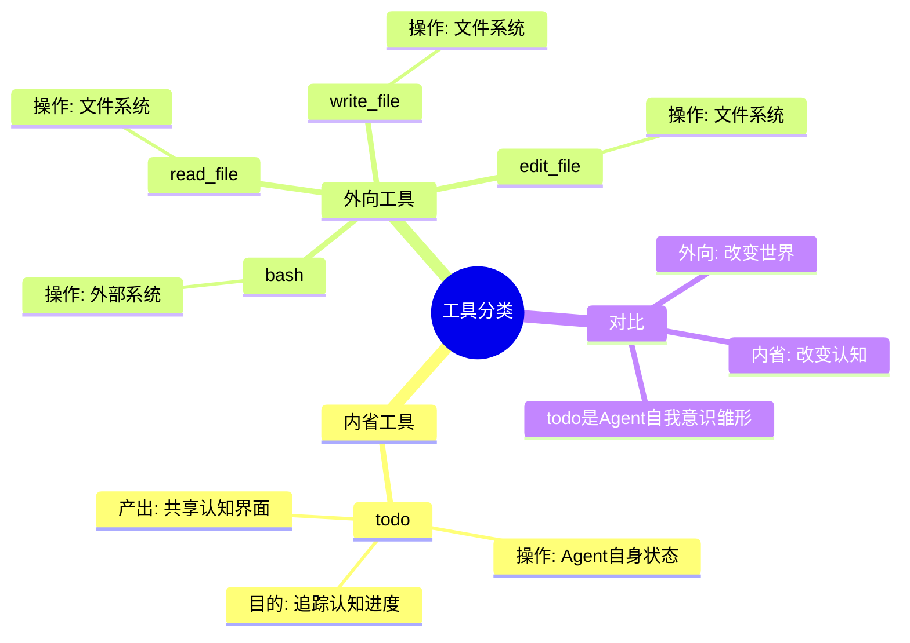
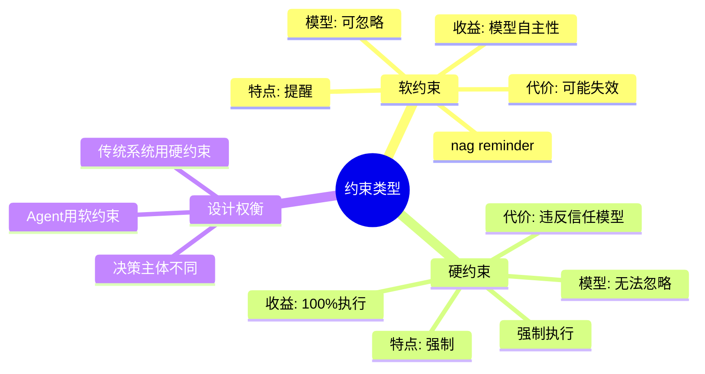

# L03: TodoWrite - 思维导图

## 核心概念层级

```mermaid
mindmap
  root((TodoWrite))
    核心机制
      TodoManager
        带状态列表
        pending/in_progress/completed
        单线程约束
      todo 工具
        内省工具
        操作自身状态
        不操作外部世界
      render
        共享认知界面
        模型和人类都能看懂
    约束设计
      单线程约束
        认知设计约束
        不是技术限制
        强制单一焦点
      nag reminder
        软性提醒
        3轮不更新就注入
        可选择忽略
      软约束vs硬约束
        软约束=提醒
        硬约束=强制
        信任模型原则
    范式转移
      Agent决策主体
        模型（神经网络）
        不是代码（if-else）
      传统系统对比
        代码控制执行
        Agent辅助决策
      todo本质
        辅助模型
        不是控制模型
    与 L02 关系
      继承
        Dispatch Map
        Agent Loop
        stop_reason
      扩展
        + todo handler
        + TodoManager
        + nag reminder
```

## 概念依赖网络

```mermaid
mindmap
  root((L03 概念网))
    前置
      L01 Agent Loop
        循环结构
        stop_reason
      L02 Tool Use
        Dispatch Map
        工具注册
    核心
      TodoManager
        依赖: L02 Dispatch Map
        实现: update + render
        约束: 单线程
      todo 工具
        类型: 内省工具
        对比: 外向工具（read/write）
      nag reminder
        依赖: TodoManager.counter
        实现: tool_result 注入
    设计原则
      软约束原则
        提醒不强制
        信任模型自主性
      认知设计原则
        约束认知状态
        不约束执行顺序
    后续
      L04 Subagent
        继承: todo 机制
        扩展: 子任务追踪
      L07 Task System
        继承: todo 概念
        扩展: 持久化 + DAG
```

## 内省工具 vs 外向工具

```mermaid
mindmap
  root((工具分类))
    内省工具
      todo
        操作: Agent自身状态
        目的: 追踪认知进度
        产出: 共享认知界面
    外向工具
      bash
        操作: 外部系统
      read_file
        操作: 文件系统
      write_file
        操作: 文件系统
      edit_file
        操作: 文件系统
    对比
      内省: 改变认知
      外向: 改变世界
      todo是Agent自我意识雏形
```

## 软约束 vs 硬约束对比

```mermaid
mindmap
  root((约束类型))
    软约束
      nag reminder
      特点: 提醒
      模型: 可忽略
      代价: 可能失效
      收益: 模型自主性
    硬约束
      强制执行
      特点: 强制
      模型: 无法忽略
      代价: 违反信任模型
      收益: 100%执行
    设计权衡
      Agent用软约束
      传统系统用硬约束
      决策主体不同
```