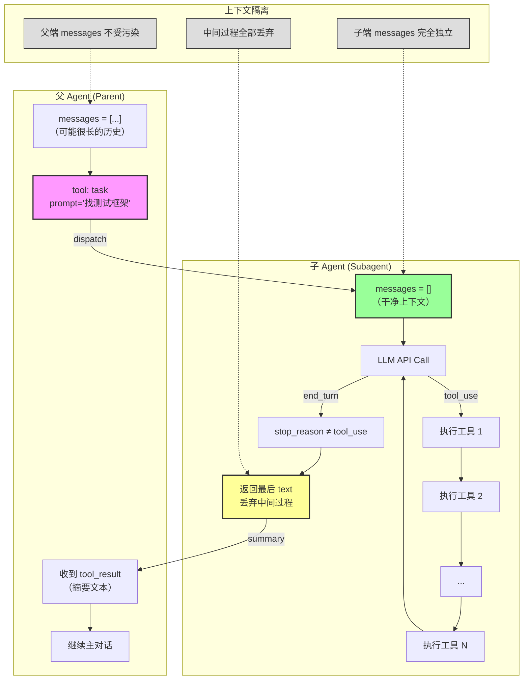
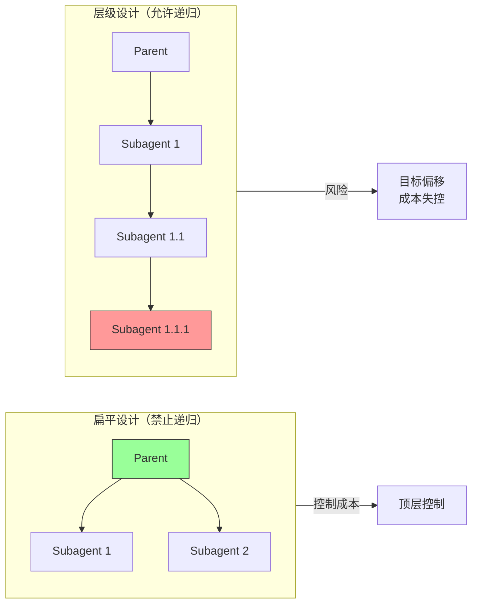
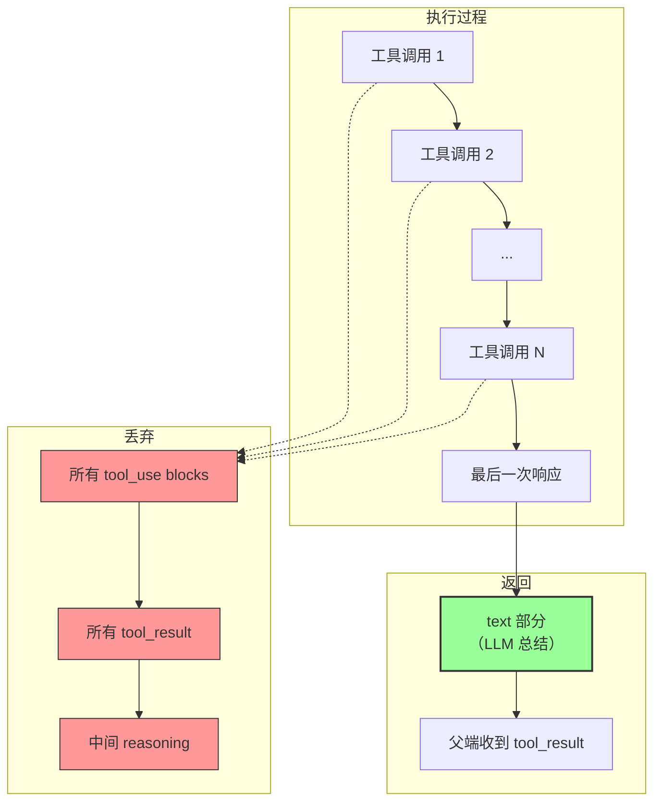
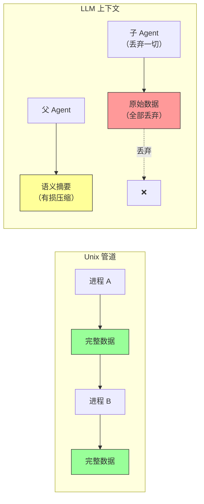
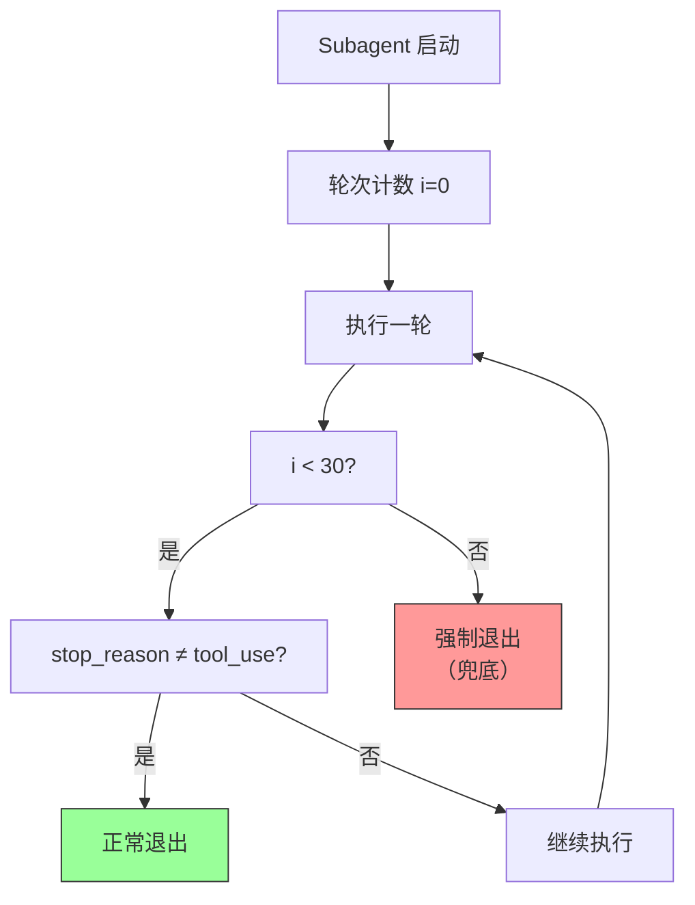

# L04: Subagent 流程图



## 流程说明

| 步骤  | 代码对应                     | 说明                  |
| --- | ------------------------ | ------------------- |
| 1   | `messages = [...]`       | 父 Agent 可能有很多历史     |
| 2   | `tool: task`             | 父端调用 task 工具派发任务    |
| 3   | `messages = []`          | **关键：干净上下文启动**      |
| 4-7 | 工具执行循环                   | 子端可能执行 30+ 次调用      |
| 8   | `stop_reason ≠ tool_use` | 循环退出条件              |
| 9   | `return text`            | **关键：只返回摘要，丢弃过程**   |
| 10  | 父端收到摘要                   | 父端 messages 只增加一段文本 |

## 核心洞察

```
父端视角：
  "帮我找测试框架" → 收到 "pytest" → 继续工作

子端视角：
  读 5 个文件 → 分析内容 → 总结 → 丢弃一切

上下文隔离：
  父端不知道子端读了哪些文件
  子端不知道父端之前聊了什么
```

---

## 禁止递归流程对比



## 扁平 vs 层级权衡

| 设计 | 优点 | 缺点 | Claude Code 选择 |
|------|------|------|------------------|
| **扁平** | 顶层控制，成本可控 | 委托深度有限 | ✅ 禁止递归 |
| **层级** | 层层委托，更灵活 | 目标偏移风险，成本失控 | ❌ 风险太大 |

---

## 返回值机制流程



## 返回值关键点

| 内容类型 | 去向 | 原因 |
|----------|------|------|
| **tool_use blocks** | 丢弃 | 父端不需要知道具体调用 |
| **tool_result** | 丢弃 | 中间结果不需要保留 |
| **中间 reasoning** | 丢弃 | 只有语义摘要有价值 |
| **最后 text 部分** | 返回 | LLM 的总结，父端需要的 |

---

## Unix管道 vs LLM上下文对比



## 范式对比

| 特性 | Unix 管道 | LLM 上下文 |
|------|----------|-----------|
| **驱动方式** | 数据驱动 | 语义驱动 |
| **传输方式** | 无损传输 | 有损压缩 |
| **数据完整性** | 完整流动 | 只保留摘要 |
| **设计哲学** | 数据不丢失 | 关键信息足够 |

---

## safety_limit 兜底机制



## safety_limit 关键点

| 误解 | 正确理解 |
|------|----------|
| 判断项目大小 | ❌ 错误 |
| 防无限循环兜底 | ✅ 正确 |
| 可配置 | ✅ 可调整 |
| 增加轮次增加成本 | ✅ 成本权衡 |