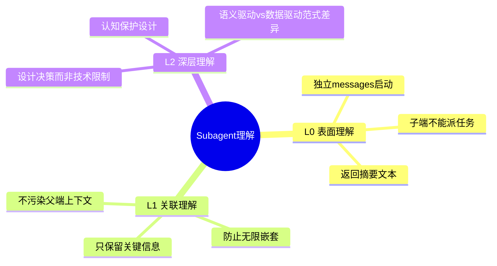
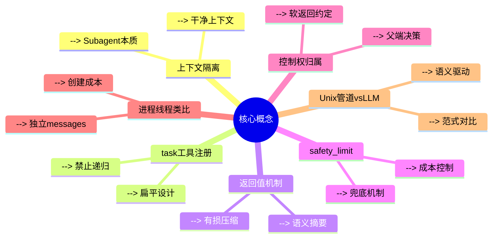
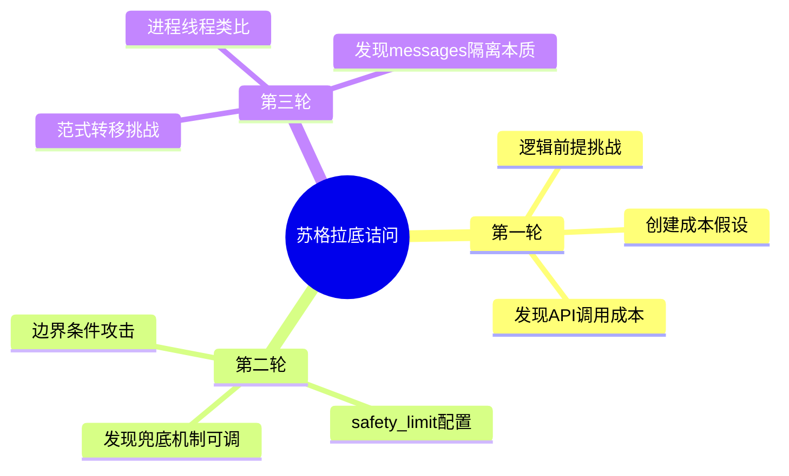
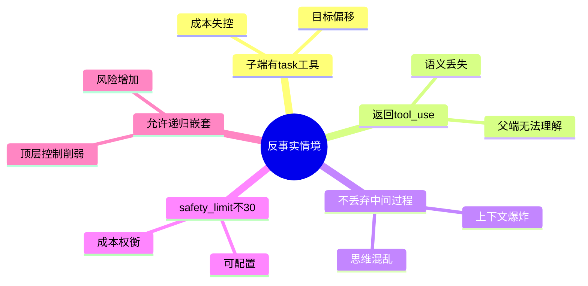
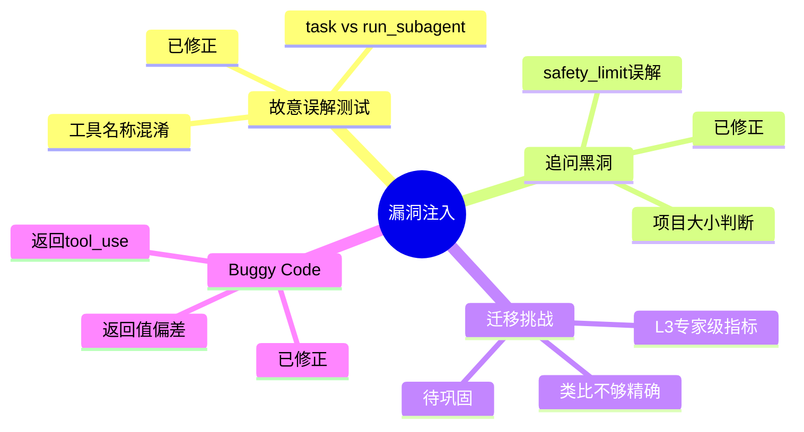
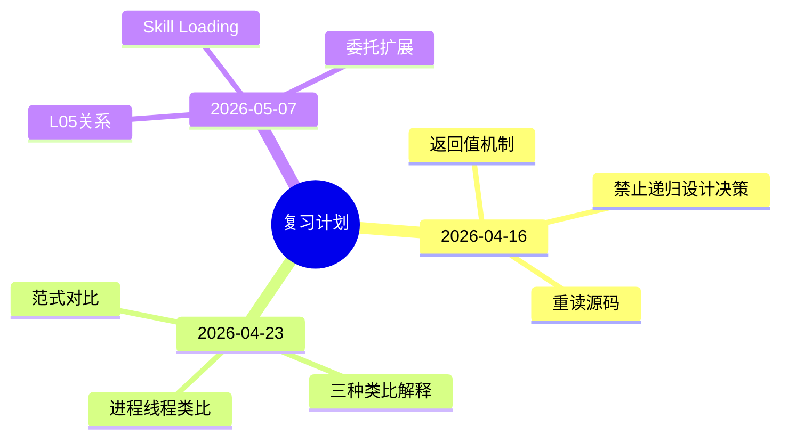

# L04: Subagent 思维导图

```mermaid
mindmap
  root((Subagent))
    核心机制
      上下文隔离
        独立 messages[]
        父端不受污染
        子端干净启动
      task 工具
        父端特有
        子端无此工具
        禁止递归
      返回值机制
        最后一次 text
        不是 tool_use
        中间过程丢弃
    设计决策
      禁止递归
        不是技术限制
        防止目标偏移
        防止成本失控
        扁平 vs 层级权衡
      safety_limit
        30轮兜底
        防无限循环
        可配置
        不是项目大小判断
      控制权归属
        父端控制决策
        子端执行任务
        软返回约定
    关键类比
      进程 vs 线程 vs Subagent
        进程：独立内存
        线程：共享内存
        Subagent：独立 messages
      Unix管道 vs LLM上下文
        Unix：无损传输
        LLM：有损压缩
        只保留语义摘要
      老板 vs 员工
        老板派活
        员工干活
        只汇报结果
    边界理解
      创建成本
        不是"小"
        是一次 API 调用
        但换来父端清洁
      返回时机
        stop_reason ≠ tool_use
        不是工具执行完
        是 LLM 决定结束
      工具限制
        子端有基础工具
        无 task 工具
        禁止再派子任务
    脆弱点追踪
      已修正
        工具名称混淆
        safety_limit误解
        返回值理解偏差
        返回值机制模糊
      部分修正
        进程线程类比
        递归禁止根本原因
      待巩固
        迁移能力不足
    后续扩展
      L05: Skill Loading
        Subagent 加载 Skill
      L06: Context Compact
        Subagent 摘要策略
      L07: Task System
        Subagent + 持久化
      L09: Agent Teams
        多 Subagent 协作
```

## 概念层级

```
顶层：Subagent（委托执行）
├── 第一层：核心机制（上下文隔离 + task工具 + 返回值）
│   ├── 第二层：设计决策（禁止递归 + safety_limit + 控制权）
│       ├── 第三层：关键类比（进程/线程 + Unix/LLM + 老板/员工）
│           ├── 第四层：边界理解（创建成本 + 返回时机 + 工具限制）
│               ├── 第五层：脆弱点追踪（已修正 + 部分修正 + 待巩固）
│                   └── 第六层：后续扩展（L05-L10）
```

## 核心格言

> *"大任务拆小，每个小任务干净的上下文"*
>
> Subagent 不是"更小的 Agent"，而是"干净上下文的委托执行"。
>
> 核心价值是上下文隔离，不是性能优化。

---

## 三层理解模型



## 熟练度层级

| 层级 | 特征 | 能力 |
|------|------|------|
| **L0** | 知道代码做什么 | 能读代码理解逻辑 |
| **L1** | 能关联概念 | 能解释为什么这样设计 |
| **L2** | 理解设计决策 | 能分析权衡，迁移类比 |
| **L3** | 专家级洞察 | 能跨领域迁移，创新应用 |

---

## 七个核心概念关系图



## 概念依赖关系

```
上下文隔离 ──→ Subagent本质 ──→ 干净上下文
task工具注册 ──→ 禁止递归 ──→ 扁平设计
返回值机制 ──→ 有损压缩 ──→ 语义摘要
safety_limit ──→ 成本控制 ──→ 兜底机制
控制权归属 ──→ 软返回约定 ──→ 父端决策
进程线程类比 ──→ 独立messages ──→ 创建成本
Unix管道vsLLM ──→ 范式对比 ──→ 语义驱动
```

---

## 三轮苏格拉底诘问核心发现



## 诘问洞察

| 轮次 | 挑战类型 | 核心发现 |
|------|----------|----------|
| R1 | 逻辑前提 | 创建成本是一次API调用，不是"小" |
| R2 | 边界条件 | safety_limit可配置，但增加成本 |
| R3 | 范式转移 | messages隔离类似进程，共享类似线程 |

---

## 五个反事实情境核心洞察



## 情境测试要点

| 情境 | 核心风险 | 正确理解 |
|------|----------|----------|
| 子端有task | 目标偏移 | 扁平vs层级权衡 |
| 返回tool_use | 语义丢失 | 返回text摘要 |
| 不丢弃过程 | 上下文爆炸 | 有损压缩必要 |
| safety_limit | 成本失控 | 兜底机制 |
| 允许递归 | 控制削弱 | 设计决策 |

---

## 四个漏洞注入测试结果



## 漏洞修正状态

| 测试类型 | 脆弱点 | 修正状态 |
|----------|--------|----------|
| misinterpretation | 工具名称混淆 | ✅ 已修正 |
| 追问黑洞 | safety_limit误解 | ✅ 已修正 |
| 迁移挑战 | 类比能力不足 | 🔄 待巩固 |
| buggy_code | 返回值偏差 | ✅ 已修正 |

---

## 三次复习计划核心内容



## 复习方法

| 时间点 | 复习内容 | 复习方法 |
|--------|----------|----------|
| 2026-04-16 | 返回值+禁止递归 | 重读源码，自问自答 |
| 2026-04-23 | 进程/线程类比 | 用三种类比解释概念 |
| 2026-05-07 | L05关系 | 回顾Subagent如何加载Skill |