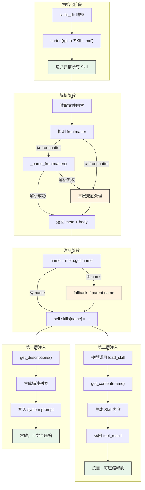
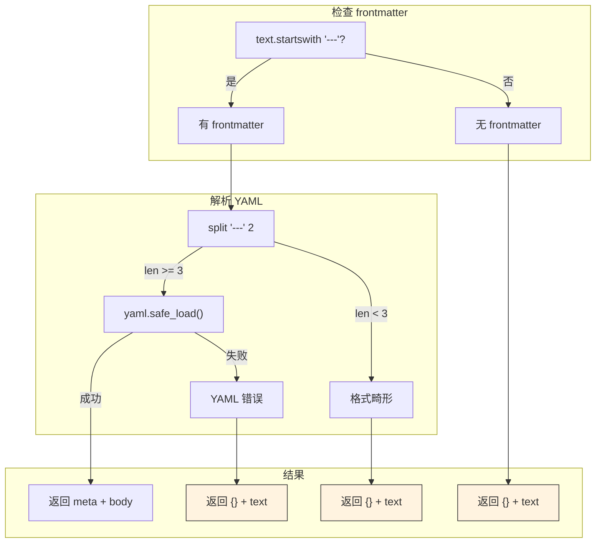
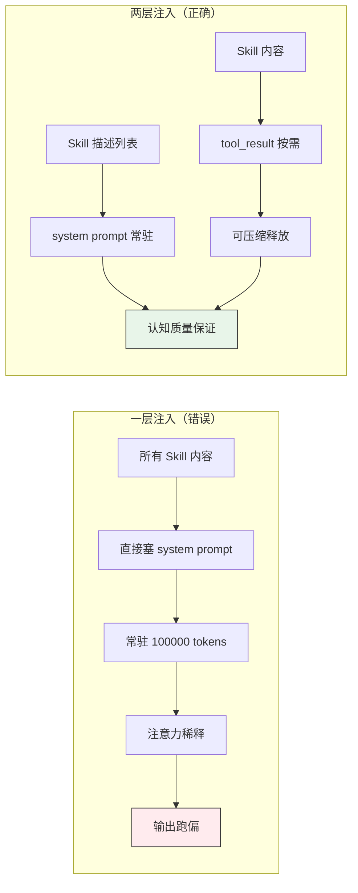
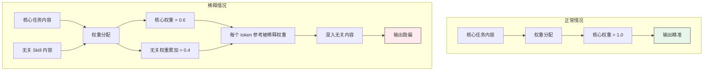
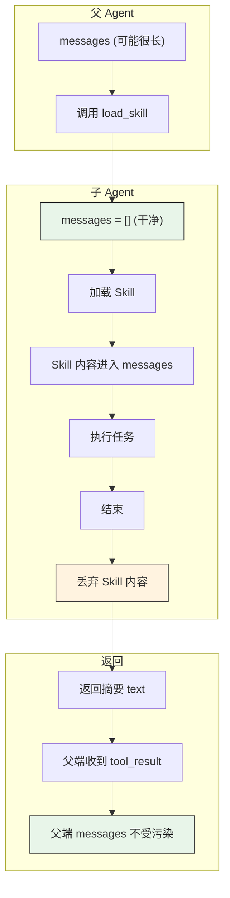
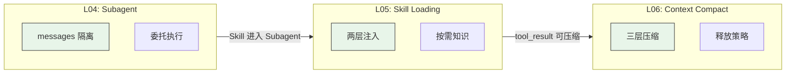
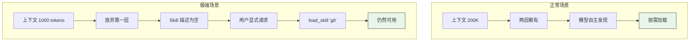

# L05: Skill Loading 流程图

## 流程说明

| 步骤 | 代码对应 | 说明 |
|------|----------|------|
| 1-3 | `rglob("SKILL.md")` | 递归扫描 skills 目录 |
| 4-5 | `_parse_frontmatter()` | 解析 YAML frontmatter |
| 6 | 三层兜底 | 无 frontmatter、格式畸形、YAML 错误 → 空 meta |
| 7-9 | `meta.get("name", f.parent.name)` | 容错性设计，目录名兜底 |
| 10-13 | `get_descriptions()` | 第一层：生成描述列表，写入 system prompt |
| 14-18 | `get_content(name)` | 第二层：按需加载，返回 tool_result |

---

## 容错性设计流程

## 容错性设计要点

| 错误类型 | 频率 | 后果 | 处理 |
|----------|------|------|------|
| 无 frontmatter | 高频 | 轻（Skill 仍能注册） | ✅ 兜底，用目录名 |
| 格式畸形 | 中频 | 轻（Skill 仍能注册） | ✅ 兜底，用目录名 |
| YAML 解析失败 | 中频 | 轻（Skill 仍能注册） | ✅ 兜底，用目录名 |
| **写错 name 字段** | 低频 | 重（Skill 找不到） | ❌ 暴露，让用户发现 |

---

## 两层注入对比

## 一层 vs 两层权衡

| 设计 | Token 成本 | 认知影响 | 压缩能力 |
|------|-----------|----------|----------|
| **一层（全塞）** | 高（常驻） | 注意力稀释 | ❌ 不可压缩 |
| **两层注入** | 低（按需） | 认知质量保证 | ✅ 可压缩释放 |

---

## Skill vs Tool 流程对比

```mermaid
flowchart TB
    subgraph Skill["Skill 加载流程"]
        S1["模型请求 load_skill"]
        S2["dispatch map 查找"]
        S3["get_content()"]
        S4["返回文本内容"]
        S5["注入到 messages"]
        S6["模型获得知识指引"]
    end

    subgraph Tool["Tool 执行流程"]
        T1["模型请求 tool"]
        T2["dispatch map 查找"]
        T3["执行具体操作"]
        T4["返回执行结果"]
        T5["注入到 messages"]
        T6["模型获得能力输出"]
    end

    S1 --> S2 --> S3 --> S4 --> S5 --> S6
    T1 --> T2 --> T3 --> T4 --> T5 --> T6

    style S4 fill:#f3e5f5,stroke:#333
    style T4 fill:#f3e5f5,stroke:#333
```

## Skill vs Tool 对比

| 维度 | Skill | Tool |
|------|-------|------|
| **触发** | load_skill(name) | read_file(path) 等 |
| **机制** | 都走 dispatch map | 都走 dispatch map |
| **返回值** | 文本内容（知识指引） | 执行结果（能力输出） |
| **目的** | 告诉模型"怎么做" | 让模型"能做什么" |

---

## 注意力稀释机制

## 注意力稀释链条

| 阶段 | 内容 | 结果 |
|------|------|------|
| 输入 | 核心任务 + 无关 Skill | 权重总和 = 1.0 |
| 分配 | 核心权重被稀释 | 0.6（核心） + 0.4（无关） |
| Token 生成 | 参考被稀释权重 | 混入无关内容 |
| 输出 | 原本应输出"错误处理" | 变成"检查文件大小"（PDF Skill 污染） |

---

## Subagent + Skill 流程

## Subagent + Skill 关键点

| 内容类型 | 去向 | 原因 |
|----------|------|------|
| Skill 内容 | Subagent messages | 委托执行需要知识指引 |
| 中间过程 | 丢弃 | 不污染 Parent 上下文 |
| 最终摘要 | 返回 Parent | Parent 只需要结果 |

**设计原则**：认知质量 > 经济成本，宁可重复加载不污染 Parent 上下文。

---

## 与 L04/L06 的关系

## 课程关系说明

| 课程 | 核心能力 | 与 L05 的关系 |
|------|----------|---------------|
| L04 Subagent | messages 隔离 | Skill 进入 Subagent messages，用完丢弃 |
| L05 Skill Loading | 两层注入 | 核心，按需知识加载 |
| L06 Context Compact | 三层压缩 | tool_result（第二层）可被压缩释放 |

---

## 第一层可放弃场景

## 第一层可放弃说明

| 场景 | 第一层 | 第二层 | 可用性 |
|------|--------|--------|--------|
| 正常（200K） | ✅ 有（导航） | ✅ 有（内容） | ✅ 完全可用 |
| 极端（1000） | ❌ 放弃 | ✅ 有（内容） | ✅ 用户显式触发可用 |

**核心不变量**：第二层是本体，第一层是导航辅助。导航可以省略，本体不能。