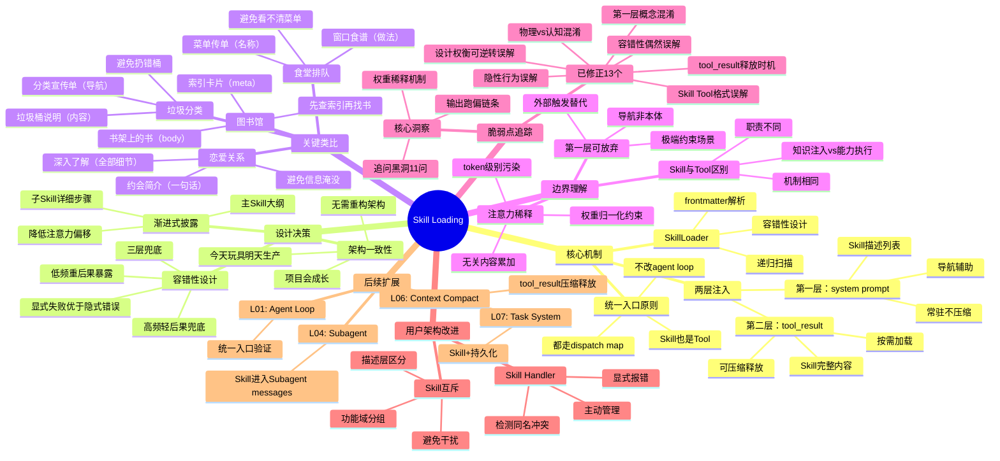
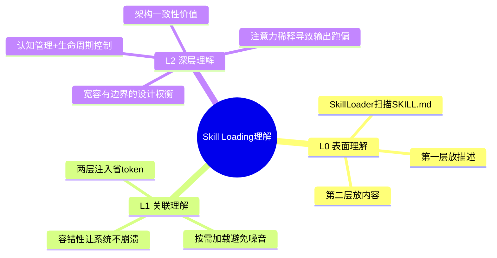
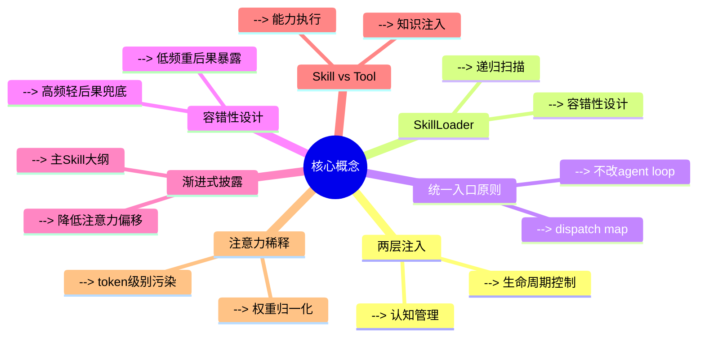
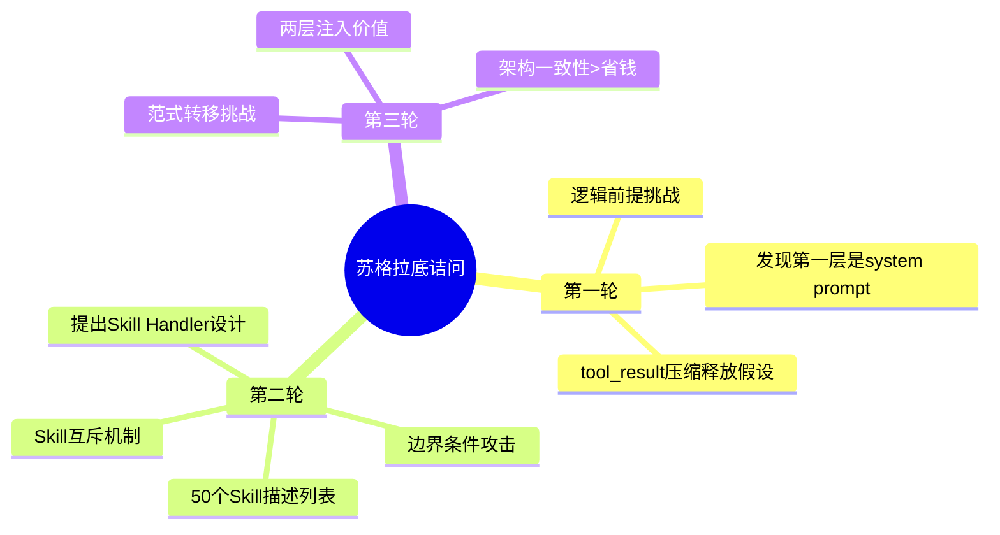
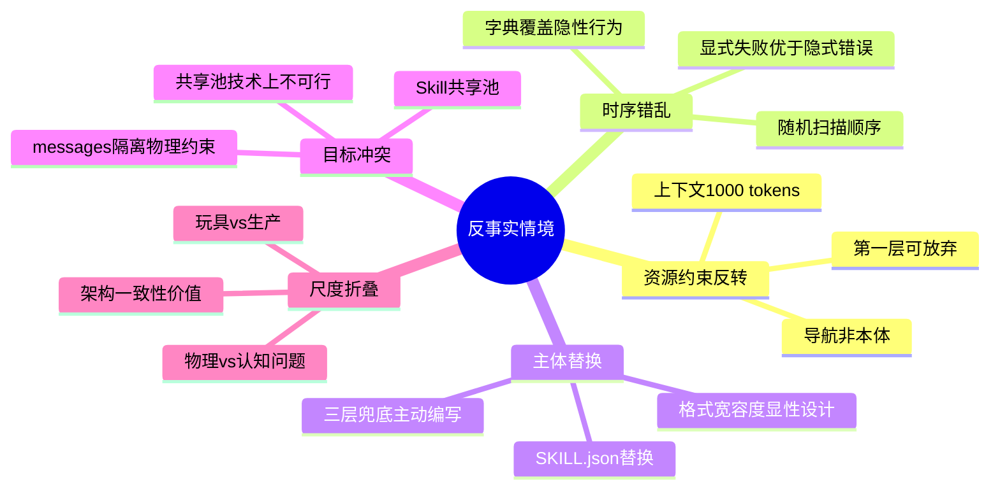
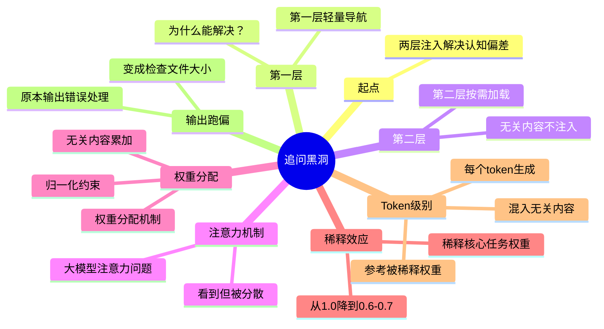
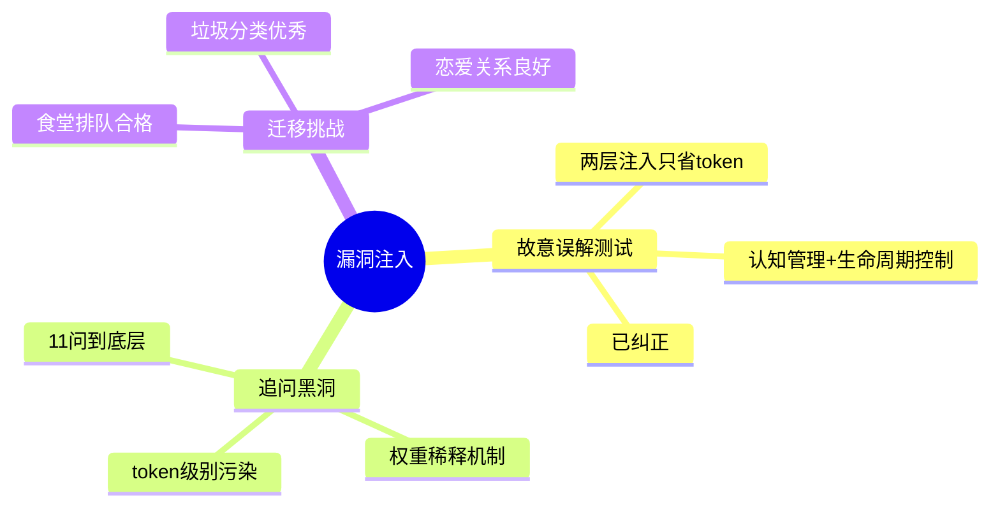
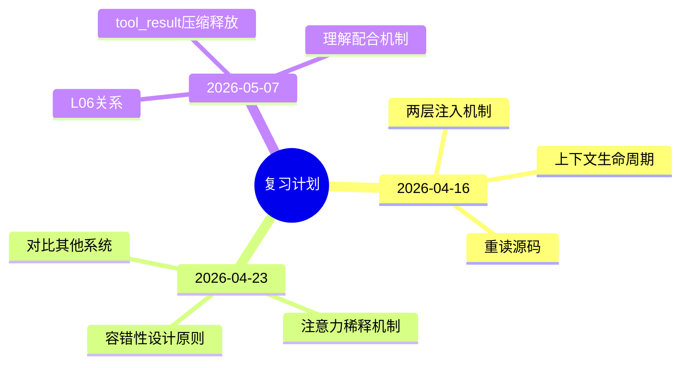

# L05: Skill Loading 思维导图



## 概念层级

```
顶层：Skill Loading（按需知识加载）
├── 第一层：核心机制（两层注入 + SkillLoader + 统一入口）
│   ├── 第二层：设计决策（容错性 + 渐进式披露 + 架构一致性）
│       ├── 第三层：关键类比（垃圾分类 + 图书馆 + 食堂 + 恋爱）
│           ├── 第四层：边界理解（第一层可放弃 + Skill vs Tool + 注意力稀释）
│               ├── 第五层：脆弱点追踪（13个已修正 + 核心洞察）
│                   └── 第六层：后续扩展（L01/L04/L06/L07）
```

## 核心格言

> *"用到什么知识，临时加载什么知识"*
>
> Skill Loading 的本质：两层注入实现认知管理。
>
> 第一层是导航（可以放弃），第二层是本体（必须保留）。

---

## 三层理解模型



## 熟练度层级

| 层级 | 特征 | 能力 |
|------|------|------|
| **L0** | 知道代码做什么 | 能读代码理解逻辑 |
| **L1** | 能关联概念 | 能解释为什么这样设计 |
| **L2** | 理解设计决策 | 能分析权衡，追溯底层机制 |
| **L3** | 专家级洞察 | 能跨领域迁移，提出架构改进 |

---

## 七个核心概念关系图



## 概念依赖关系

```
两层注入 ──→ 认知管理 ──→ 生命周期控制
SkillLoader ──→ 递归扫描 ──→ 容错性设计
统一入口原则 ──→ dispatch map ──→ 不改 agent loop
容错性设计 ──→ 高频轻后果兜底 ──→ 低频重后果暴露
渐进式披露 ──→ 主 Skill 大纲 ──→ 降低注意力偏移
Skill vs Tool ──→ 知识注入 ──→ 能力执行
注意力稀释 ──→ 权重归一化 ──→ token 级别污染
```

---

## 三轮苏格拉底诘问核心发现



## 诘问洞察

| 轮次 | 挑战类型 | 核心发现 |
|------|----------|----------|
| R1 | 逻辑前提 | 第一层是 system prompt，不在 messages 数组 |
| R2 | 边界条件 | 提出 Skill Handler 和 Skill 互斥架构改进 |
| R3 | 范式转移 | 架构一致性是两层注入的更深价值 |

---

## 五个反事实情境核心洞察



## 情境测试要点

| 情境 | 核心风险 | 不变量提炼 |
|------|----------|------------|
| 资源约束反转 | 第一层被认为必需 | 第二层是本体，第一层是导航辅助 |
| 时序错乱 | 隐性行为误认为显性设计 | 确定性优于随机性 |
| 主体替换 | 容错性设计误认为偶然 | 宽容有边界 |
| 目标冲突 | 设计权衡误认为可逆转 | messages 隔离是物理约束 |
| 尺度折叠 | 两层注入价值误认为只省 token | 架构一致性 > 短期省钱 |

---

## 追问黑洞完整链条



## 追问链条要点

| 阶段 | 问题 | 核心洞察 |
|------|------|----------|
| 起点 | 两层注入解决认知偏差？ | 第一层轻量导航 |
| 注意力 | 无关内容如何影响？ | 看到但被分散 |
| 权重 | 权重如何分配？ | 归一化约束，无关内容累加 |
| 稀释 | 稀释后果？ | 核心权重从 1.0 降到 0.6-0.7 |
| Token | 每个 token 怎么生成？ | 参考被稀释权重，混入无关内容 |
| 输出 | 最终结果？ | 代码审查建议变成检查文件大小 |

---

## 漏洞注入测试结果



## 漏洞修正状态

| 测试类型 | 脆弱点 | 修正状态 |
|----------|--------|----------|
| misinterpretation | 两层注入只省 token | ✅ 已修正 |
| misinterpretation | Skill Tool 格式差异是本质 | ✅ 已修正 |
| misinterpretation | 容错性是吞掉错误 | ✅ 已修正 |
| 追问黑洞 | 注意力稀释机制 | ✅ 完全追溯 |
| 迁移挑战 | 垃圾分类类比 | ✅ 优秀 |

---

## 三次复习计划核心内容



## 复习方法

| 时间点 | 复习内容 | 复习方法 |
|--------|----------|----------|
| 2026-04-16 | 两层注入 + 生命周期 | 重读源码，自问自答 |
| 2026-04-23 | 容错性 + 注意力稀释 | 对比其他系统的错误处理 |
| 2026-05-07 | L06 Context Compact | 理解压缩机制的配合 |