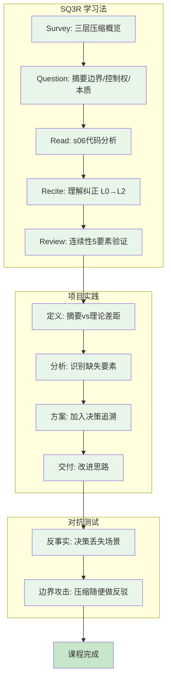
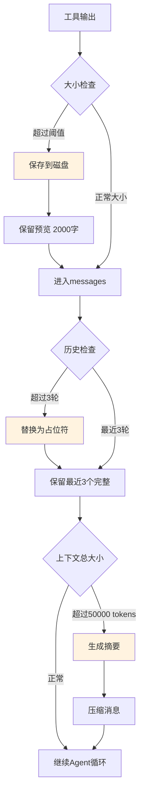
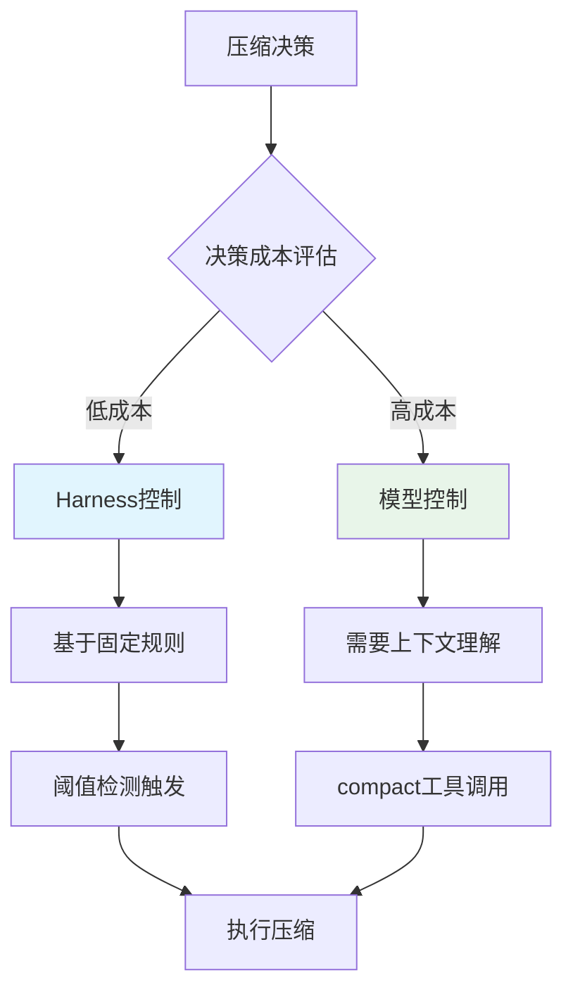
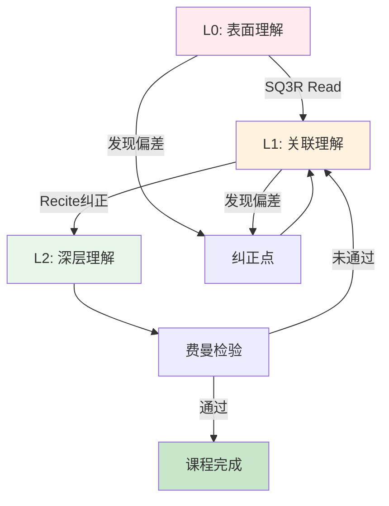

# L06: Context Compact - 流程图

## 学习流程图

## 三层压缩策略流程

## 控制权归属决策流程

## 心智模型层级转换

## 状态颜色编码说明

| 状态 | 颜色 | 含义 |
|------|------|------|
| `#e8f5e9` | 浅绿 | 已完成/已掌握 |
| `#fff3e0` | 浅橙 | 进行中/关键节点 |
| `#e1f5fe` | 浅蓝 | 未开始/待执行 |
| `#ffebee` | 浅红 | 脆弱点/需纠正 |
| `#c8e6c9` | 深绿 | 最终完成 |