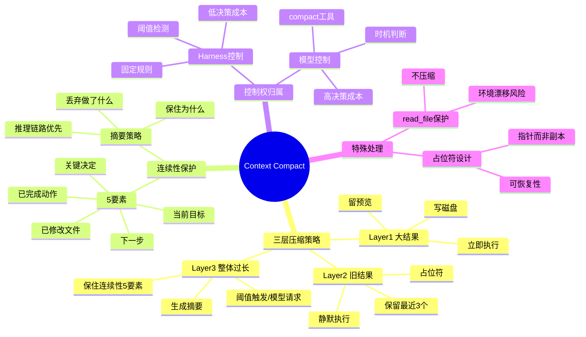
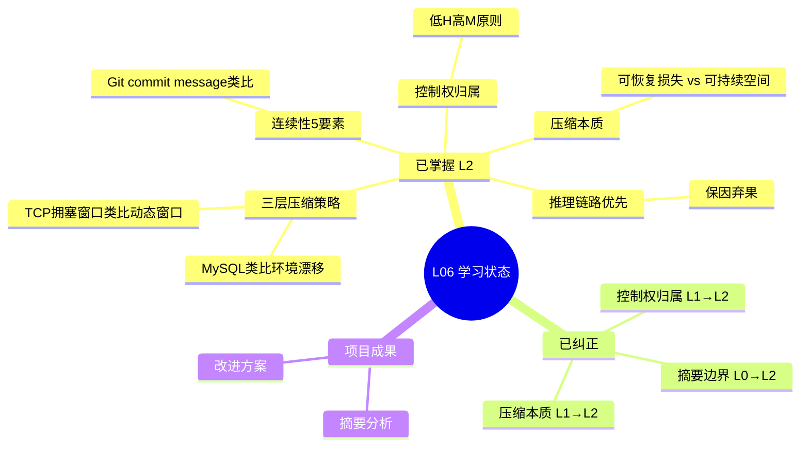
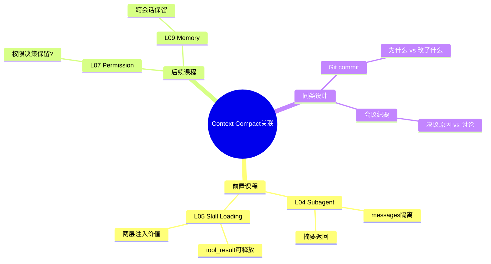

# L06: Context Compact - 概念思维导图

## 核心概念思维导图

## 学习进度思维导图

## 与其他课程关联

## 层级规则说明

| 层级 | 内容 | 来源 |
|------|------|------|
| root | Context Compact（主题） | syllabus.title |
| 一级分支 | 核心概念模块 | core_points |
| 二级分支 | 子概念 | lessons内容提取 |
| 三级分支 | 具体知识点 | lessons详细内容 |
| 四级分支 | 细节（已折叠） | - |

**深度控制**：不超过4层，超过时折叠为 `... (更多内容)`