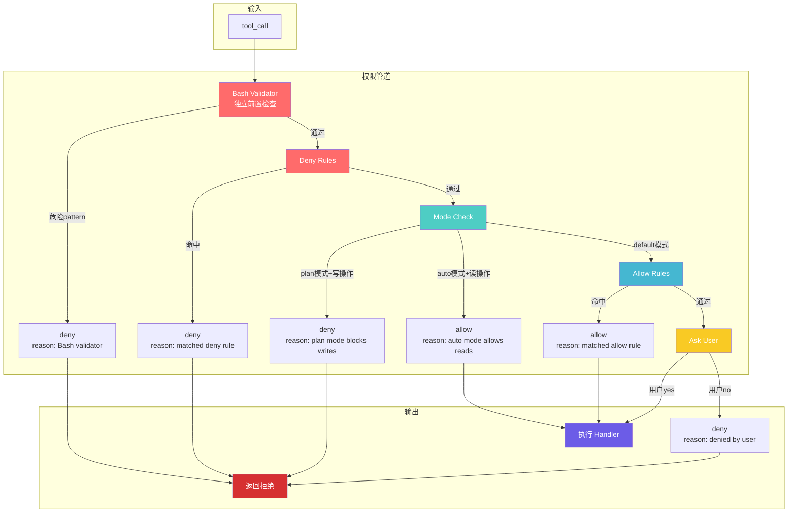
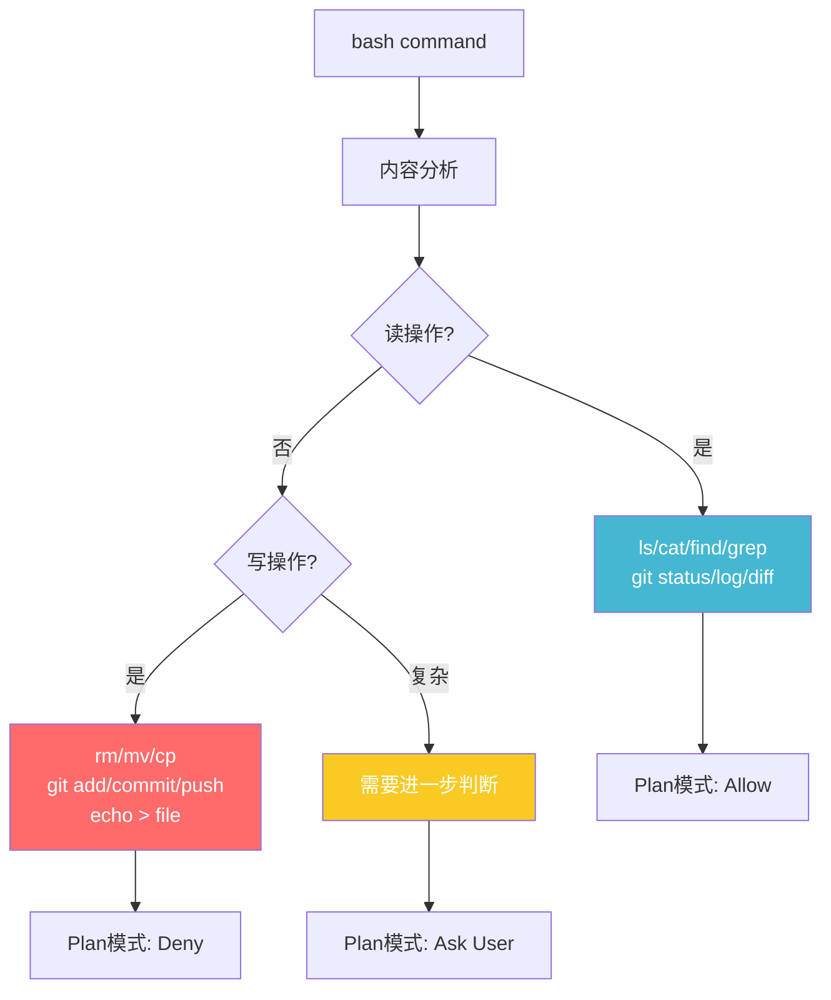
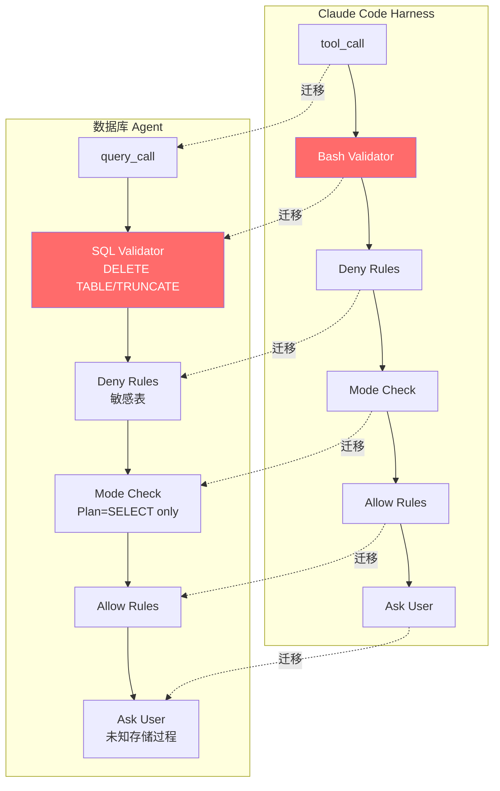

# L07: Permission System - 流程图

## 权限管道流程



## 三种模式对比

```mermaid
flowchart LR
    subgraph default模式
        D1[未命中规则] --> D2[Ask User]
        D2 -->|yes| D3[执行]
        D2 -->|no| D4[拒绝]
    end
    
    subgraph plan模式
        P1[读操作] --> P2[Allow]
        P3[写操作] --> P4[Deny]
        P2 --> P5[执行]
        P4 --> P6[拒绝]
    end
    
    subgraph auto模式
        A1[安全操作<br/>read/search] --> A2[Allow]
        A3[危险操作<br/>write/bash危险] --> A4[Ask]
        A2 --> A5[执行]
        A4 -->|yes| A5
        A4 -->|no| A6[拒绝]
    end
    
    style D2 fill:#f9ca24,color:#fff
    style P2 fill:#45b7d1,color:#fff
    style P4 fill:#ff6b6b,color:#fff
    style A2 fill:#45b7d1,color:#fff
    style A4 fill:#f9ca24,color:#fff
```

## Bash读写分类



## 数据库Agent迁移

