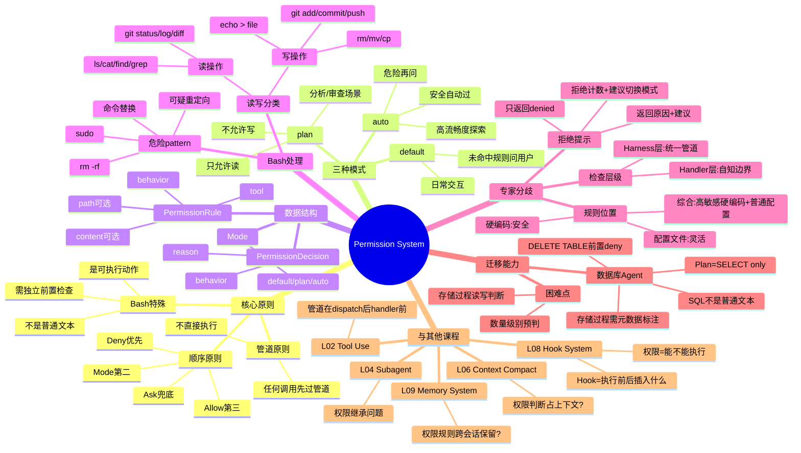

# L07: Permission System - 思维导图

```mermaid
mindmap
  root((Permission System))
    核心原则
      管道原则
        任何调用先过管道
        不直接执行
      顺序原则
        Deny优先
        Mode第二
        Allow第三
        Ask兜底
      Bash特殊
        不是普通文本
        是可执行动作
        需独立前置检查
    
    三种模式
      default
        未命中规则问用户
        日常交互
      plan
        只允许读
        不允许写
        分析/审查场景
      auto
        安全自动过
        危险再问
        高流畅度探索
    
    数据结构
      PermissionRule
        tool
        behavior
        path可选
        content可选
      Mode
        default/plan/auto
      PermissionDecision
        behavior
        reason
    
    Bash处理
      危险pattern
        sudo
        rm -rf
        命令替换
        可疑重定向
      读写分类
        读操作
          ls/cat/find/grep
          git status/log/diff
        写操作
          rm/mv/cp
          git add/commit/push
          echo > file
    
    专家分歧
      规则位置
        配置文件:灵活
        硬编码:安全
        综合:高敏感硬编码+普通配置
      检查层级
        Handler层:自知边界
        Harness层:统一管道
      拒绝提示
        只返回denied
        返回原因+建议
        拒绝计数+建议切换模式
    
    迁移能力
      数据库Agent
        SQL不是普通文本
        DELETE TABLE前置deny
        Plan=SELECT only
        存储过程需元数据标注
      困难点
        数量级别预判
        存储过程读写判断
    
    与其他课程
      L02 Tool Use
        管道在dispatch后handler前
      L04 Subagent
        权限继承问题
      L06 Context Compact
        权限判断占上下文?
      L08 Hook System
        权限=能不能执行
        Hook=执行前后插入什么
      L09 Memory System
        权限规则跨会话保留?
```