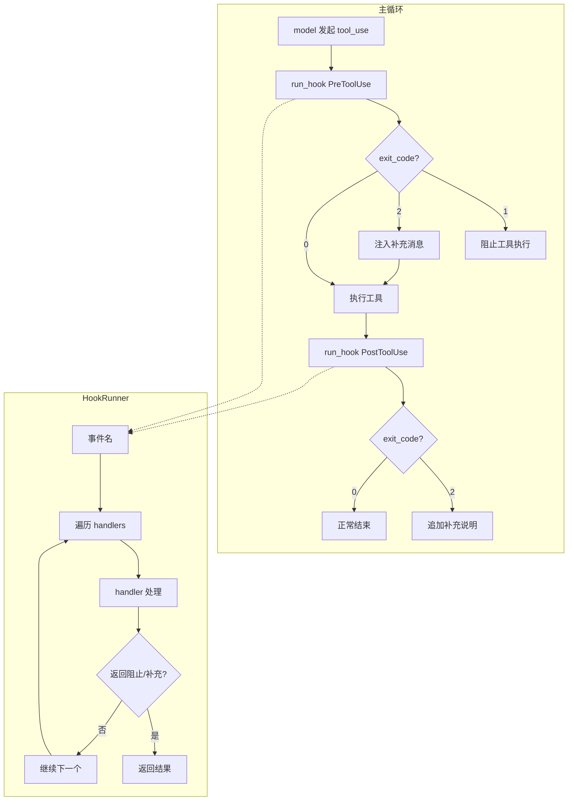
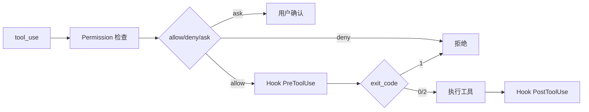

# L08 Hook System - 流程图

```mermaid
flowchart TD
    subgraph 主循环
        A[model 发起 tool_use] --> B[run_hook PreToolUse]
        B --> C{exit_code?}
        C -->|1| D[阻止工具执行]
        C -->|2| E[注入补充消息]
        C -->|0| F[执行工具]
        E --> F
        F --> G[run_hook PostToolUse]
        G --> H{exit_code?}
        H -->|2| I[追加补充说明]
        H -->|0| J[正常结束]
    end

    subgraph HookRunner
        K[事件名] --> L[遍历 handlers]
        L --> M[handler 处理]
        M --> N{返回阻止/补充?}
        N -->|是| O[返回结果]
        N -->|否| P[继续下一个]
        P --> L
    end

    B -.-> K
    G -.-> K
```

## Hook 与 Permission 的关系

```mermaid
flowchart LR
    A[tool_use] --> B[Permission 检查]
    B --> C{allow/deny/ask}
    C -->|deny| D[拒绝]
    C -->|ask| E[用户确认]
    C -->|allow| F[Hook PreToolUse]
    F --> G{exit_code}
    G -->|1| D
    G -->|0/2| H[执行工具]
    H --> I[Hook PostToolUse]
```