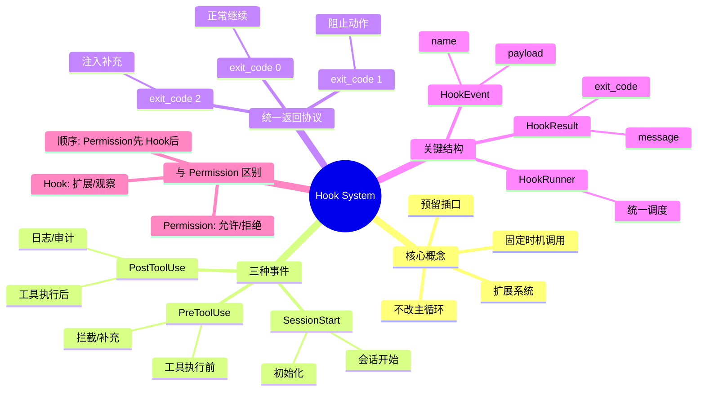

# L08 Hook System - 思维导图

```mermaid
mindmap
  root((Hook System))
    核心概念
      预留插口
      固定时机调用
      不改主循环
      扩展系统
    三种事件
      SessionStart
        会话开始
        初始化
      PreToolUse
        工具执行前
        拦截/补充
      PostToolUse
        工具执行后
        日志/审计
    统一返回协议
      exit_code 0
        正常继续
      exit_code 1
        阻止动作
      exit_code 2
        注入补充
    关键结构
      HookEvent
        name
        payload
      HookResult
        exit_code
        message
      HookRunner
        统一调度
    与 Permission 区别
      Permission: 允许/拒绝
      Hook: 扩展/观察
      顺序: Permission先 Hook后
```