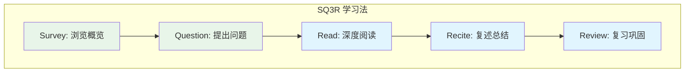
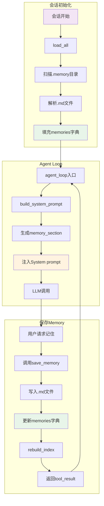
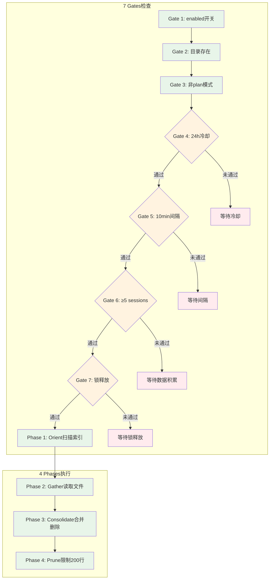
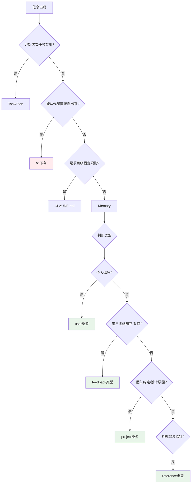
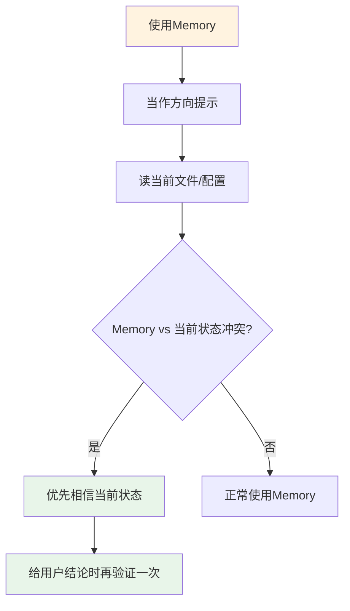

# L09 Memory System - 学习流程图

## SQ3R 学习流程

```mermaid
flowchart TD
    subgraph SQ3R["SQ3R 学习法"]
        S1[Survey: 浏览概览]
        S2[Question: 提出问题]
        S3[Read: 深度阅读]
        S4[Recite: 复述总结]
        S5[Review: 复习巩固]
        S1 --> S2 --> S3 --> S4 --> S5
    end

    style S1 fill:#e8f5e9
    style S2 fill:#e8f5e9
    style S3 fill:#e1f5fe
    style S4 fill:#e1f5fe
    style S5 fill:#e1f5fe
```

## Memory生命周期流程

```mermaid
flowchart TD
    subgraph Init["会话初始化"]
        A1[会话开始] --> A2[load_all]
        A2 --> A3[扫描.memory目录]
        A3 --> A4[解析.md文件]
        A4 --> A5[填充memories字典]
    end

    subgraph Loop["Agent Loop"]
        B1[agent_loop入口] --> B2[build_system_prompt]
        B2 --> B3[生成memory_section]
        B3 --> B4[注入System prompt]
        B4 --> B5[LLM调用]
    end

    subgraph Save["保存Memory"]
        C1[用户请求记住] --> C2[调用save_memory]
        C2 --> C3[写入.md文件]
        C3 --> C4[更新memories字典]
        C4 --> C5[rebuild_index]
        C5 --> C6[返回tool_result]
    end

    A5 --> B1
    B5 --> C1
    C6 --> B1

    style A1 fill:#f3e5f5
    style A5 fill:#e8f5e9
    style B4 fill:#fff3e0
    style C4 fill:#e8f5e9
```

## Dream Consolidator流程

```mermaid
flowchart TD
    subgraph Gates["7 Gates检查"]
        G1[Gate 1: enabled开关] --> G2[Gate 2: 目录存在]
        G2 --> G3[Gate 3: 非plan模式]
        G3 --> G4{Gate 4: 24h冷却}
        G4 -->|通过| G5{Gate 5: 10min间隔}
        G4 -->|未通过| E1[等待冷却]
        G5 -->|通过| G6{Gate 6: ≥5 sessions}
        G5 -->|未通过| E2[等待间隔]
        G6 -->|通过| G7{Gate 7: 锁释放}
        G6 -->|未通过| E3[等待数据积累]
        G7 -->|通过| P1
        G7 -->|未通过| E4[等待锁释放]
    end

    subgraph Phases["4 Phases执行"]
        P1[Phase 1: Orient扫描索引] --> P2[Phase 2: Gather读取文件]
        P2 --> P3[Phase 3: Consolidate合并删除]
        P3 --> P4[Phase 4: Prune限制200行]
    end

    style G1 fill:#e8f5e9
    style G2 fill:#e8f5e9
    style G3 fill:#e8f5e9
    style G4 fill:#fff3e0
    style G5 fill:#fff3e0
    style G6 fill:#fff3e0
    style G7 fill:#fff3e0
    style P1 fill:#e8f5e9
    style P2 fill:#e8f5e9
    style P3 fill:#e8f5e9
    style P4 fill:#e8f5e9
    style E1 fill:#ffebee
    style E2 fill:#ffebee
    style E3 fill:#ffebee
    style E4 fill:#ffebee
```

## 四类型判断流程

```mermaid
flowchart TD
    A[信息出现] --> B{只对这次任务有用?}
    B -->|是| C[Task/Plan]
    B -->|否| D{能从代码直接看出来?}
    D -->|是| E[❌ 不存]
    D -->|否| F{是项目级固定规则?}
    F -->|是| G[CLAUDE.md]
    F -->|否| H[Memory]
    H --> I{判断类型}
    I --> J{个人偏好?}
    J -->|是| K[user类型]
    J -->|否| L{用户明确纠正/认可?}
    L -->|是| M[feedback类型]
    L -->|否| N{团队约定/设计原因?}
    N -->|是| O[project类型]
    N -->|否| P{外部资源指针?}
    P -->|是| Q[reference类型]

    style E fill:#ffebee
    style K fill:#e8f5e9
    style M fill:#e8f5e9
    style O fill:#e8f5e9
    style Q fill:#e8f5e9
```

## 漂移处理流程

```mermaid
flowchart TD
    A[使用Memory] --> B[当作方向提示]
    B --> C[读当前文件/配置]
    C --> D{Memory vs 当前状态冲突?}
    D -->|是| E[优先相信当前状态]
    D -->|否| F[正常使用Memory]
    E --> G[给用户结论时再验证一次]

    style A fill:#fff3e0
    style E fill:#e8f5e9
    style G fill:#e8f5e9
```