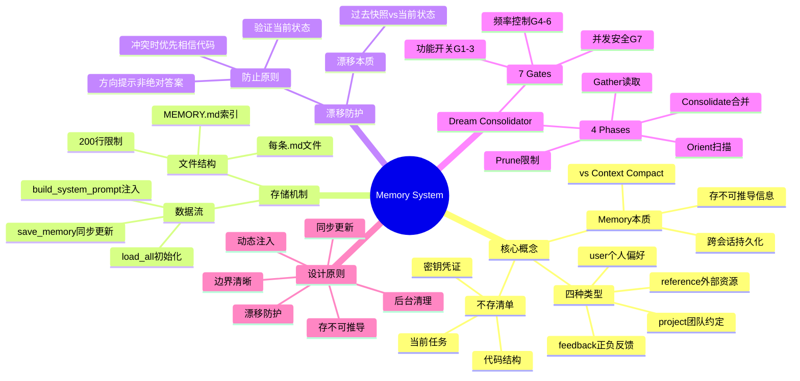
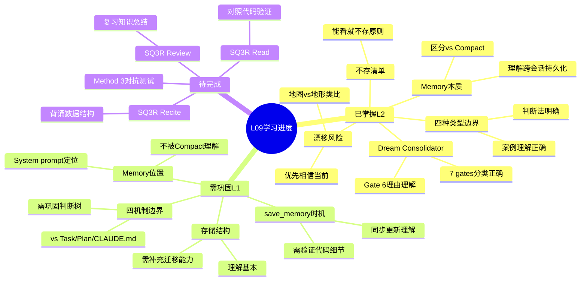
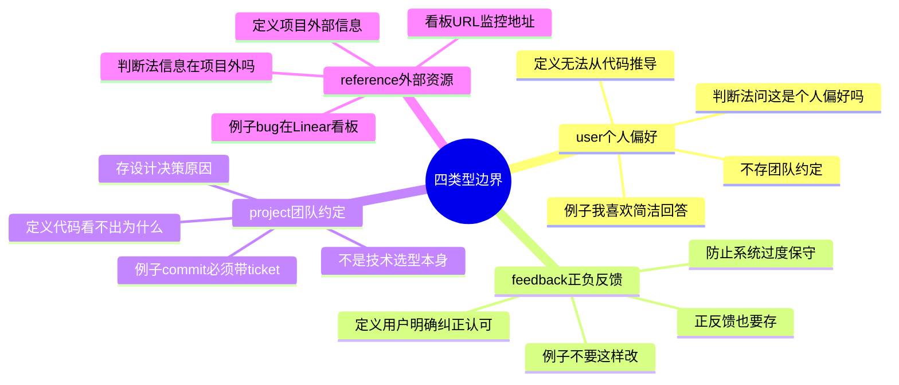
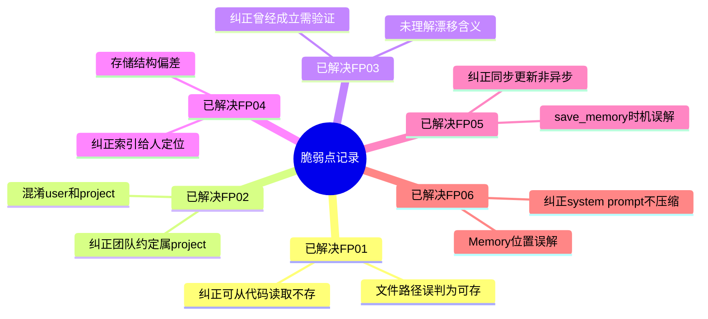

# L09 Memory System - 概念思维导图

## 核心能力思维导图

```mermaid
mindmap
    root((Memory System))
        核心概念
            Memory本质
                跨会话持久化
                存不可推导信息
                vs Context Compact
            四种类型
                user个人偏好
                feedback正负反馈
                project团队约定
                reference外部资源
            不存清单
                代码结构
                当前任务
                密钥凭证
        存储机制
            文件结构
                每条.md文件
                MEMORY.md索引
                200行限制
            数据流
                load_all初始化
                build_system_prompt注入
                save_memory同步更新
        漂移防护
            漂移本质
                过去快照vs当前状态
            防止原则
                方向提示非绝对答案
                验证当前状态
                冲突时优先相信代码
        Dream Consolidator
            7 Gates
                功能开关G1-3
                频率控制G4-6
                并发安全G7
            4 Phases
                Orient扫描
                Gather读取
                Consolidate合并
                Prune限制
        设计原则
            存不可推导
            边界清晰
            同步更新
            动态注入
            漂移防护
            后台清理
```

## 学习进度思维导图

```mermaid
mindmap
    root((L09学习进度))
        已掌握L2
            Memory本质
                理解跨会话持久化
                区分vs Compact
            四种类型边界
                判断法明确
                案例理解正确
            不存清单
                能看就不存原则
            漂移风险
                地图vs地形类比
                优先相信当前
            Dream Consolidator
                7 gates分类正确
                Gate 6理由理解
        需巩固L1
            存储结构
                理解基本
                需补充迁移能力
            save_memory时机
                同步更新理解
                需验证代码细节
            Memory位置
                System prompt定位
                不被Compact理解
            四机制边界
                vs Task/Plan/CLAUDE.md
                需巩固判断树
        待完成
            SQ3R Read
                对照代码验证
            SQ3R Recite
                背诵数据结构
            SQ3R Review
                复习知识总结
            Method 3对抗测试
```

## 四类型边界思维导图

```mermaid
mindmap
    root((四类型边界))
        user个人偏好
            定义无法从代码推导
            例子我喜欢简洁回答
            判断法问这是个人偏好吗
            不存团队约定
        feedback正负反馈
            定义用户明确纠正认可
            正反馈也要存
            防止系统过度保守
            例子不要这样改
        project团队约定
            定义代码看不出为什么
            存设计决策原因
            不是技术选型本身
            例子commit必须带ticket
        reference外部资源
            定义项目外部信息
            看板URL监控地址
            判断法信息在项目外吗
            例子bug在Linear看板
```

## 脆弱点思维导图

```mermaid
mindmap
    root((脆弱点记录))
        已解决FP01
            文件路径误判为可存
            纠正可从代码读取不存
        已解决FP02
            混淆user和project
            纠正团队约定属project
        已解决FP03
            未理解漂移含义
            纠正曾经成立需验证
        已解决FP04
            存储结构偏差
            纠正索引给人定位
        已解决FP05
            save_memory时机误解
            纠正同步更新非异步
        已解决FP06
            Memory位置误解
            纠正system prompt不压缩
```