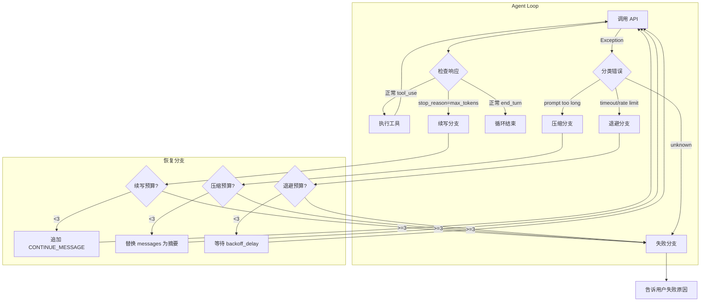
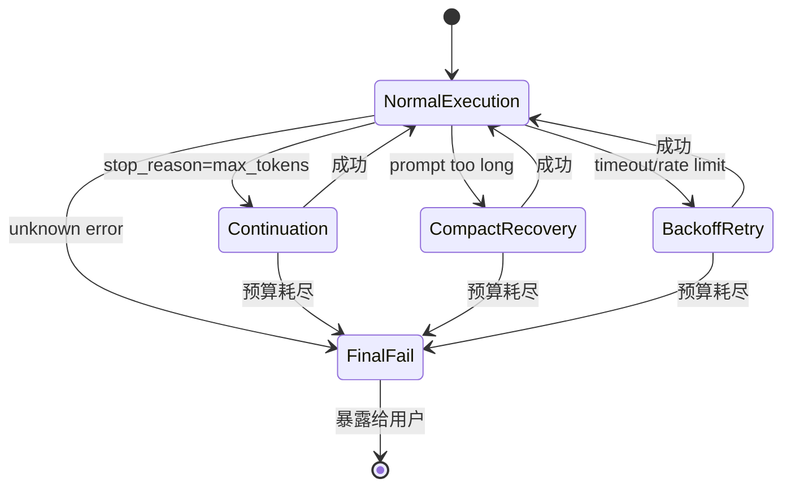

# L11 Error Recovery - 流程图



## 恢复状态机



## choose_recovery 决策树

```mermaid
flowchart LR
    E[错误输入] --> C{choose_recovery}
    
    C -->|stop_reason=max_tokens| R1["kind: continue"]
    C -->|"prompt" + "long"| R2["kind: compact"]
    C -->|"timeout/rate/unavailable"| R3["kind: backoff"]
    C -->|其他| R4["kind: fail"]
    
    R1 --> A1[追加续写提示]
    R2 --> A2[压缩 messages]
    R3 --> A3[退避等待]
    R4 --> A4[暴露失败]
```