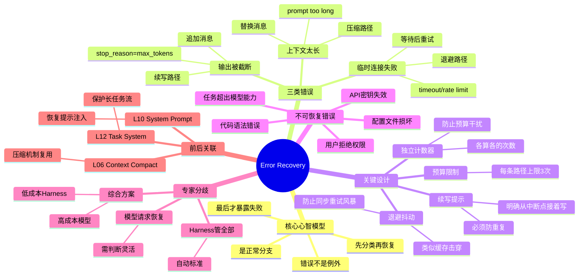

# L11 Error Recovery - 思维导图

```mermaid
mindmap
  root((Error Recovery))
    核心心智模型
      错误不是例外
      是正常分支
      先分类再恢复
      最后才暴露失败
    
    三类错误
      输出被截断
        stop_reason=max_tokens
        续写路径
        追加消息
      上下文太长
        prompt too long
        压缩路径
        替换消息
      临时连接失败
        timeout/rate limit
        退避路径
        等待后重试
    
    关键设计
      独立计数器
        各算各的次数
        防止预算干扰
      续写提示
        必须防重复
        明确从中断点接着写
      退避抖动
        防止同步重试风暴
        类似缓存击穿
      预算限制
        每条路径上限3次
    
    不可恢复错误
      API密钥失效
      用户拒绝权限
      代码语法错误
      任务超出模型能力
      配置文件损坏
    
    专家分歧
      Harness管全部
        自动标准
      模型请求恢复
        需判断灵活
      综合方案
        低成本Harness
        高成本模型
    
    前后关联
      L06 Context Compact
        压缩机制复用
      L10 System Prompt
        恢复提示注入
      L12 Task System
        保护长任务流
```