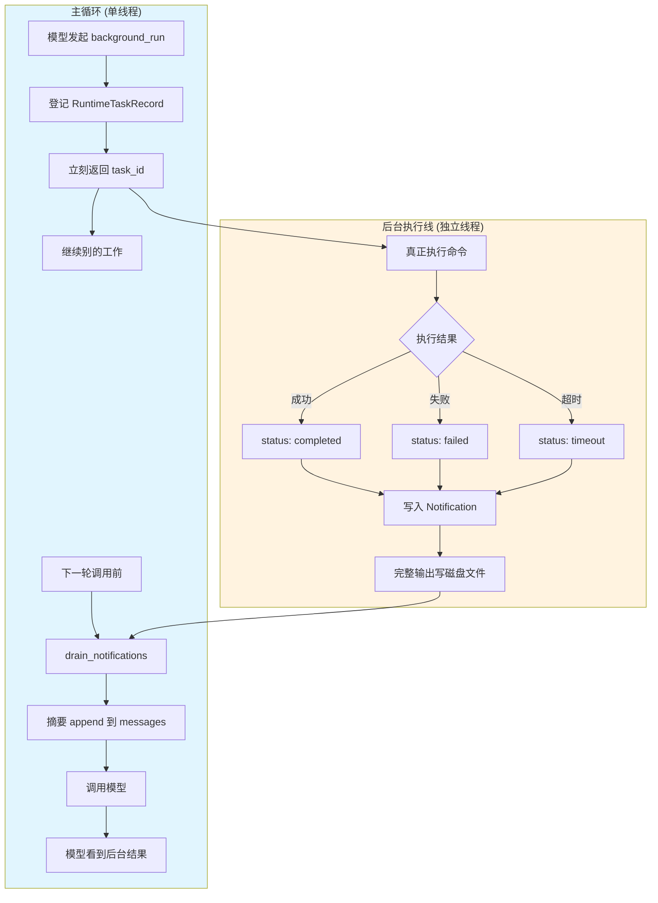
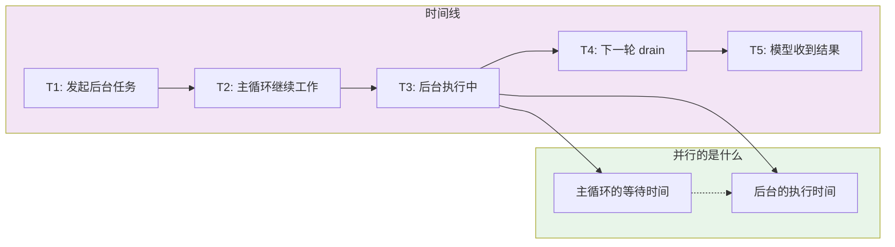
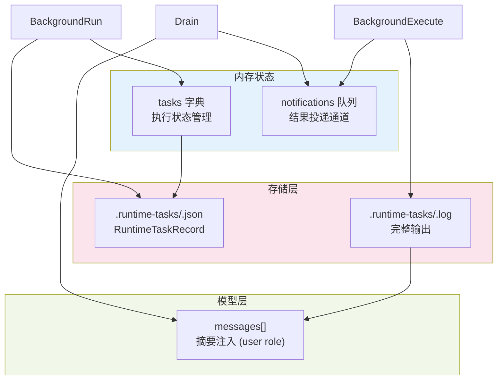

# L13 Background Tasks - 流程图

```mermaid
flowchart TB
    subgraph MainLoop["主循环 (单线程)"]
        A[模型发起 background_run] --> B[登记 RuntimeTaskRecord]
        B --> C[立刻返回 task_id]
        C --> D[继续别的工作]
        
        E[下一轮调用前] --> F[drain_notifications]
        F --> G[摘要 append 到 messages]
        G --> H[调用模型]
        H --> I[模型看到后台结果]
    end
    
    subgraph Background["后台执行线 (独立线程)"]
        J[真正执行命令] --> K{执行结果}
        K -->|成功| L[status: completed]
        K -->|失败| M[status: failed]
        K -->|超时| N[status: timeout]
        L & M & N --> O[写入 Notification]
        O --> P[完整输出写磁盘文件]
    end
    
    C --> J
    P --> F
    
    style MainLoop fill:#e1f5fe
    style Background fill:#fff3e0
```

## 主循环与后台执行线的关系

```mermaid
flowchart LR
    subgraph Timing["时间线"]
        T1[T1: 发起后台任务] --> T2[T2: 主循环继续工作]
        T2 --> T3[T3: 后台执行中]
        T3 --> T4[T4: 下一轮 drain]
        T4 --> T5[T5: 模型收到结果]
    end
    
    subgraph Parallel["并行的是什么"]
        P1[主循环的等待时间] -.-> P2[后台的执行时间]
    end
    
    T3 --> P1
    T3 --> P2
    
    style Timing fill:#f3e5f5
    style Parallel fill:#e8f5e9
```

## 数据流向

```mermaid
flowchart TB
    subgraph Storage["存储层"]
        RT[".runtime-tasks/<id>.json<br/>RuntimeTaskRecord"]
        LOG[".runtime-tasks/<id>.log<br/>完整输出"]
    end
    
    subgraph Memory["内存状态"]
        TASKS["tasks 字典<br/>执行状态管理"]
        NOTIF["notifications 队列<br/>结果投递通道"]
    end
    
    subgraph Agent["模型层"]
        MSG["messages[]<br/>摘要注入 (user role)"]
    end
    
    BackgroundRun --> TASKS
    BackgroundRun --> RT
    BackgroundExecute --> LOG
    BackgroundExecute --> NOTIF
    Drain --> NOTIF
    Drain --> MSG
    
    TASKS --> RT
    LOG --> MSG
    
    style Storage fill:#fce4ec
    style Memory fill:#e3f2fd
    style Agent fill:#f1f8e9
```