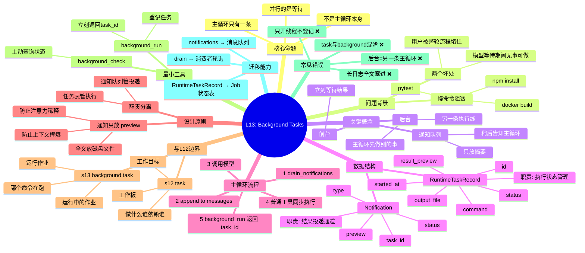

# L13 Background Tasks - 思维导图

```mermaid
mindmap
  root((L13: Background Tasks))
    核心命题
      主循环只有一条
      并行的是等待
      不是主循环本身
    问题背景
      慢命令阻塞
        npm install
        pytest
        docker build
      两个坏处
        模型等待期间无事可做
        用户被整轮流程堵住
    关键概念
      前台
        立刻等待结果
      后台
        另一条执行线
        主循环先做别的事
      通知队列
        稍后告知主循环
        只放摘要
    数据结构
      RuntimeTaskRecord
        id
        command
        status
        started_at
        result_preview
        output_file
        职责: 执行状态管理
      Notification
        type
        task_id
        status
        preview
        职责: 结果投递通道
    主循环流程
      1 drain_notifications
      2 append to messages
      3 调用模型
      4 普通工具同步执行
      5 background_run 返回 task_id
    设计原则
      通知只放 preview
        防止上下文撑爆
        防止注意力稀释
        全文放磁盘文件
      职责分离
        任务表管执行
        通知队列管投递
    与L12边界
      s12 task
        工作目标
        做什么谁依赖谁
        工作板
      s13 background task
        运行作业
        哪个命令在跑
        运行中的作业
    最小工具
      background_run
        登记任务
        立刻返回task_id
      background_check
        主动查询状态
    常见错误
      后台=另一条主循环 ❌
      只开线程不登记 ❌
      长日志全文塞进 ❌
      task与background混淆 ❌
    迁移能力
      notifications → 消息队列
      drain → 消费者轮询
      RuntimeTaskRecord → Job状态表
```