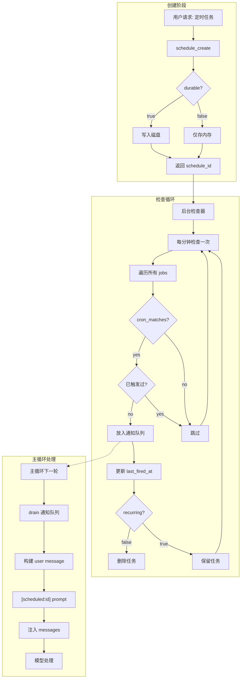
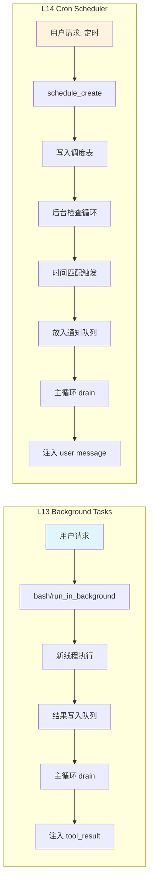

# L14 Cron Scheduler Flowchart

## 调度器核心流程

```mermaid
flowchart TB
    subgraph 创建阶段
        A[用户请求: 定时任务] --> B[schedule_create]
        B --> C{durable?}
        C -->|true| D[写入磁盘]
        C -->|false| E[仅存内存]
        D --> F[返回 schedule_id]
        E --> F
    end

    subgraph 检查循环
        G[后台检查器] --> H[每分钟检查一次]
        H --> I[遍历所有 jobs]
        I --> J{cron_matches?}
        J -->|yes| K{已触发过?}
        K -->|no| L[放入通知队列]
        K -->|yes| M[跳过]
        J -->|no| M
        L --> N[更新 last_fired_at]
        N --> O{recurring?}
        O -->|false| P[删除任务]
        O -->|true| Q[保留任务]
        M --> H
        Q --> H
    end

    subgraph 主循环处理
        R[主循环下一轮] --> S[drain 通知队列]
        S --> T[构建 user message]
        T --> U["[scheduled:id] prompt"]
        U --> V[注入 messages]
        V --> W[模型处理]
    end

    F --> G
    L -.-> R
```

## 与后台任务的对比

```mermaid
flowchart LR
    subgraph L13 Background Tasks
        A1[用户请求] --> B1[bash/run_in_background]
        B1 --> C1[新线程执行]
        C1 --> D1[结果写入队列]
        D1 --> E1[主循环 drain]
        E1 --> F1[注入 tool_result]
    end

    subgraph L14 Cron Scheduler
        A2[用户请求: 定时] --> B2[schedule_create]
        B2 --> C2[写入调度表]
        C2 --> D2[后台检查循环]
        D2 --> E2[时间匹配触发]
        E2 --> F2[放入通知队列]
        F2 --> G2[主循环 drain]
        G2 --> H2[注入 user message]
    end

    style A1 fill:#e1f5fe
    style A2 fill:#fff3e0
```

**核心差异**：
- L13：启动后等**结果**回来
- L14：记住后等**开始**时机