# Context 生成参考文档

本文档是 Context 生成的核心参考指南，定义了 Context 的目标、模板、生成规则和数据来源映射。

---

## 1. Context 的三大目标

Context 的设计围绕三个核心目标展开，确保学习过程既深入又高效：

### 1.1 心智模型构建

**目标**：帮助学生建立领域专家的思维框架，形成系统化的认知结构。

| 维度 | 说明 | 实现方式 |
|------|------|----------|
| 概念网络 | 构建概念之间的关联关系 | 通过核心概念定义和依赖映射 |
| 专家视角 | 理解领域专家如何看待问题 | 展示专家共识与分歧点 |
| 思维模式 | 掌握专家解决问题的思路 | 深度测试问题引导思考 |
| 迁移能力 | 将知识应用到新情境 | 跨领域类比和变体练习 |

**核心要素**：
- 核心概念及其定义
- 概念间的依赖关系
- 专家共识与分歧点
- 深度测试问题

### 1.2 结构化流程管理

**目标**：通过标准化的学习流程确保学习的完整性和可追溯性。

| 方法 | 阶段 | 说明 |
|------|------|------|
| SQ3R | Survey → Question → Read → Recite → Review | 系统化的阅读理解流程 |
| 项目式学习 | 定义 → 规划 → 执行 → 交付 | 实践驱动的学习方式 |
| KISS 复盘 | Keep → Improve → Start → Stop | 持续改进的反思机制 |

**流程整合**：
```
SQ3R 学习 → 项目实践 → KISS 复盘 → 下一轮迭代
```

### 1.3 对抗性压力测试

**目标**：暴露认知盲区，验证理解深度，确保知识的稳健性。

| 测试类型 | 目的 | 实现方式 |
|----------|------|----------|
| 脆弱点测试 | 识别理解薄弱环节 | 历史错误回顾 + 预测性诊断 |
| 反事实推理 | 验证因果理解 | "如果...会怎样"情境 |
| 漏洞注入 | 测试边界条件 | 刻意引入错误检测 |
| 矛盾检测 | 发现认知冲突 | 对立观点对比分析 |

**核心机制**：
- 从历史交互中识别脆弱点
- 构建反事实情境测试深度理解
- 注入故意错误测试纠错能力

---

## 2. Markdown 总结模板

### 2.1 完整模板结构

```markdown
# [阶段名称] Context 总结

## 元信息
- **生成时间**：YYYY-MM-DD HH:mm
- **阶段**：[L0/L1/L2]
- **核心能力**：[能力名称]
- **学习进度**：[百分比]

---

## 一、心智模型构建

### 1.1 核心概念网络

| 概念 | 定义 | 依赖关系 | 熟练度 |
|------|------|----------|--------|
| [概念1] | [定义] | → [依赖概念] | [高/中/低] |
| [概念2] | [定义] | → [依赖概念] | [高/中/低] |

### 1.2 专家视角

#### 专家共识
- **[议题1]**：[共识内容]
- **[议题2]**：[共识内容]

#### 专家分歧
- **[议题]**：
  - 观点A：[描述]
  - 观点B：[描述]
  - 学习者理解：[当前认知]

### 1.3 深度测试问题

> **Q1**: [问题内容]
>
> **思考引导**：
> - 角度1：[提示]
> - 角度2：[提示]
>
> **预期理解层级**：
> - L0（表面）：[描述]
> - L1（关联）：[描述]
> - L2（深层）：[描述]

---

## 二、结构化学习

### 2.1 SQ3R 进度

| 阶段 | 状态 | 关键产出 | 下一步 |
|------|------|----------|--------|
| Survey | [完成/进行中/未开始] | [产出] | [行动] |
| Question | [完成/进行中/未开始] | [产出] | [行动] |
| Read | [完成/进行中/未开始] | [产出] | [行动] |
| Recite | [完成/进行中/未开始] | [产出] | [行动] |
| Review | [完成/进行中/未开始] | [产出] | [行动] |

### 2.2 项目成果

| 项目 | 状态 | 关键交付物 | 学习价值 |
|------|------|-----------|----------|
| [项目1] | [状态] | [交付物] | [价值] |
| [项目2] | [状态] | [交付物] | [价值] |

### 2.3 KISS 复盘

| 类别 | 内容 | 优先级 |
|------|------|--------|
| **Keep** (保持) | [继续做的有效做法] | - |
| **Improve** (改进) | [需要优化的地方] | [高/中/低] |
| **Start** (开始) | [新增的行动项] | [高/中/低] |
| **Stop** (停止) | [无效的行为] | - |

---

## 三、对抗测试

### 3.1 脆弱点诊断

| 脆弱点 | 来源 | 风险等级 | 补救措施 |
|--------|------|----------|----------|
| [弱点1] | [历史错误/预测] | [高/中/低] | [措施] |
| [弱点2] | [历史错误/预测] | [高/中/低] | [措施] |

### 3.2 反事实情境

> **情境**：[假设条件]
>
> **问题**：在这种情境下，[会发生什么/应该如何应对]？
>
> **测试目标**：验证对 [概念/原理] 的深层理解
>
> **预期回答要点**：
> 1. [要点1]
> 2. [要点2]
> 3. [要点3]

### 3.3 漏洞注入测试

> **以下内容包含错误，请识别并纠正**：
>
> [包含故意错误的内容]
>
> **错误类型**：[概念错误/逻辑错误/事实错误]
> **难度**：[简单/中等/困难]

---

## 四、行动指引

### 4.1 即时任务
- [ ] [任务1]
- [ ] [任务2]

### 4.2 本阶段目标
1. [目标1]
2. [目标2]

### 4.3 里程碑检查点
- [ ] [检查点1] - 预计完成：[日期]
- [ ] [检查点2] - 预计完成：[日期]
```

### 2.2 精简模板（用于快速更新）

```markdown
# [阶段] 快速 Context

## 当前状态
- **阶段**：[L0/L1/L2]
- **进度**：[百分比]
- **核心任务**：[任务描述]

## 关键更新
- **已完成**：[内容]
- **进行中**：[内容]
- **待开始**：[内容]

## 脆弱点
1. [弱点1]
2. [弱点2]

## 下一步行动
1. [行动1]
2. [行动2]
```

---

## 3. Mermaid 图表生成规则

### 3.1 流程图生成规则

#### 基本语法

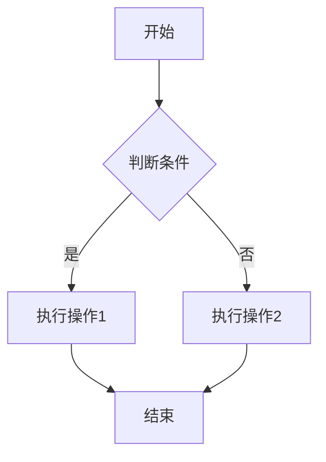

#### 流程图类型与应用场景

| 类型 | 语法 | 应用场景 |
|------|------|----------|
| 自上而下 | `flowchart TD` | 线性流程、阶段推进 |
| 自左而右 | `flowchart LR` | 时间线、并行任务 |
| 子图分组 | `subgraph` | 模块划分、阶段分组 |

#### 学习流程图模板

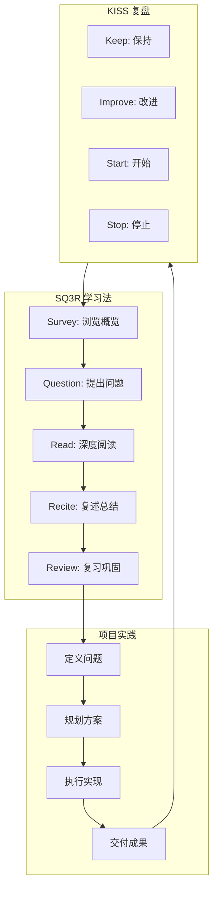

#### 状态转换图模板

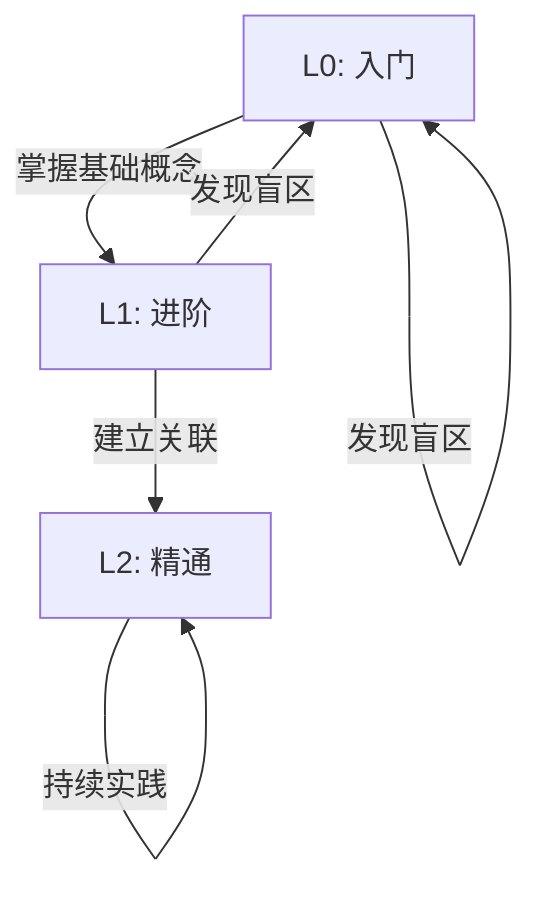

### 3.2 思维导图生成规则

#### 基本语法

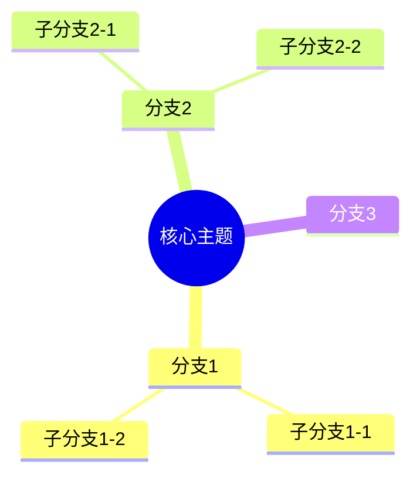

#### 思维导图类型与应用场景

| 类型 | 说明 | 应用场景 |
|------|------|----------|
| 概念图 | 展示概念层级结构 | 核心概念梳理 |
| 知识图谱 | 展示知识关联网络 | 知识体系构建 |
| 任务分解 | 展示任务层级 | 项目规划 |

#### 概念思维导图模板

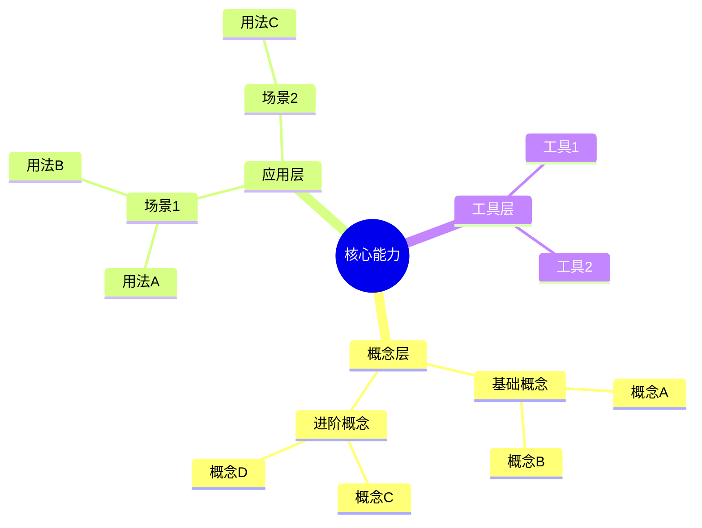

#### 学习进度思维导图模板

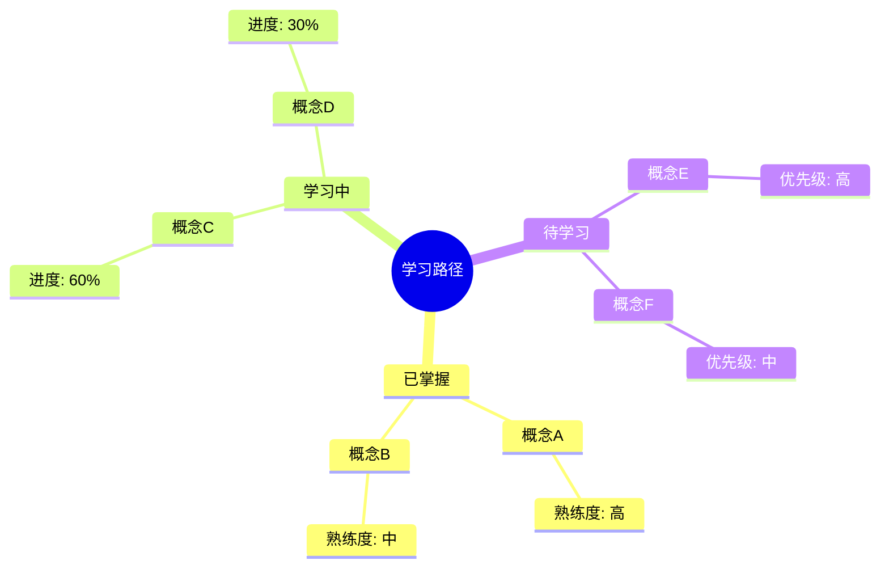

### 3.3 嵌入 Markdown 的方式

#### 行内嵌入

```markdown
以下是当前的学习流程：

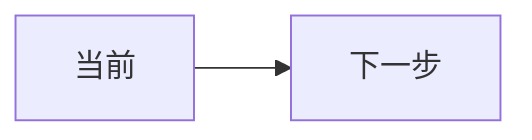
```

#### 块级嵌入（带说明）

```markdown
### 3.1 概念关系图

下图展示了核心概念之间的依赖关系：

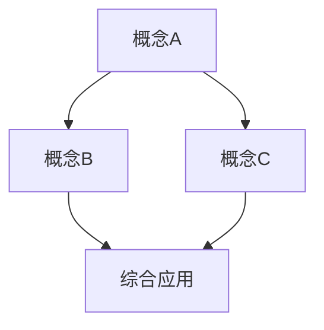

**图示说明**：
- 箭头表示依赖方向
- 方框颜色深浅表示掌握程度
```

#### 多图表组合

```markdown
### 学习全景图

#### 流程视角


#### 结构视角


**两种视角的关系**：
- 流程视角强调时序和步骤
- 结构视角强调层级和关联
```

### 3.4 样式规范

#### 节点样式

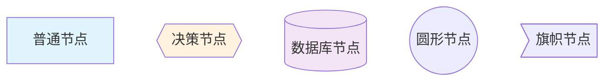

#### 颜色编码

| 颜色 | 含义 | 用途 |
|------|------|------|
| `#e1f5fe` (浅蓝) | 信息/输入 | 数据源、参考资料 |
| `#e8f5e9` (浅绿) | 完成/成功 | 已完成任务、已掌握知识 |
| `#fff3e0` (浅橙) | 进行中 | 当前活动、学习中的概念 |
| `#ffebee` (浅红) | 警告/问题 | 脆弱点、错误风险 |
| `#f3e5f5` (浅紫) | 输出/结果 | 交付物、成果 |

### 3.5 Mermaid 生成实现指南

本节提供具体的 Mermaid 图表生成逻辑，帮助实现从数据源到可视化图表的转换。

#### 3.5.1 流程图生成逻辑

##### 从 lessons/*.md 识别流程步骤

流程步骤的识别采用多模式匹配策略：

**步骤识别模式表**

| 模式类型 | 正则表达式 | 匹配示例 |
|----------|-----------|----------|
| 数字列表 | `^\d+\.\s+(.+)$` | `1. 第一步操作` |
| Step 标记 | `^Step\s*(\d+)[:：]\s*(.+)$` | `Step 1: 初始化配置` |
| 中文步骤 | `^步骤\s*(\d+)[:：]\s*(.+)$` | `步骤1：准备环境` |
| 阶段标题 | `^##\s+阶段\s*(\d+)[:：]?\s*(.+)$` | `## 阶段1：需求分析` |
| 流程动词 | `^[-*]\s+(创建|配置|执行|验证|部署|测试).+$` | `- 创建配置文件` |

**生成流程**

```
输入: lessons/*.md 文件内容
  │
  ▼
步骤1: 扫描文档，识别步骤标记
  │   - 匹配数字列表模式
  │   - 匹配 Step/步骤 标记
  │   - 匹配阶段标题
  │
  ▼
步骤2: 提取步骤内容
  │   - 提取步骤编号
  │   - 提取步骤描述
  │   - 识别嵌套子步骤
  │
  ▼
步骤3: 识别决策点和分支
  │   - 检测条件关键词 (如果、若、当)
  │   - 检测分支关键词 (则、否则、跳转)
  │
  ▼
步骤4: 构建节点和边
  │   - 为每个步骤创建节点
  │   - 根据顺序创建边
  │   - 添加分支条件标签
  │
  ▼
输出: Mermaid flowchart 代码
```

##### 节点和边的生成规则

**节点类型判断**

```python
def determine_node_type(content: str) -> str:
    """根据内容判断节点类型"""

    # 决策节点：包含条件判断
    if any(kw in content for kw in ['?', '是否', '如果', '若', '判断', '检查']):
        return 'decision'  # {{ }} 菱形

    # 数据库节点：数据存储相关
    if any(kw in content for kw in ['存储', '保存', '数据库', '记录', '写入']):
        return 'database'  # [( )] 圆柱

    # 起点/终点
    if any(kw in content for kw in ['开始', 'Start', '结束', 'End', '完成']):
        return 'terminal'  # (( )) 圆形

    # 默认：矩形节点
    return 'process'  # [ ] 矩形
```

**Mermaid 节点语法映射**

| 节点类型 | Mermaid 语法 | 示例 |
|----------|-------------|------|
| process | `A[描述]` | `A[执行操作]` |
| decision | `B{条件?}` | `B{是否通过?}` |
| database | `C[(存储)]` | `C[(数据库)]` |
| terminal | `D((开始))` | `D((开始))` |

**边的生成规则**

```python
def generate_edge(source: str, target: str, label: str = None) -> str:
    """生成边的 Mermaid 代码"""

    if label:
        return f"    {source} -->|{label}| {target}"
    else:
        return f"    {source} --> {target}"
```

##### 分支条件的处理

**分支识别模式**

```python
BRANCH_PATTERNS = [
    # 条件-结果模式
    r'如果\s*(.+?)\s*[，,]?\s*(?:则|那么)\s*(.+)',
    r'若\s*(.+?)\s*[，,]?\s*(?:则|那么)\s*(.+)',
    r'当\s*(.+?)\s*时\s*[，,]?\s*(.+)',

    # 问题-选择模式
    r'(.+?)\s*[?？]\s*\n\s*[-*]\s*是[：:]\s*(.+)',
    r'(.+?)\s*[?？]\s*\n\s*[-*]\s*否[：:]\s*(.+)',

    # 分支标记
    r'[-*]\s*(是|Yes|Y)\s*[：:]\s*(.+)',
    r'[-*]\s*(否|No|N)\s*[：:]\s*(.+)',
]
```

**分支 Mermaid 生成示例**

输入内容：
```markdown
检查配置文件是否存在？
- 是：加载配置
- 否：创建默认配置
```

生成 Mermaid：
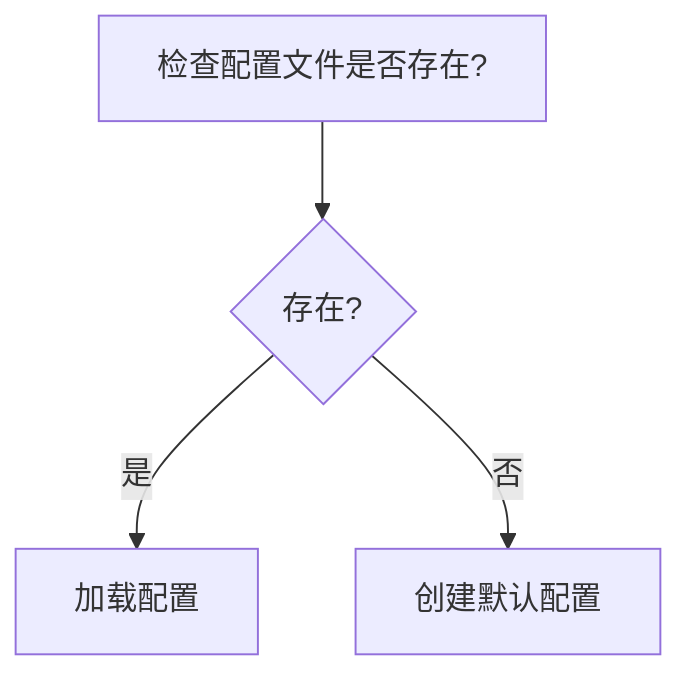

#### 3.5.2 思维导图生成逻辑

##### 从 syllabus.core_points 构建根节点

**数据结构转换**

```python
def build_mindmap_from_syllabus(syllabus: dict) -> str:
    """从 syllabus 构建思维导图"""

    mermaid_code = ["mindmap"]

    # 根节点：使用学习主题或核心能力
    root = syllabus.get('title', '核心能力')
    mermaid_code.append(f"    root(({root}))")

    # 遍历 core_points 构建分支
    for cp in syllabus.get('core_points', []):
        level = cp.get('level', 'L0')
        name = cp.get('name', '未命名')

        # 根据层级组织
        indent = "        "  # 二级缩进
        mermaid_code.append(f"{indent}{name}")

        # 添加子节点
        for sub in cp.get('sub_points', []):
            mermaid_code.append(f"{indent}    {sub['name']}")

    return "\n".join(mermaid_code)
```

**层级映射规则**

| syllabus 字段 | 思维导图层级 | 示例 |
|--------------|-------------|------|
| `title` | root (根节点) | `root((核心能力))` |
| `core_points[].name` | 一级分支 | `概念A` |
| `core_points[].sub_points[].name` | 二级分支 | `子概念A1` |
| `core_points[].details[]` | 三级分支 | `具体知识点` |

##### 从 lessons 提取子节点

**标题层级识别**

```python
def extract_from_lesson(lesson_content: str) -> list:
    """从 lesson 内容提取概念层级"""

    hierarchy = []
    lines = lesson_content.split('\n')

    for line in lines:
        # 一级标题 -> 一级分支
        if line.startswith('# ') and not line.startswith('## '):
            hierarchy.append({
                'level': 1,
                'content': line[2:].strip(),
                'children': []
            })

        # 二级标题 -> 二级分支
        elif line.startswith('## '):
            if hierarchy:
                hierarchy[-1]['children'].append({
                    'level': 2,
                    'content': line[3:].strip(),
                    'children': []
                })

        # 三级标题 -> 三级分支
        elif line.startswith('### '):
            if hierarchy and hierarchy[-1]['children']:
                hierarchy[-1]['children'][-1]['children'].append({
                    'level': 3,
                    'content': line[4:].strip()
                })

    return hierarchy
```

##### 层级深度控制

**深度控制策略**

```python
MAX_DEPTH = 4  # 最大层级深度

def prune_to_depth(node: dict, current_depth: int = 0) -> dict:
    """修剪过深的层级"""

    if current_depth >= MAX_DEPTH:
        # 超过最大深度，合并子节点内容
        if node.get('children'):
            node['collapsed'] = '... (更多内容已折叠)'
            del node['children']
        return node

    # 递归处理子节点
    if 'children' in node:
        node['children'] = [
            prune_to_depth(child, current_depth + 1)
            for child in node['children']
        ]

    return node
```

**深度与可读性平衡**

| 层级深度 | 推荐场景 | 控制方法 |
|---------|---------|---------|
| 1-2 层 | 概览图、导航 | 只显示主干分支 |
| 3-4 层 | 详细概念图 | 保留主要内容 |
| 5+ 层 | 完整知识图谱 | 折叠次要内容 |

#### 3.5.3 内容提取规则

##### 流程步骤的识别模式

**综合模式匹配表**

| 模式名称 | 正则表达式 | 优先级 | 说明 |
|---------|-----------|-------|------|
| 显式步骤 | `(?i)^step\s*(\d+)[:：]\s*(.+)$` | 1 | 最高优先级 |
| 中文步骤 | `^步骤\s*(\d+)[:：]\s*(.+)$` | 1 | 与显式步骤同级 |
| 数字列表 | `^(\d+)\.\s+(.+)$` | 2 | 普通有序列表 |
| 阶段标记 | `^阶段\s*(\d+)[:：]?\s*(.+)$` | 2 | 阶段划分 |
| 流程动词 | `^[-*]\s+(执行|创建|配置|验证|部署|测试|编写|设计)\s*(.+)$` | 3 | 动词开头 |
| 隐式顺序 | `^(首先|然后|接着|最后|最终)[，,：:\s]+(.+)$` | 4 | 顺序词引导 |

**提取代码实现**

```python
import re
from dataclasses import dataclass
from typing import List, Optional

@dataclass
class FlowStep:
    id: str
    content: str
    order: int
    node_type: str
    children: List['FlowStep']
    condition: Optional[str] = None

PATTERNS = [
    ('explicit_step', r'(?i)^step\s*(\d+)[:：]\s*(.+)$', 1),
    ('chinese_step', r'^步骤\s*(\d+)[:：]\s*(.+)$', 1),
    ('numbered', r'^(\d+)\.\s+(.+)$', 2),
    ('phase', r'^阶段\s*(\d+)[:：]?\s*(.+)$', 2),
    ('action', r'^[-*]\s+(执行|创建|配置|验证|部署|测试)\s*(.+)$', 3),
    ('sequential', r'^(首先|然后|接着|最后)[，,：:\s]+(.+)$', 4),
]

def extract_flow_steps(content: str) -> List[FlowStep]:
    """从内容中提取流程步骤"""

    steps = []
    lines = content.split('\n')
    step_counter = 0

    for line in lines:
        line = line.strip()
        if not line:
            continue

        for pattern_name, pattern, priority in PATTERNS:
            match = re.match(pattern, line)
            if match:
                step_counter += 1

                # 提取组
                groups = match.groups()
                if pattern_name in ['explicit_step', 'chinese_step']:
                    step_num = int(groups[0])
                    step_content = groups[1]
                elif pattern_name == 'numbered':
                    step_num = int(groups[0])
                    step_content = groups[1]
                elif pattern_name == 'phase':
                    step_num = int(groups[0])
                    step_content = groups[1]
                elif pattern_name == 'action':
                    step_num = step_counter
                    step_content = f"{groups[0]}{groups[1]}"
                else:  # sequential
                    step_num = step_counter
                    step_content = groups[1]

                steps.append(FlowStep(
                    id=f"S{step_num}",
                    content=step_content,
                    order=step_num,
                    node_type=determine_node_type(step_content),
                    children=[]
                ))
                break

    return sorted(steps, key=lambda x: x.order)
```

##### 概念层级的识别模式

**标题层级解析**

```python
def parse_heading_hierarchy(content: str) -> dict:
    """解析标题层级结构"""

    hierarchy = {'root': None, 'levels': {}}
    lines = content.split('\n')

    heading_pattern = r'^(#{1,6})\s+(.+)$'

    for line in lines:
        match = re.match(heading_pattern, line)
        if match:
            level = len(match.group(1))
            title = match.group(2).strip()

            # 一级标题作为根
            if level == 1:
                hierarchy['root'] = title
                hierarchy['levels'][1] = [{'title': title, 'children': []}]
            else:
                # 确保层级存在
                if level not in hierarchy['levels']:
                    hierarchy['levels'][level] = []

                node = {'title': title, 'children': []}
                hierarchy['levels'][level].append(node)

                # 连接到父级
                if level - 1 in hierarchy['levels'] and hierarchy['levels'][level - 1]:
                    parent = hierarchy['levels'][level - 1][-1]
                    parent['children'].append(node)

    return hierarchy
```

**缩进层级解析**

```python
def parse_indent_hierarchy(lines: list) -> list:
    """解析缩进层级结构"""

    root_nodes = []
    stack = [(0, None)]  # (indent_level, node)

    for line in lines:
        if not line.strip():
            continue

        # 计算缩进
        indent = len(line) - len(line.lstrip())
        content = line.strip()

        # 去除列表标记
        content = re.sub(r'^[-*+]\s+', '', content)
        content = re.sub(r'^\d+\.\s+', '', content)

        node = {'content': content, 'children': []}

        # 弹出栈直到找到父级
        while stack and stack[-1][0] >= indent:
            stack.pop()

        if stack:
            # 添加到父级的子节点
            parent = stack[-1][1]
            parent['children'].append(node)
        else:
            # 根节点
            root_nodes.append(node)

        stack.append((indent, node))

    return root_nodes
```

#### 3.5.4 生成示例

##### 示例1：流程图生成

**输入内容 (lessons/process-guide.md)**

```markdown
# 配置文件部署流程

## 阶段1：准备环境

Step 1: 检查系统环境
- 确认 Python 版本 >= 3.8
- 确认依赖包已安装

Step 2: 加载配置
如果配置文件存在，则读取现有配置
否则创建默认配置

Step 3: 验证配置
检查必要字段是否完整？
- 是：继续执行
- 否：返回步骤2补充配置

Step 4: 部署应用
将配置写入目标位置

Step 5: 完成部署
记录部署日志
```

**生成的 Mermaid 代码**

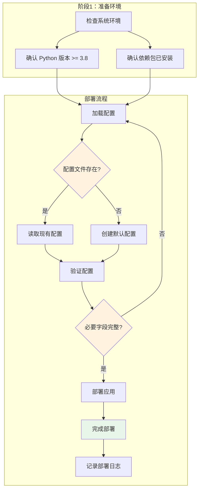

##### 示例2：思维导图生成

**输入数据 (syllabus.yaml)**

```yaml
title: "Python 编程基础"
core_points:
  - id: "cp-001"
    name: "数据类型"
    description: "理解 Python 基本数据类型"
    sub_points:
      - name: "数值类型"
        details: ["整数", "浮点数", "复数"]
      - name: "序列类型"
        details: ["字符串", "列表", "元组"]
      - name: "映射类型"
        details: ["字典"]
  - id: "cp-002"
    name: "控制流"
    description: "掌握程序控制结构"
    sub_points:
      - name: "条件语句"
        details: ["if-elif-else"]
      - name: "循环语句"
        details: ["for 循环", "while 循环", "break/continue"]
```

**生成的 Mermaid 代码**

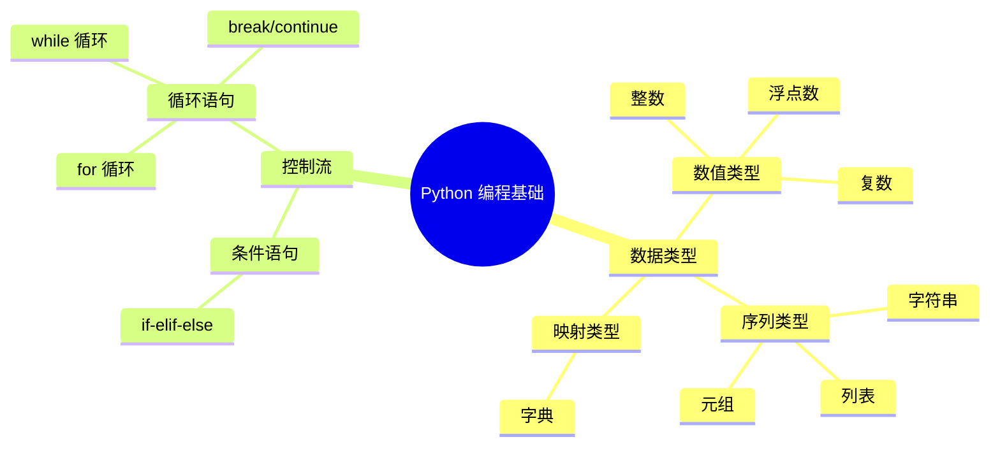

##### 示例3：完整生成函数

**综合生成代码**

```python
from pathlib import Path
from typing import Dict, List
import yaml

class MermaidGenerator:
    """Mermaid 图表生成器"""

    def __init__(self, lessons_dir: str, syllabus_path: str):
        self.lessons_dir = Path(lessons_dir)
        self.syllabus_path = Path(syllabus_path)
        self.syllabus = self._load_syllabus()

    def _load_syllabus(self) -> dict:
        """加载 syllabus 配置"""
        with open(self.syllabus_path, 'r', encoding='utf-8') as f:
            return yaml.safe_load(f)

    def generate_flowchart(self, lesson_file: str) -> str:
        """从 lesson 文件生成流程图"""
        lesson_path = self.lessons_dir / lesson_file
        with open(lesson_path, 'r', encoding='utf-8') as f:
            content = f.read()

        steps = extract_flow_steps(content)

        # 生成 Mermaid 代码
        lines = ["flowchart TD"]

        for i, step in enumerate(steps):
            # 生成节点
            if step.node_type == 'decision':
                lines.append(f"    {step.id}{{{step.content}?}}")
            elif step.node_type == 'terminal':
                lines.append(f"    {step.id}(({step.content}))")
            else:
                lines.append(f"    {step.id}[{step.content}]")

            # 生成边（连接到下一个节点）
            if i < len(steps) - 1:
                next_step = steps[i + 1]
                lines.append(f"    {step.id} --> {next_step.id}")

        return "\n".join(lines)

    def generate_mindmap(self, max_depth: int = 3) -> str:
        """从 syllabus 生成思维导图"""
        lines = ["mindmap"]

        # 根节点
        root = self.syllabus.get('title', '知识体系')
        lines.append(f"    root(({root}))")

        # 遍历核心知识点
        for cp in self.syllabus.get('core_points', []):
            name = cp.get('name', '未命名')
            lines.append(f"        {name}")

            # 子知识点
            for sub in cp.get('sub_points', []):
                sub_name = sub.get('name', '')
                lines.append(f"            {sub_name}")

                # 详情（控制深度）
                if max_depth >= 3:
                    for detail in sub.get('details', [])[:5]:  # 限制数量
                        lines.append(f"                {detail}")

        return "\n".join(lines)

    def save_to_file(self, content: str, output_path: str):
        """保存到文件"""
        with open(output_path, 'w', encoding='utf-8') as f:
            f.write(f"# 自动生成的 Mermaid 图表\n\n")
            f.write(f"```mermaid\n{content}\n```\n")

# 使用示例
if __name__ == "__main__":
    generator = MermaidGenerator(
        lessons_dir="lessons",
        syllabus_path="syllabus.yaml"
    )

    # 生成流程图
    flowchart = generator.generate_flowchart("process-guide.md")
    generator.save_to_file(flowchart, "output/flowchart.mermaid.md")

    # 生成思维导图
    mindmap = generator.generate_mindmap(max_depth=3)
    generator.save_to_file(mindmap, "output/mindmap.mermaid.md")
```

---

## 4. 内容来源映射

Context 的内容需要从多个数据源整合，下表定义了内容与数据来源的对应关系：

### 4.1 数据源映射表

| Context 内容 | 主要数据来源 | 次要数据来源 | 更新频率 |
|-------------|-------------|-------------|----------|
| 核心概念 | `syllabus.core_points` | `lessons/*.md` | 阶段性 |
| 概念定义 | `lessons/*.md` | `syllabus.definitions` | 阶段性 |
| 专家共识/分歧 | `lessons/*.md` | 外部参考资源 | 阶段性 |
| 学习进度 | `.learning/learning-state.json` | `.learning/memory-store.json` | 实时 |
| SQ3R 状态 | `.learning/learning-state.json` | - | 实时 |
| 项目成果 | `.learning/artifacts/` | `.learning/memory-store.json` | 项目完成时 |
| 脆弱点 | `.learning/memory-store.json` | 历史交互记录 | 每次交互 |
| KISS 复盘 | `.learning/memory-store.json` | `.learning/artifacts/` | 每周 |
| 深度测试问题 | `syllabus.deep_questions` | `lessons/*.md` | 阶段性 |

### 4.2 数据源详细说明

#### 4.2.1 syllabus.core_points

```yaml
# 数据结构示例
core_points:
  - id: "cp-001"
    name: "核心概念名称"
    description: "概念描述"
    level: "L0"
    dependencies: ["cp-000"]  # 前置依赖
    mastery_criteria:
      - "能够解释概念"
      - "能够举例说明"
```

**使用方式**：
- 提取当前阶段的核心概念列表
- 构建概念依赖图
- 确定 mastery_criteria 作为评估标准

#### 4.2.2 lessons/*.md

```markdown
# 课程文件结构

## 概念定义
[概念的定义和解释]

## 专家观点
### 共识
- 共识点1
- 共识点2

### 分歧
- 分歧点：观点A vs 观点B

## 深度问题
1. [问题1]
2. [问题2]
```

**使用方式**：
- 提取概念定义用于心智模型构建
- 提取专家观点用于对比分析
- 提取深度问题用于对抗测试

#### 4.2.3 .learning/learning-state.json

```json
{
  "current_phase": "L0",
  "progress": {
    "L0": {
      "sq3r": {
        "survey": "completed",
        "question": "in_progress",
        "read": "not_started",
        "recite": "not_started",
        "review": "not_started"
      },
      "mastery": {
        "cp-001": 0.8,
        "cp-002": 0.6
      }
    }
  },
  "active_project": "project-001"
}
```

**使用方式**：
- 获取当前学习阶段和进度
- 获取 SQ3R 各阶段状态
- 获取概念掌握度数据

#### 4.2.4 .learning/memory-store.json

```json
{
  "fragile_points": [
    {
      "id": "fp-001",
      "concept_id": "cp-002",
      "type": "misconception",
      "description": "容易混淆概念A和B",
      "occurrence_count": 3,
      "last_occurrence": "2024-01-15",
      "remediation": "加强对比练习"
    }
  ],
  "kiss_reviews": [
    {
      "date": "2024-01-15",
      "keep": ["每日复习习惯"],
      "improve": ["笔记整理效率"],
      "start": ["增加实践项目"],
      "stop": ["拖延复习"]
    }
  ],
  "interactions": [
    {
      "timestamp": "2024-01-15T10:30:00",
      "type": "qa",
      "topic": "概念理解",
      "quality_score": 0.7
    }
  ]
}
```

**使用方式**：
- 提取脆弱点用于对抗测试
- 提取 KISS 复盘数据
- 分析历史交互质量趋势

### 4.3 数据获取优先级

```
优先级：实时数据 > 缓存数据 > 默认值

实时数据源：
- .learning/learning-state.json
- .learning/memory-store.json

缓存数据源：
- syllabus（阶段更新）
- lessons（阶段更新）

默认值：
- 模板默认内容
- 通用指导原则
```

---

## 5. Context 目录结构

### 5.1 目录层级设计

```
context/
├── L0/
│   ├── README.md                 # 阶段概览
│   ├── flowchart.mermaid.md      # 学习流程图
│   ├── mindmap.mermaid.md        # 概念思维导图
│   └── context-meta.yaml         # 元数据（增量更新）
├── L1/
│   ├── README.md
│   ├── flowchart.mermaid.md
│   ├── mindmap.mermaid.md
│   └── context-meta.yaml
├── L2/
│   ├── README.md
│   ├── flowchart.mermaid.md
│   ├── mindmap.mermaid.md
│   └── context-meta.yaml
└── shared/
    ├── templates/                # 共享模板
    │   ├── summary-template.md
    │   └── quick-update-template.md
    └── assets/                  # 共享资源
        └── styles/
            └── mermaid-themes.json
```

### 5.2 各文件职责

| 文件 | 职责 | 更新时机 |
|------|------|----------|
| `README.md` | 阶段完整 Context 总结 | 每次阶段交互后 |
| `flowchart.mermaid.md` | 学习流程可视化 | SQ3R 状态变化时 |
| `mindmap.mermaid.md` | 概念网络可视化 | 核心概念变化时 |
| `context-meta.yaml` | 增量更新元数据 | 每次交互后 |

### 5.3 README.md 结构

```markdown
# [阶段名称] Context

> 最后更新：YYYY-MM-DD HH:mm
> 版本：vX.Y.Z

## 快速导航
- [流程图](./flowchart.mermaid.md)
- [思维导图](./mindmap.mermaid.md)
- [元数据](./context-meta.yaml)

## 当前状态概览
[状态摘要]

---

[完整 Context 内容，参见第2节模板]
```

### 5.4 flowchart.mermaid.md 结构

```markdown
# [阶段名称] 学习流程图

> 最后更新：YYYY-MM-DD HH:mm

## 完整流程图

```mermaid
flowchart TD
    [Mermaid 图表代码]
```

## 阶段说明

| 阶段 | 说明 | 状态 |
|------|------|------|
| ... | ... | ... |

## 关键决策点

[决策点说明]
```

### 5.5 mindmap.mermaid.md 结构

```markdown
# [阶段名称] 概念思维导图

> 最后更新：YYYY-MM-DD HH:mm

## 完整思维导图


## 概念层级说明

| 层级 | 概念 | 掌握度 |
|------|------|--------|
| ... | ... | ... |

## 关联关系

[关联关系说明]
```

---

## 6. context-meta.yaml 结构

### 6.1 完整结构定义

```yaml
# context-meta.yaml - Context 元数据文件
# 用于增量更新和状态追踪

version: "1.0"
generated_at: "2024-01-15T10:30:00"
phase: "L0"

# 数据版本追踪
data_versions:
  learning_state: "v1.2"
  memory_store: "v1.5"
  syllabus: "v2.0"

# 内容哈希（用于检测变化）
content_hashes:
  summary: "sha256:abc123..."
  flowchart: "sha256:def456..."
  mindmap: "sha256:ghi789..."

# 增量更新配置
incremental_update:
  enabled: true
  strategy: "merge"  # merge | replace | append

  # 合并规则
  merge_rules:
    fragile_points: "append_new"
    progress: "replace"
    concepts: "merge_by_id"

# 变更日志
changelog:
  - timestamp: "2024-01-15T10:30:00"
    changes:
      - type: "update"
        field: "progress.L0.mastery.cp-001"
        old_value: 0.6
        new_value: 0.8
      - type: "add"
        field: "fragile_points"
        value: "fp-003"

# 学习状态快照
state_snapshot:
  current_phase: "L0"
  overall_progress: 0.45

  sq3r_status:
    survey: "completed"
    question: "in_progress"
    read: "not_started"
    recite: "not_started"
    review: "not_started"

  mastery_levels:
    cp-001: 0.8
    cp-002: 0.6
    cp-003: 0.4

  active_project: "project-001"

# 脆弱点追踪
fragile_points:
  - id: "fp-001"
    concept_id: "cp-002"
    severity: "medium"
    last_tested: "2024-01-15"
    test_count: 3
    pass_rate: 0.67

  - id: "fp-002"
    concept_id: "cp-003"
    severity: "high"
    last_tested: "2024-01-14"
    test_count: 5
    pass_rate: 0.4

# KISS 复盘摘要
kiss_summary:
  last_review: "2024-01-14"
  next_review: "2024-01-21"
  keep:
    - "每日固定时间学习"
    - "使用思维导图整理笔记"
  improve:
    - "增加实践练习频率"
  start:
    - "建立错题本"
  stop:
    - "跳过复习环节"

# 生成策略配置
generation_config:
  include_sections:
    - "mental_model"
    - "structured_learning"
    - "adversarial_test"

  template_variant: "full"  # full | quick | minimal

  mermaid_output:
    enabled: true
    format: "markdown"
    theme: "default"

  localization:
    language: "zh-CN"
    timezone: "Asia/Shanghai"
```

### 6.2 字段说明

#### 版本和元信息

| 字段 | 类型 | 说明 |
|------|------|------|
| `version` | string | 元数据格式版本 |
| `generated_at` | datetime | 生成时间戳 |
| `phase` | string | 当前学习阶段 |

#### 数据版本追踪

| 字段 | 类型 | 说明 |
|------|------|------|
| `data_versions.learning_state` | string | learning-state.json 版本 |
| `data_versions.memory_store` | string | memory-store.json 版本 |
| `data_versions.syllabus` | string | syllabus 版本 |

#### 内容哈希

| 字段 | 类型 | 说明 |
|------|------|------|
| `content_hashes.summary` | string | README.md 内容哈希 |
| `content_hashes.flowchart` | string | 流程图内容哈希 |
| `content_hashes.mindmap` | string | 思维导图内容哈希 |

#### 增量更新配置

| 字段 | 类型 | 说明 |
|------|------|------|
| `incremental_update.enabled` | boolean | 是否启用增量更新 |
| `incremental_update.strategy` | enum | 更新策略：merge/replace/append |
| `incremental_update.merge_rules` | map | 各字段的合并规则 |

#### 变更日志

| 字段 | 类型 | 说明 |
|------|------|------|
| `changelog[].timestamp` | datetime | 变更时间 |
| `changelog[].changes[].type` | enum | 变更类型：update/add/delete |
| `changelog[].changes[].field` | string | 变更字段路径 |
| `changelog[].changes[].old_value` | any | 旧值 |
| `changelog[].changes[].new_value` | any | 新值 |

#### 状态快照

| 字段 | 类型 | 说明 |
|------|------|------|
| `state_snapshot.current_phase` | string | 当前阶段 |
| `state_snapshot.overall_progress` | float | 总体进度 (0-1) |
| `state_snapshot.sq3r_status` | map | SQ3R 各阶段状态 |
| `state_snapshot.mastery_levels` | map | 各概念掌握度 |
| `state_snapshot.active_project` | string | 当前项目 ID |

#### 脆弱点追踪

| 字段 | 类型 | 说明 |
|------|------|------|
| `fragile_points[].id` | string | 脆弱点 ID |
| `fragile_points[].concept_id` | string | 关联概念 ID |
| `fragile_points[].severity` | enum | 严重程度：low/medium/high |
| `fragile_points[].last_tested` | date | 最后测试日期 |
| `fragile_points[].test_count` | int | 测试次数 |
| `fragile_points[].pass_rate` | float | 通过率 (0-1) |

### 6.3 增量更新算法

```python
def update_context_meta(old_meta: dict, new_data: dict) -> dict:
    """
    增量更新 context-meta.yaml

    策略：
    1. 比较 content_hashes，确定需要更新的部分
    2. 根据 merge_rules 合并数据
    3. 追加 changelog
    4. 更新 generated_at 和 data_versions
    """

    # 1. 检测变化
    changes = detect_changes(old_meta, new_data)

    # 2. 应用合并规则
    for field, rule in old_meta['incremental_update']['merge_rules'].items():
        if field in changes:
            if rule == 'append_new':
                old_meta[field] = merge_append_new(
                    old_meta.get(field, []),
                    changes[field]
                )
            elif rule == 'replace':
                old_meta[field] = changes[field]
            elif rule == 'merge_by_id':
                old_meta[field] = merge_by_id(
                    old_meta.get(field, []),
                    changes[field]
                )

    # 3. 更新变更日志
    old_meta['changelog'].append({
        'timestamp': now(),
        'changes': changes
    })

    # 4. 更新元信息
    old_meta['generated_at'] = now()
    old_meta['content_hashes'] = compute_hashes(new_data)

    return old_meta
```

### 6.4 使用示例

#### 创建新阶段 Context

```yaml
# 初始化 L1 阶段
version: "1.0"
generated_at: "2024-01-20T09:00:00"
phase: "L1"

data_versions:
  learning_state: "v2.0"
  memory_store: "v2.0"
  syllabus: "v2.0"

incremental_update:
  enabled: true
  strategy: "merge"
  merge_rules:
    fragile_points: "append_new"
    progress: "replace"
    concepts: "merge_by_id"

state_snapshot:
  current_phase: "L1"
  overall_progress: 0.0
  sq3r_status:
    survey: "not_started"
    question: "not_started"
    read: "not_started"
    recite: "not_started"
    review: "not_started"
  mastery_levels: {}
  active_project: null

fragile_points: []
kiss_summary: {}
changelog: []
```

#### 更新进度

```yaml
# 增量更新示例
changelog:
  - timestamp: "2024-01-20T10:30:00"
    changes:
      - type: "update"
        field: "state_snapshot.overall_progress"
        old_value: 0.0
        new_value: 0.15
      - type: "update"
        field: "state_snapshot.sq3r_status.survey"
        old_value: "not_started"
        new_value: "completed"
      - type: "add"
        field: "state_snapshot.mastery_levels"
        value:
          cp-101: 0.6
```

---

## 附录 A：Context 生成流程

```
输入：用户交互请求
  │
  ▼
读取学习状态 (learning-state.json)
  │
  ▼
读取记忆存储 (memory-store.json)
  │
  ▼
读取课程大纲 (syllabus.yaml)
  │
  ▼
读取课程内容 (lessons/*.md)
  │
  ▼
┌─────────────────────────────────┐
│      数据整合与处理             │
│  - 构建心智模型内容             │
│  - 整合结构化学习状态           │
│  - 生成对抗测试内容             │
└─────────────────────────────────┘
  │
  ▼
┌─────────────────────────────────┐
│      内容渲染                   │
│  - 应用 Markdown 模板           │
│  - 生成 Mermaid 图表            │
│  - 嵌入数据来源                 │
└─────────────────────────────────┘
  │
  ▼
更新 context-meta.yaml
  │
  ▼
输出：完整 Context 内容
```

---

## 附录 B：常见问题处理

### B.1 数据源缺失处理

| 情况 | 处理方式 |
|------|----------|
| learning-state.json 不存在 | 使用默认初始状态 |
| memory-store.json 不存在 | 创建空存储，无历史数据 |
| syllabus 核心概念缺失 | 使用通用概念模板 |
| lessons 内容不完整 | 标注"待补充"，使用占位符 |

### B.2 冲突解决策略

| 冲突类型 | 解决策略 |
|----------|----------|
| 进度数据不一致 | 以 learning-state.json 为准 |
| 概念定义冲突 | 以 lessons/*.md 为准 |
| 掌握度评估差异 | 取历史平均值 |
| 多数据源版本不一致 | 使用最新版本 |

### B.3 性能优化

| 优化项 | 方法 |
|--------|------|
| 减少文件读取 | 使用 content_hashes 检测变化 |
| 增量更新 | 只更新变化的部分 |
| 缓存策略 | 缓存不变的内容模板 |
| 并行处理 | 并行读取独立数据源 |

---

## 附录 C：模板变量参考

### C.1 可用变量列表

| 变量名 | 来源 | 说明 |
|--------|------|------|
| `{{phase}}` | learning-state | 当前阶段 |
| `{{progress}}` | learning-state | 总体进度 |
| `{{core_points}}` | syllabus | 核心概念列表 |
| `{{sq3r_status}}` | learning-state | SQ3R 状态 |
| `{{fragile_points}}` | memory-store | 脆弱点列表 |
| `{{kiss_review}}` | memory-store | 最新 KISS 复盘 |
| `{{active_project}}` | learning-state | 当前项目 |
| `{{mastery_levels}}` | learning-state | 各概念掌握度 |
| `{{generated_at}}` | system | 生成时间 |

### C.2 条件渲染

```markdown
{{#if fragile_points.length > 0}}
## 脆弱点诊断
[显示脆弱点内容]
{{/if}}

{{#each core_points}}
- {{name}}: {{description}} (掌握度: {{mastery}})
{{/each}}
```

---

## 7. Markdown 生成实现指南

本章节提供具体的实现指导，说明如何基于模板和数据源生成最终的 Markdown Context 文档。

### 7.1 数据读取顺序和优先级

#### 7.1.1 数据源读取顺序

生成 Context 时，应按以下顺序读取数据源：

```
步骤 1: 读取静态配置数据
├── syllabus.yaml          # 大纲、核心概念定义、阶段配置
└── lessons/*.md          # 课程内容、专家观点、深度问题

步骤 2: 读取动态状态数据
├── learning-state.json    # 当前进度、SQ3R状态、掌握度
└── memory-store.json      # 脆弱点、交互历史、KISS复盘

步骤 3: 读取元数据（如存在）
└── context-meta.yaml     # 增量更新配置、版本追踪

步骤 4: 合并与校验
└── 应用优先级规则，解决冲突
```

#### 7.1.2 数据优先级规则

| 优先级 | 数据来源 | 适用场景 |
|--------|----------|----------|
| **最高** | 实时数据 | 进度、状态、脆弱点等动态变化的数据 |
| **次高** | 缓存数据 | syllabus、lessons 等阶段性更新的数据 |
| **最低** | 默认值 | 当数据源缺失时的回退值 |

具体优先级矩阵：

```yaml
# 进度类数据
progress:
  source_priority:
    - learning-state.json    # 最高优先
    - context-meta.yaml      # 缓存快照
    - default: 0.0           # 默认值

# 概念类数据
concepts:
  source_priority:
    - syllabus.core_points   # 最高优先
    - lessons/*.md           # 补充定义
    - default: "待定义"      # 默认值

# 脆弱点数据
fragile_points:
  source_priority:
    - memory-store.json      # 最高优先
    - context-meta.yaml      # 历史记录
    - default: []            # 默认空数组

# 专家观点数据
expert_views:
  source_priority:
    - lessons/*.md           # 最高优先
    - syllabus               # 备用
    - default: {}            # 默认空对象
```

### 7.2 变量替换规则

#### 7.2.1 基础变量替换

模板中使用双花括号 `{{variable}}` 标记变量，替换时按以下规则处理：

| 变量名 | 数据来源 | 数据路径 | 格式化规则 |
|--------|----------|----------|------------|
| `{{phase}}` | learning-state | `current_phase` | 直接替换，可选值：L0/L1/L2 |
| `{{phase_name}}` | syllabus | `phases[phase].name` | 中文名称 |
| `{{progress}}` | learning-state | `progress[phase].overall` | 转百分比，保留1位小数 |
| `{{generated_at}}` | system | 当前时间 | 格式：YYYY-MM-DD HH:mm |
| `{{active_project}}` | learning-state | `active_project` | 无项目时显示"无" |

#### 7.2.2 复合变量替换

复合变量需要从多个数据源聚合：

```yaml
# 核心能力变量
{{core_ability}}:
  sources:
    - learning-state.json: current_ability
    - syllabus.yaml: phases[current_phase].core_ability
  fallback: "通用能力培养"

# 学习进度变量
{{learning_progress}}:
  calculation: |
    completed_concepts = count(mastery >= 0.8)
    total_concepts = count(core_points)
    progress = completed_concepts / total_concepts * 100
  format: "{progress}%"

# 项目交付物变量
{{project_deliverables}}:
  sources:
    - artifacts/: 文件列表
    - memory-store.json: project_outputs
  aggregation: 合并去重
```

#### 7.2.3 列表变量迭代

使用 `{{#each}}` 语法迭代列表数据：

```markdown
{{#each core_points}}
| {{name}} | {{definition}} | -> {{dependencies}} | {{mastery_level}} |
{{/each}}
```

实现伪代码：

```python
def render_list_variable(template: str, items: list) -> str:
    """
    渲染列表变量

    Args:
        template: 包含 {{#each}}...{{/each}} 的模板片段
        items: 数据项列表

    Returns:
        渲染后的 Markdown 字符串
    """
    result_lines = []
    for item in items:
        # 提取模板内的行模板
        line_template = extract_each_block(template)
        # 替换变量
        rendered_line = replace_variables(line_template, item)
        result_lines.append(rendered_line)

    return "\n".join(result_lines)
```

#### 7.2.4 嵌套变量访问

支持使用点号访问嵌套属性：

```markdown
{{sq3r_status.survey}}         # 访问 sq3r_status 对象的 survey 属性
{{mastery_levels.cp-001}}      # 访问 mastery_levels 对象的 cp-001 键
{{fragile_points.0.description}} # 访问数组第一个元素的 description
```

### 7.3 各章节内容生成逻辑

#### 7.3.1 心智模型构建章节生成

**目标**：从 lessons/*.md 提取核心概念，构建概念网络和专家视角。

**数据流程**：

```
输入：syllabus.core_points + lessons/*.md
  |
  +-> 核心概念网络
  |   +-- 从 syllabus.core_points 获取概念 ID 列表
  |   +-- 从 lessons/{concept_id}.md 提取定义
  |   +-- 从 syllabus.core_points.dependencies 构建依赖关系
  |   +-- 从 learning-state.mastery 计算熟练度
  |
  +-> 专家视角
  |   +-- 从 lessons/*.md 的 "专家观点" 章节提取共识
  |   +-- 从 lessons/*.md 的 "专家观点" 章节提取分歧
  |   +-- 从 memory-store.interactions 获取学习者理解记录
  |
  +-> 深度测试问题
      +-- 从 syllabus.deep_questions 提取问题模板
      +-- 从 lessons/*.md 的 "深度问题" 章节提取问题
      +-- 构建思考引导和预期理解层级
```

**实现伪代码**：

```python
def generate_mental_model_section(
    syllabus: dict,
    lessons: dict,
    learning_state: dict,
    memory_store: dict
) -> str:
    """
    生成心智模型构建章节

    Returns:
        完整的 Markdown 章节内容
    """
    phase = learning_state.get("current_phase", "L0")
    core_points = syllabus.get("core_points", {}).get(phase, [])
    mastery_levels = learning_state.get("progress", {}).get(phase, {}).get("mastery", {})

    # 生成核心概念网络表格
    concept_rows = []
    for cp in core_points:
        cp_id = cp["id"]
        lesson = lessons.get(cp_id, {})

        # 提取定义
        definition = lesson.get("定义", cp.get("description", "待补充"))

        # 构建依赖关系字符串
        deps = cp.get("dependencies", [])
        deps_str = " -> ".join(deps) if deps else "-"

        # 计算熟练度等级
        mastery = mastery_levels.get(cp_id, 0)
        mastery_level = "高" if mastery >= 0.8 else ("中" if mastery >= 0.5 else "低")

        concept_rows.append(f"| {cp['name']} | {definition} | {deps_str} | {mastery_level} |")

    # 生成专家共识
    consensus_items = []
    for cp in core_points:
        lesson = lessons.get(cp["id"], {})
        for item in lesson.get("专家观点", {}).get("共识", []):
            consensus_items.append(f"- **{item.get('议题', '')}**：{item.get('内容', '')}")

    # 生成专家分歧
    divergence_items = []
    for cp in core_points:
        lesson = lessons.get(cp["id"], {})
        for div in lesson.get("专家观点", {}).get("分歧", []):
            # 从 memory-store 获取学习者理解
            learner_understanding = get_learner_understanding(
                memory_store, cp["id"], div.get("议题", "")
            )
            divergence_items.append(f"""- **{div.get('议题', '')}**：
  - 观点A：{div.get('观点A', '')}
  - 观点B：{div.get('观点B', '')}
  - 学习者理解：{learner_understanding}""")

    # 生成深度测试问题
    deep_questions = []
    for q in syllabus.get("deep_questions", {}).get(phase, []):
        deep_questions.append(f"""> **Q**: {q.get('问题', '')}
>
> **思考引导**：
> - 角度1：{q.get('提示', [''])[0] if q.get('提示') else ''}
> - 角度2：{q.get('提示', ['', ''])[1] if len(q.get('提示', [])) > 1 else ''}
>
> **预期理解层级**：
> - L0（表面）：{q.get('预期', {}).get('L0', '')}
> - L1（关联）：{q.get('预期', {}).get('L1', '')}
> - L2（深层）：{q.get('预期', {}).get('L2', '')}""")

    # 组装章节内容
    return f"""## 一、心智模型构建

### 1.1 核心概念网络

| 概念 | 定义 | 依赖关系 | 熟练度 |
|------|------|----------|--------|
{chr(10).join(concept_rows)}

### 1.2 专家视角

#### 专家共识
{chr(10).join(consensus_items) if consensus_items else "*暂无专家共识数据*"}

#### 专家分歧
{chr(10).join(divergence_items) if divergence_items else "*暂无专家分歧数据*"}

### 1.3 深度测试问题

{chr(10).join(deep_questions) if deep_questions else "*暂无深度测试问题*"}"""
```

**从 lessons/*.md 提取核心概念的关键方法**：

```python
def extract_concept_from_lesson(lesson_path: str) -> dict:
    """
    从课程文件提取概念信息

    文件结构期望：
    # 概念名称

    ## 概念定义
    [定义内容]

    ## 专家观点
    ### 共识
    - ...
    ### 分歧
    - ...

    ## 深度问题
    1. ...
    """
    content = read_file(lesson_path)

    result = {
        "name": extract_h1(content),
        "definition": extract_section(content, "概念定义"),
        "expert_consensus": extract_subsection(content, "专家观点", "共识"),
        "expert_divergence": extract_subsection(content, "专家观点", "分歧"),
        "deep_questions": extract_list_items(content, "深度问题")
    }

    return result

def extract_section(content: str, section_title: str) -> str:
    """提取指定章节的内容"""
    pattern = rf"## {section_title}\n([\s\S]*?)(?=\n## |\Z)"
    match = re.search(pattern, content)
    return match.group(1).strip() if match else ""

def extract_subsection(content: str, section: str, subsection: str) -> list:
    """提取子章节的列表项"""
    pattern = rf"### {subsection}\n([\s\S]*?)(?=\n### |\n## |\Z)"
    match = re.search(pattern, content)
    if not match:
        return []

    items_text = match.group(1).strip()
    return [line[2:].strip() for line in items_text.split("\n") if line.startswith("- ")]
```

#### 7.3.2 结构化学习章节生成

**目标**：生成 SQ3R 进度、项目成果和 KISS 复盘内容。

**SQ3R 总结生成逻辑**：

```python
def generate_sq3r_section(learning_state: dict) -> str:
    """
    生成 SQ3R 进度表格

    Args:
        learning_state: 学习状态数据

    Returns:
        Markdown 表格字符串
    """
    phase = learning_state.get("current_phase", "L0")
    sq3r = learning_state.get("progress", {}).get(phase, {}).get("sq3r", {})

    # SQ3R 阶段定义
    stages = [
        ("Survey", "survey", "浏览概览，建立框架"),
        ("Question", "question", "提出问题，明确目标"),
        ("Read", "read", "深度阅读，理解内容"),
        ("Recite", "recite", "复述总结，巩固记忆"),
        ("Review", "review", "复习巩固，查漏补缺")
    ]

    rows = []
    for stage_name, stage_key, description in stages:
        status = sq3r.get(stage_key, "not_started")
        status_zh = {
            "completed": "完成",
            "in_progress": "进行中",
            "not_started": "未开始"
        }.get(status, "未开始")

        # 根据状态生成产出和下一步
        if status == "completed":
            output = sq3r.get(f"{stage_key}_output", "已完成")
            next_step = "-"
        elif status == "in_progress":
            output = sq3r.get(f"{stage_key}_output", "进行中")
            next_step = get_next_action(stage_key)
        else:
            output = "-"
            next_step = get_start_action(stage_key)

        rows.append(f"| {stage_name} | {status_zh} | {output} | {next_step} |")

    return f"""### 2.1 SQ3R 进度

| 阶段 | 状态 | 关键产出 | 下一步 |
|------|------|----------|--------|
{chr(10).join(rows)}"""

def get_next_action(stage: str) -> str:
    """获取当前阶段的下一步行动"""
    actions = {
        "survey": "完成 Survey 阶段的笔记整理",
        "question": "整理问题列表，准备深度阅读",
        "read": "完成阅读笔记，准备复述",
        "recite": "完成复述练习，准备复习",
        "review": "进行最终复习测试"
    }
    return actions.get(stage, "继续当前阶段")

def get_start_action(stage: str) -> str:
    """获取未开始阶段的启动行动"""
    actions = {
        "survey": "开始浏览课程大纲和目录",
        "question": "列出学习问题清单",
        "read": "开始深度阅读课程内容",
        "recite": "用自己的话复述核心概念",
        "review": "进行阶段性复习"
    }
    return actions.get(stage, "等待前置阶段完成")
```

**项目成果生成逻辑**：

```python
def generate_project_section(
    learning_state: dict,
    memory_store: dict,
    artifacts_dir: str
) -> str:
    """
    生成项目成果表格

    Args:
        learning_state: 学习状态数据
        memory_store: 记忆存储数据
        artifacts_dir: 成果文件目录路径

    Returns:
        Markdown 表格字符串
    """
    active_project = learning_state.get("active_project")
    projects = memory_store.get("projects", [])

    if not projects and not active_project:
        return "### 2.2 项目成果\n\n*暂无项目数据*"

    rows = []
    for project in projects:
        name = project.get("name", "未命名项目")
        status = project.get("status", "未开始")
        deliverables = project.get("deliverables", [])
        learning_value = project.get("learning_value", "-")

        deliverables_str = "、".join(deliverables) if deliverables else "-"
        rows.append(f"| {name} | {status} | {deliverables_str} | {learning_value} |")

    # 如果有活跃项目但不在列表中
    if active_project and not any(p.get("id") == active_project for p in projects):
        rows.append(f"| {active_project} | 进行中 | - | 进行中 |")

    return f"""### 2.2 项目成果

| 项目 | 状态 | 关键交付物 | 学习价值 |
|------|------|-----------|----------|
{chr(10).join(rows)}"""
```

**KISS 复盘生成逻辑**：

```python
def generate_kiss_section(memory_store: dict) -> str:
    """
    生成 KISS 复盘表格

    Args:
        memory_store: 记忆存储数据

    Returns:
        Markdown 表格字符串
    """
    kiss_reviews = memory_store.get("kiss_reviews", [])

    if not kiss_reviews:
        return "### 2.3 KISS 复盘\n\n*暂无复盘数据，完成阶段性学习后生成*"

    # 获取最新的复盘
    latest = kiss_reviews[-1] if kiss_reviews else {}

    keep_items = latest.get("keep", [])
    improve_items = latest.get("improve", [])
    start_items = latest.get("start", [])
    stop_items = latest.get("stop", [])

    rows = []

    for item in keep_items:
        rows.append(f"| **Keep** (保持) | {item} | - |")

    for i, item in enumerate(improve_items):
        priority = "高" if i == 0 else ("中" if i == 1 else "低")
        rows.append(f"| **Improve** (改进) | {item} | {priority} |")

    for i, item in enumerate(start_items):
        priority = "高" if i == 0 else ("中" if i == 1 else "低")
        rows.append(f"| **Start** (开始) | {item} | {priority} |")

    for item in stop_items:
        rows.append(f"| **Stop** (停止) | {item} | - |")

    review_date = latest.get("date", "未知")

    return f"""### 2.3 KISS 复盘

> 最近复盘时间：{review_date}

| 类别 | 内容 | 优先级 |
|------|------|--------|
{chr(10).join(rows) if rows else "| - | 暂无数据 | - |"}"""
```

#### 7.3.3 对抗测试章节生成

**目标**：从 memory-store.json 提取脆弱点，生成诊断、反事实情境和漏洞注入测试。

**脆弱点提取逻辑**：

```python
def generate_adversarial_section(
    memory_store: dict,
    lessons: dict,
    syllabus: dict
) -> str:
    """
    生成对抗测试章节

    Args:
        memory_store: 记忆存储数据
        lessons: 课程内容数据
        syllabus: 大纲数据

    Returns:
        完整的 Markdown 章节内容
    """
    fragile_points = memory_store.get("fragile_points", [])
    interactions = memory_store.get("interactions", [])

    # 生成脆弱点诊断
    fragile_section = generate_fragile_diagnosis(fragile_points)

    # 生成反事实情境（基于脆弱点）
    counterfactual_section = generate_counterfactual_scenarios(fragile_points, lessons)

    # 生成漏洞注入测试
    injection_section = generate_injection_tests(fragile_points, lessons)

    return f"""## 三、对抗测试

{fragile_section}

{counterfactual_section}

{injection_section}"""

def generate_fragile_diagnosis(fragile_points: list) -> str:
    """
    生成脆弱点诊断表格
    """
    if not fragile_points:
        return """### 3.1 脆弱点诊断

*暂无脆弱点数据。完成更多学习交互后系统将自动识别薄弱环节。*"""

    # 按风险等级排序
    sorted_points = sorted(
        fragile_points,
        key=lambda x: {"high": 0, "medium": 1, "low": 2}.get(x.get("severity", "low"), 2)
    )

    rows = []
    for fp in sorted_points:
        concept_id = fp.get("concept_id", "未知")
        description = fp.get("description", "-")
        source = fp.get("source", "历史错误")
        severity = fp.get("severity", "low")
        severity_zh = {"high": "高", "medium": "中", "low": "低"}.get(severity, "低")
        remediation = fp.get("remediation", "建议复习相关概念")

        rows.append(f"| {description} | {source} | {severity_zh} | {remediation} |")

    return f"""### 3.1 脆弱点诊断

| 脆弱点 | 来源 | 风险等级 | 补救措施 |
|--------|------|----------|----------|
{chr(10).join(rows)}"""

def generate_counterfactual_scenarios(fragile_points: list, lessons: dict) -> str:
    """
    生成反事实情境测试

    基于高风险脆弱点创建"如果...会怎样"的假设情境
    """
    # 筛选高风险脆弱点
    high_risk = [fp for fp in fragile_points if fp.get("severity") == "high"]

    if not high_risk:
        return """### 3.2 反事实情境

*当前无高风险脆弱点，暂不需要反事实测试。*"""

    scenarios = []
    for fp in high_risk[:2]:  # 最多显示2个
        concept_id = fp.get("concept_id")
        lesson = lessons.get(concept_id, {})

        # 从课程内容提取相关概念
        concept_name = lesson.get("name", concept_id)

        # 生成假设情境
        scenario = generate_hypothetical_scenario(fp, lesson)
        scenarios.append(scenario)

    return f"""### 3.2 反事实情境

{chr(10).join(scenarios)}"""

def generate_hypothetical_scenario(fragile_point: dict, lesson: dict) -> str:
    """
    为特定脆弱点生成假设情境
    """
    concept = lesson.get("name", "该概念")
    misconception = fragile_point.get("description", "")

    # 基于误解类型生成情境
    scenario_type = fragile_point.get("type", "misconception")

    if scenario_type == "misconception":
        hypothesis = f"如果 {concept} 的定义被完全颠覆..."
        expected_points = [
            f"识别原定义的核心要素",
            f"分析颠覆后的逻辑矛盾",
            f"重新构建正确的概念理解"
        ]
    elif scenario_type == "knowledge_gap":
        hypothesis = f"如果在实际应用中缺少 {concept} 的知识..."
        expected_points = [
            f"预测可能出现的问题",
            f"识别缺失的关键环节",
            f"提出补充学习的方案"
        ]
    else:
        hypothesis = f"如果遇到 {concept} 的边界情况..."
        expected_points = [
            f"识别边界条件",
            f"分析可能的异常情况",
            f"提出处理策略"
        ]

    return f"""> **情境**：{hypothesis}
>
> **问题**：在这种情况下，应该如何调整理解或应对？
>
> **测试目标**：验证对 {concept} 的深层理解
>
> **预期回答要点**：
{chr(10).join([f"> 1. {p}" for p in expected_points])}"""

def generate_injection_tests(fragile_points: list, lessons: dict) -> str:
    """
    生成漏洞注入测试

    基于脆弱点创建包含故意错误的内容，测试学习者发现错误的能力
    """
    if not fragile_points:
        return """### 3.3 漏洞注入测试

*暂无足够数据生成漏洞注入测试。*"""

    # 选择最适合测试的脆弱点
    test_point = fragile_points[0]
    concept_id = test_point.get("concept_id")
    lesson = lessons.get(concept_id, {})

    # 生成包含错误的内容
    concept_name = lesson.get("name", "相关概念")
    definition = lesson.get("definition", "")

    # 创建包含错误的版本
    error_content = inject_error(definition, test_point)
    error_type = test_point.get("type", "概念错误")

    return f"""### 3.3 漏洞注入测试

> **以下内容包含错误，请识别并纠正**：
>
> {error_content}
>
> **错误类型**：{error_type}
> **难度**：{"困难" if test_point.get("severity") == "high" else "中等"}"""

def inject_error(correct_content: str, fragile_point: dict) -> str:
    """
    在正确内容中注入与脆弱点相关的错误
    """
    misconception = fragile_point.get("description", "")

    # 简单的错误注入策略：
    # 1. 替换关键术语
    # 2. 颠倒因果关系
    # 3. 添加多余条件

    # 这里使用简单的占位符逻辑，实际实现可以根据具体需求扩展
    if "混淆" in misconception:
        # 如果是混淆型错误，替换关键术语
        return correct_content.replace("是", "不是", 1) if "是" in correct_content else f"错误说法：{correct_content}"
    else:
        # 其他情况，添加明显的错误标记
        return f"{correct_content}（这是错误的说法）"
```

### 7.4 条件渲染规则

当某些数据缺失时，应按照以下规则处理：

#### 7.4.1 数据缺失处理策略

```yaml
# 完整性级别定义
completeness_levels:
  full:       # 所有数据完整
    action: "渲染完整模板"

  partial:    # 部分数据缺失
    action: "渲染可用部分，缺失部分显示占位符"

  minimal:    # 仅有基础数据
    action: "渲染精简模板"

  empty:      # 无有效数据
    action: "渲染默认引导内容"
```

#### 7.4.2 条件渲染规则表

| 数据缺失场景 | 渲染策略 | 占位符内容 |
|-------------|----------|-----------|
| `core_points` 为空 | 省略概念表格 | "*当前阶段暂无核心概念定义*" |
| `expert_views` 为空 | 显示提示信息 | "*暂无专家观点数据*" |
| `deep_questions` 为空 | 显示引导 | "*请向教练提问以生成深度测试问题*" |
| `fragile_points` 为空 | 显示正面反馈 | "*当前未识别到明显薄弱点，继续保持*" |
| `sq3r` 全部未开始 | 显示开始引导 | "*请从 Survey 阶段开始学习*" |
| `projects` 为空 | 显示项目建议 | "*建议启动实践项目巩固所学*" |
| `kiss_reviews` 为空 | 显示复盘提示 | "*完成阶段性学习后进行 KISS 复盘*" |
| `lessons/*.md` 不存在 | 使用 syllabus 数据 | 使用 `core_points.description` 作为定义 |

#### 7.4.3 条件渲染实现

```python
def render_with_conditions(template: str, data: dict) -> str:
    """
    条件渲染模板

    支持以下条件语法：
    - {{#if variable}}...{{/if}}
    - {{#if variable.length > 0}}...{{/if}}
    - {{#unless variable}}...{{/unless}}
    - {{#else}}...{{/else}}
    """
    import re

    # 处理 {{#if variable.length > 0}} 语法
    def eval_length_condition(match):
        var_name = match.group(1)
        operator = match.group(2)
        threshold = int(match.group(3))
        content = match.group(4)
        else_content = match.group(5) if match.group(5) else ""

        value = get_nested_value(data, var_name, [])
        actual_length = len(value) if isinstance(value, (list, dict)) else 0

        condition_met = False
        if operator == ">":
            condition_met = actual_length > threshold
        elif operator == ">=":
            condition_met = actual_length >= threshold
        elif operator == "==":
            condition_met = actual_length == threshold
        elif operator == "<":
            condition_met = actual_length < threshold

        return content if condition_met else else_content

    # 处理 {{#if variable}} 语法
    def eval_simple_condition(match):
        var_name = match.group(1)
        content = match.group(2)
        else_content = match.group(3) if match.group(3) else ""

        value = get_nested_value(data, var_name)
        condition_met = bool(value) and value != [] and value != {}

        return content if condition_met else else_content

    # 处理 {{#unless variable}} 语法
    def eval_unless_condition(match):
        var_name = match.group(1)
        content = match.group(2)

        value = get_nested_value(data, var_name)
        condition_met = not value or value == [] or value == {}

        return content if condition_met else ""

    # 应用正则替换
    pattern_length = r'\{\{#if\s+(\w+(?:\.\w+)*)\.length\s*([><=!]+)\s*(\d+)\}\}([\s\S]*?)\{\{/if\}\}'
    template = re.sub(pattern_length, eval_length_condition, template)

    pattern_simple = r'\{\{#if\s+(\w+(?:\.\w+)*)\}\}([\s\S]*?)(?:\{\{#else\}\}([\s\S]*?))?\{\{/if\}\}'
    template = re.sub(pattern_simple, eval_simple_condition, template)

    pattern_unless = r'\{\{#unless\s+(\w+(?:\.\w+)*)\}\}([\s\S]*?)\{\{/unless\}\}'
    template = re.sub(pattern_unless, eval_unless_condition, template)

    return template
```

### 7.5 生成流程伪代码

#### 7.5.1 主流程

```python
def generate_context_markdown(
    learning_state_path: str,
    memory_store_path: str,
    syllabus_path: str,
    lessons_dir: str,
    output_path: str
) -> str:
    """
    生成完整的 Context Markdown 文档

    Args:
        learning_state_path: learning-state.json 路径
        memory_store_path: memory-store.json 路径
        syllabus_path: syllabus.yaml 路径
        lessons_dir: lessons 目录路径
        output_path: 输出文件路径

    Returns:
        生成的 Markdown 内容
    """
    # ========== 步骤 1: 加载数据源 ==========
    learning_state = load_json(learning_state_path)
    memory_store = load_json(memory_store_path)
    syllabus = load_yaml(syllabus_path)
    lessons = load_lessons(lessons_dir)

    # 处理数据缺失
    learning_state = learning_state or get_default_learning_state()
    memory_store = memory_store or get_default_memory_store()
    syllabus = syllabus or get_default_syllabus()

    # ========== 步骤 2: 确定当前阶段 ==========
    phase = learning_state.get("current_phase", "L0")
    phase_name = syllabus.get("phases", {}).get(phase, {}).get("name", phase)

    # ========== 步骤 3: 准备模板变量 ==========
    variables = {
        "phase": phase,
        "phase_name": phase_name,
        "progress": calculate_progress(learning_state, phase),
        "generated_at": format_datetime(now()),
        "core_ability": get_core_ability(syllabus, phase),
        "active_project": learning_state.get("active_project", "无"),
    }

    # ========== 步骤 4: 生成各章节内容 ==========

    # 4.1 心智模型构建章节
    mental_model = generate_mental_model_section(
        syllabus, lessons, learning_state, memory_store
    )

    # 4.2 结构化学习章节
    structured_learning = generate_structured_learning_section(
        learning_state, memory_store
    )

    # 4.3 对抗测试章节
    adversarial_test = generate_adversarial_section(
        memory_store, lessons, syllabus
    )

    # 4.4 行动指引章节
    action_guide = generate_action_guide_section(
        learning_state, memory_store, syllabus
    )

    # ========== 步骤 5: 组装完整文档 ==========
    document = f"""# [{phase_name}] Context 总结

## 元信息
- **生成时间**：{variables["generated_at"]}
- **阶段**：{phase}
- **核心能力**：{variables["core_ability"]}
- **学习进度**：{variables["progress"]}%

---

{mental_model}

---

{structured_learning}

---

{adversarial_test}

---

{action_guide}
"""

    # ========== 步骤 6: 应用条件渲染 ==========
    document = render_with_conditions(document, {
        "learning_state": learning_state,
        "memory_store": memory_store,
        "syllabus": syllabus,
        "lessons": lessons
    })

    # ========== 步骤 7: 写入文件 ==========
    write_file(output_path, document)

    # ========== 步骤 8: 更新元数据 ==========
    update_context_meta(
        output_path.replace("README.md", "context-meta.yaml"),
        variables,
        learning_state,
        memory_store
    )

    return document
```

#### 7.5.2 子流程：加载课程文件

```python
def load_lessons(lessons_dir: str) -> dict:
    """
    加载所有课程文件

    Args:
        lessons_dir: lessons 目录路径

    Returns:
        以概念 ID 为键的课程内容字典
    """
    lessons = {}

    for file_path in glob.glob(f"{lessons_dir}/*.md"):
        # 提取文件名作为概念 ID
        concept_id = os.path.splitext(os.path.basename(file_path))[0]

        # 解析 Markdown 文件
        content = read_file(file_path)
        parsed = parse_lesson_markdown(content)

        lessons[concept_id] = parsed

    return lessons

def parse_lesson_markdown(content: str) -> dict:
    """
    解析课程 Markdown 文件

    返回结构：
    {
        "name": "概念名称",
        "definition": "定义内容",
        "expert_views": {
            "consensus": [...],
            "divergence": [...]
        },
        "deep_questions": [...],
        "examples": [...],
        "related_concepts": [...]
    }
    """
    result = {}

    # 提取标题（概念名称）
    result["name"] = extract_h1(content)

    # 提取各章节
    sections = extract_all_sections(content)

    result["definition"] = sections.get("概念定义", sections.get("定义", ""))
    result["expert_views"] = {
        "consensus": extract_list_items(sections.get("专家共识", "")),
        "divergence": extract_divergence_items(sections.get("专家分歧", ""))
    }
    result["deep_questions"] = extract_list_items(sections.get("深度问题", ""))
    result["examples"] = extract_list_items(sections.get("示例", ""))

    return result
```

#### 7.5.3 子流程：计算进度

```python
def calculate_progress(learning_state: dict, phase: str) -> float:
    """
    计算当前阶段的学习进度

    进度计算公式：
    progress = (SQ3R 进度权重 * SQ3R 完成度) +
               (概念掌握权重 * 概念平均掌握度) +
               (项目完成权重 * 项目完成度)

    Args:
        learning_state: 学习状态数据
        phase: 当前阶段

    Returns:
        进度百分比（0-100）
    """
    phase_data = learning_state.get("progress", {}).get(phase, {})

    # SQ3R 进度（权重 40%）
    sq3r = phase_data.get("sq3r", {})
    sq3r_stages = ["survey", "question", "read", "recite", "review"]
    sq3r_completed = sum(1 for s in sq3r_stages if sq3r.get(s) == "completed")
    sq3r_progress = sq3r_completed / len(sq3r_stages) * 40

    # 概念掌握度（权重 40%）
    mastery = phase_data.get("mastery", {})
    if mastery:
        avg_mastery = sum(mastery.values()) / len(mastery)
    else:
        avg_mastery = 0
    concept_progress = avg_mastery * 40

    # 项目完成度（权重 20%）
    projects = phase_data.get("projects", [])
    if projects:
        completed_projects = sum(1 for p in projects if p.get("status") == "completed")
        project_progress = (completed_projects / len(projects)) * 20
    else:
        project_progress = 10  # 无项目时给基础分

    total_progress = sq3r_progress + concept_progress + project_progress

    return round(total_progress, 1)
```

#### 7.5.4 完整生成流程图

```
+-------------------------------------------------------------------+
|                    Context Markdown 生成流程                       |
+-------------------------------------------------------------------+
                                |
                                v
+-------------------------------------------------------------------+
|  1. 数据加载阶段                                                   |
|  +-------------+  +-------------+  +-------------+                 |
|  |syllabus.yaml|  |lessons/*.md |  |learning-state|                 |
|  +------+------+  +------+------+  +------+------+                 |
|         |                |                |                        |
|         +----------------+----------------+                        |
|                          v                                         |
|                  +---------------+                                 |
|                  |memory-store   |                                 |
|                  +-------+-------+                                 |
+-------------------------------------------------------------------+
                           v
+-------------------------------------------------------------------+
|  2. 数据处理阶段                                                   |
|  +-----------------------------------------------------------+   |
|  |  确定当前阶段 -> phase = learning_state.current_phase     |   |
|  +-----------------------------------------------------------+   |
|                          |                                         |
|         +----------------+----------------+                        |
|         v                v                v                        |
|  +-------------+  +-------------+  +-------------+                 |
|  | 提取核心概念 |  | 提取SQ3R状态|  | 提取脆弱点  |                 |
|  | 构建依赖关系 |  | 计算进度    |  | 分析交互历史|                 |
|  +-------------+  +-------------+  +-------------+                 |
+-------------------------------------------------------------------+
                           v
+-------------------------------------------------------------------+
|  3. 章节生成阶段                                                   |
|                                                                   |
|  +-----------------+                                              |
|  | 心智模型构建    | <- syllabus.core_points + lessons            |
|  | - 概念网络表格  |                                              |
|  | - 专家视角      |                                              |
|  | - 深度问题      |                                              |
|  +-----------------+                                              |
|  +-----------------+                                              |
|  | 结构化学习      | <- learning_state + memory_store             |
|  | - SQ3R 进度     |                                              |
|  | - 项目成果      |                                              |
|  | - KISS 复盘     |                                              |
|  +-----------------+                                              |
|  +-----------------+                                              |
|  | 对抗测试        | <- memory_store.fragile_points + lessons      |
|  | - 脆弱点诊断    |                                              |
|  | - 反事实情境    |                                              |
|  | - 漏洞注入      |                                              |
|  +-----------------+                                              |
|  +-----------------+                                              |
|  | 行动指引        | <- 综合所有数据源                             |
|  | - 即时任务      |                                              |
|  | - 阶段目标      |                                              |
|  | - 里程碑检查    |                                              |
|  +-----------------+                                              |
+-------------------------------------------------------------------+
                           v
+-------------------------------------------------------------------+
|  4. 模板渲染阶段                                                   |
|                                                                   |
|  +-----------------------------------------------------------+   |
|  |  变量替换：{{variable}} -> 实际值                           |   |
|  +-----------------------------------------------------------+   |
|                          |                                         |
|                          v                                         |
|  +-----------------------------------------------------------+   |
|  |  条件渲染：{{#if condition}}...{{/if}}                     |   |
|  +-----------------------------------------------------------+   |
|                          |                                         |
|                          v                                         |
|  +-----------------------------------------------------------+   |
|  |  列表迭代：{{#each items}}...{{/each}}                     |   |
|  +-----------------------------------------------------------+   |
+-------------------------------------------------------------------+
                           v
+-------------------------------------------------------------------+
|  5. 输出阶段                                                       |
|                                                                   |
|  +-----------------------------------------------------------+   |
|  |  写入 README.md                                            |   |
|  +-----------------------------------------------------------+   |
|                          |                                         |
|                          v                                         |
|  +-----------------------------------------------------------+   |
|  |  更新 context-meta.yaml（版本追踪、增量更新配置）           |   |
|  +-----------------------------------------------------------+   |
|                          |                                         |
|                          v                                         |
|  +-----------------------------------------------------------+   |
|  |  生成 Mermaid 图表（可选）                                  |   |
|  |  - flowchart.mermaid.md                                    |   |
|  |  - mindmap.mermaid.md                                      |   |
|  +-----------------------------------------------------------+   |
+-------------------------------------------------------------------+
```

---

## 8. Obsidian Canvas 生成指南

本章节提供 Obsidian Canvas 思维导图的生成规范，作为 Mermaid 思维导图的补充方案。Canvas 格式支持在 Obsidian 中直接编辑和交互，适合需要动态调整的学习场景。

### 8.1 Canvas 格式说明

#### 8.1.1 JSON 结构

Obsidian Canvas 使用 JSON 格式，顶层结构包含两个数组：

```json
{
  "nodes": [...],  // 所有节点对象
  "edges": [...]   // 所有连接线
}
```

**核心属性说明**：

| 属性 | 类型 | 必需 | 说明 |
|------|------|------|------|
| `nodes` | array | 可选 | 包含所有画布对象（text, file, link, group） |
| `edges` | array | 可选 | 包含所有节点间的连接 |

#### 8.1.2 节点类型

**共有属性**（所有节点类型都需包含）：

| 属性 | 类型 | 必需 | 说明 |
|------|------|------|------|
| `id` | string | 必需 | 唯一标识符（8-12字符hex） |
| `type` | string | 必需 | 节点类型：`text`, `file`, `link`, `group` |
| `x` | integer | 必需 | X坐标（像素） |
| `y` | integer | 必需 | Y坐标（像素） |
| `width` | integer | 必需 | 宽度（像素） |
| `height` | integer | 必需 | 高度（像素） |
| `color` | string | 可选 | 颜色（hex `"#4A90E2"` 或预设 `"1"`-`"6"`） |

**各类型特有属性**：

1. **Text Nodes**（文本节点）

```json
{
  "id": "abc123",
  "type": "text",
  "x": 0,
  "y": 0,
  "width": 250,
  "height": 100,
  "text": "# 核心概念\n\n概念说明内容",
  "color": "4"
}
```

2. **File Nodes**（文件节点）

```json
{
  "id": "def456",
  "type": "file",
  "x": 300,
  "y": 0,
  "width": 400,
  "height": 300,
  "file": "lessons/concept-a.md",
  "subpath": "#核心定义"  // 可选，链接到特定章节
}
```

3. **Group Nodes**（分组节点）

```json
{
  "id": "group001",
  "type": "group",
  "x": -50,
  "y": -50,
  "width": 700,
  "height": 500,
  "label": "核心概念区",
  "color": "4"
}
```

#### 8.1.3 边类型和连接规则

**边的属性**：

| 属性 | 类型 | 必需 | 说明 |
|------|------|------|------|
| `id` | string | 必需 | 唯一标识符 |
| `fromNode` | string | 必需 | 起始节点ID |
| `toNode` | string | 必需 | 目标节点ID |
| `fromSide` | string | 可选 | 起始边：`top`, `right`, `bottom`, `left` |
| `toSide` | string | 可选 | 目标边：`top`, `right`, `bottom`, `left` |
| `fromEnd` | string | 可选 | 起始端点：`none`, `arrow` |
| `toEnd` | string | 可选 | 目标端点：`arrow`（默认）, `none` |
| `label` | string | 可选 | 边上的标签文本 |
| `color` | string | 可选 | 边的颜色 |

**连接示例**：

```json
{
  "id": "edge1",
  "fromNode": "center01",
  "fromSide": "right",
  "toNode": "branch01",
  "toSide": "left",
  "toEnd": "arrow",
  "label": "依赖"
}
```

**Z-Index 规则**：

节点按数组顺序渲染：
- 先出现的节点在下层（底部）
- 后出现的节点在上层（顶部）

**推荐顺序**：
1. Group nodes（背景容器）
2. Sub-groups
3. Text/File/Link nodes（内容节点）

### 8.2 思维导图生成逻辑

#### 8.2.1 从 syllabus.core_points 构建中心节点

**数据转换流程**：

```
syllabus.yaml
    │
    ├── title → root node（中心节点）
    │
    ├── core_points[] → primary branches（一级分支）
    │   │
    │   ├── name → branch node text
    │   ├── description → branch detail
    │   └── level → branch color
    │
    └── core_points[].sub_points[] → secondary branches（二级分支）
        │
        └── name → leaf node text
        └── details[] → detail nodes（三级节点）
```

**节点生成规则**：

| 数据层级 | Canvas节点类型 | 颜色编码 | 尺寸建议 |
|---------|--------------|---------|---------|
| `title`（根） | text | `"6"` (紫色) | 300×140 px |
| `core_points`（一级） | text | `"5"` (青色) | 260×120 px |
| `sub_points`（二级） | text | `"4"` (绿色) | 220×100 px |
| `details`（三级） | text | `"3"` (黄色) | 200×80 px |

#### 8.2.2 从 lessons 提取子节点

**内容提取策略**：

```python
def extract_nodes_from_lessons(lessons: dict) -> list:
    """
    从 lessons/*.md 提取节点内容

    提取规则：
    1. # 标题 → 节点主文本
    2. ## 章节 → 子节点
    3. ### 小节 → 三级节点
    4. 定义内容 → 附加到节点文本
    """

    nodes = []

    for lesson_id, lesson in lessons.items():
        # 主概念节点
        main_node = {
            "id": generate_id(),
            "type": "text",
            "text": f"# {lesson['name']}\n\n{lesson['definition'][:100]}",
            "color": "5"
        }
        nodes.append(main_node)

        # 子概念节点
        for sub in lesson.get('expert_views', {}).get('consensus', []):
            sub_node = {
                "id": generate_id(),
                "type": "text",
                "text": sub[:50],
                "color": "4"
            }
            nodes.append(sub_node)

            # 创建从主节点到子节点的边
            edge = {
                "id": generate_id(),
                "fromNode": main_node["id"],
                "toNode": sub_node["id"],
                "toEnd": "arrow"
            }
            nodes.append(edge)  # 实际应存入edges数组

    return nodes
```

#### 8.2.3 布局算法

**放射状布局（Radial）**：

适用于 MindMap 格式，从中心向外辐射：

```python
def layout_radial_mindmap(root_node, branches, radius=400):
    """
    放射状布局算法

    参数：
    - root_node: 中心节点
    - branches: 一级分支列表
    - radius: 辐射半径（根据分支数量调整）
    """

    from math import pi, cos, sin

    # 根据分支数量调整半径
    n = len(branches)
    if n <= 10:
        radius = 400
    elif n <= 20:
        radius = 500
    else:
        radius = 600

    # 中心节点位置
    root_node["x"] = 0 - root_node["width"] / 2
    root_node["y"] = 0 - root_node["height"] / 2

    # 计算各分支位置
    angle_step = 2 * pi / n

    for i, branch in enumerate(branches):
        angle = i * angle_step

        # 圆周上的位置
        branch["x"] = radius * cos(angle) - branch["width"] / 2
        branch["y"] = radius * sin(angle) - branch["height"] / 2

    return root_node, branches
```

**层级布局（Hierarchical）**：

适用于深层结构：

```python
def layout_hierarchical(nodes_by_level, spacing_h=320, spacing_v=200):
    """
    层级布局算法

    每层节点水平排列，层间垂直连接
    """

    # 层级偏移
    for level, nodes in nodes_by_level.items():
        # 计算该层总宽度
        total_width = sum(n["width"] for n in nodes)
        total_spacing = (len(nodes) - 1) * spacing_h

        # 层内居中
        start_x = -(total_width + total_spacing) / 2

        current_x = start_x
        for node in nodes:
            node["x"] = current_x
            node["y"] = level * (node["height"] + spacing_v)
            current_x += node["width"] + spacing_h

    return nodes_by_level
```

**碰撞检测**：

```python
def check_collision(node1, node2, min_h=320, min_v=200):
    """
    检测节点是否重叠或间距过小
    """

    center1_x = node1["x"] + node1["width"] / 2
    center1_y = node1["y"] + node1["height"] / 2
    center2_x = node2["x"] + node2["width"] / 2
    center2_y = node2["y"] + node2["height"] / 2

    dx = abs(center1_x - center2_x)
    dy = abs(center1_y - center2_y)

    min_dx = (node1["width"] + node2["width"]) / 2 + min_h
    min_dy = (node1["height"] + node2["height"]) / 2 + min_v

    return dx < min_dx or dy < min_dy
```

#### 8.2.4 颜色编码规则

**预设颜色语义映射**：

| 预设值 | Obsidian颜色 | 学习系统用途 |
|-------|-------------|-------------|
| `"1"` | 红色 | 脆弱点、警告、需关注 |
| `"2"` | 橙色 | 进行中、待处理 |
| `"3"` | 黄色 | 细节、补充说明 |
| `"4"` | 绿色 | 已掌握、完成 |
| `"5"` | 青色 | 核心概念、重要 |
| `"6"` | 紫色 | 根节点、抽象概念 |

**掌握度颜色映射**：

| 掌握度范围 | 推荐颜色 | 说明 |
|-----------|---------|------|
| >= 0.8 | `"4"` (绿色) | 高熟练度 |
| 0.5-0.8 | `"5"` (青色) | 中等熟练度 |
| < 0.5 | `"2"` (橙色) | 低熟练度，需加强 |
| 脆弱点 | `"1"` (红色) | 识别的薄弱环节 |

### 8.3 Canvas 生成示例

#### 8.3.1 输入数据结构

**syllabus.yaml 示例**：

```yaml
title: "Python 编程基础"
core_points:
  - id: "cp-001"
    name: "数据类型"
    description: "理解 Python 基本数据类型"
    level: "L0"
    mastery: 0.7
    sub_points:
      - name: "数值类型"
        details: ["整数", "浮点数", "复数"]
      - name: "序列类型"
        details: ["字符串", "列表", "元组"]
  - id: "cp-002"
    name: "控制流"
    description: "掌握程序控制结构"
    level: "L0"
    mastery: 0.5
    sub_points:
      - name: "条件语句"
        details: ["if-elif-else"]
      - name: "循环语句"
        details: ["for", "while"]
```

#### 8.3.2 输出 JSON 示例

```json
{
  "nodes": [
    {
      "id": "group001",
      "type": "group",
      "x": -100,
      "y": -100,
      "width": 1200,
      "height": 800,
      "label": "Python 编程基础 - L0 阶段",
      "color": "6"
    },
    {
      "id": "root001",
      "type": "text",
      "x": 0,
      "y": 0,
      "width": 300,
      "height": 140,
      "text": "# Python 编程基础\n\n核心能力培养",
      "color": "6"
    },
    {
      "id": "branch001",
      "type": "text",
      "x": 400,
      "y": -200,
      "width": 260,
      "height": 120,
      "text": "## 数据类型\n\n理解基本数据类型\n掌握度: 70%",
      "color": "5"
    },
    {
      "id": "branch002",
      "type": "text",
      "x": 400,
      "y": 200,
      "width": 260,
      "height": 120,
      "text": "## 控制流\n\n掌握程序控制结构\n掌握度: 50%",
      "color": "2"
    },
    {
      "id": "leaf001",
      "type": "text",
      "x": 720,
      "y": -300,
      "width": 200,
      "height": 80,
      "text": "数值类型",
      "color": "4"
    },
    {
      "id": "leaf002",
      "type": "text",
      "x": 720,
      "y": -150,
      "width": 200,
      "height": 80,
      "text": "序列类型",
      "color": "4"
    },
    {
      "id": "leaf003",
      "type": "text",
      "x": 720,
      "y": 100,
      "width": 200,
      "height": 80,
      "text": "条件语句",
      "color": "4"
    },
    {
      "id": "leaf004",
      "type": "text",
      "x": 720,
      "y": 250,
      "width": 200,
      "height": 80,
      "text": "循环语句",
      "color": "4"
    }
  ],
  "edges": [
    {
      "id": "e001",
      "fromNode": "root001",
      "fromSide": "right",
      "toNode": "branch001",
      "toSide": "left",
      "toEnd": "arrow"
    },
    {
      "id": "e002",
      "fromNode": "root001",
      "fromSide": "right",
      "toNode": "branch002",
      "toSide": "left",
      "toEnd": "arrow"
    },
    {
      "id": "e003",
      "fromNode": "branch001",
      "fromSide": "right",
      "toNode": "leaf001",
      "toSide": "left",
      "toEnd": "arrow"
    },
    {
      "id": "e004",
      "fromNode": "branch001",
      "fromSide": "right",
      "toNode": "leaf002",
      "toSide": "left",
      "toEnd": "arrow"
    },
    {
      "id": "e005",
      "fromNode": "branch002",
      "fromSide": "right",
      "toNode": "leaf003",
      "toSide": "left",
      "toEnd": "arrow"
    },
    {
      "id": "e006",
      "fromNode": "branch002",
      "fromSide": "right",
      "toNode": "leaf004",
      "toSide": "left",
      "toEnd": "arrow"
    }
  ]
}
```

#### 8.3.3 完整生成函数

```python
import json
import secrets
from pathlib import Path
from math import pi, cos, sin
from typing import Dict, List, Any

class CanvasGenerator:
    """Obsidian Canvas 思维导图生成器"""

    # 布局常量
    HORIZONTAL_SPACING = 320
    VERTICAL_SPACING = 200

    # 颜色预设
    COLORS = {
        "root": "6",       # 紫色
        "primary": "5",    # 青色
        "secondary": "4",  # 绿色
        "detail": "3",     # 黄色
        "warning": "1",    # 红色
        "progress": "2"    # 橙色
    }

    def __init__(self, lessons_dir: str, syllabus_path: str):
        self.lessons_dir = Path(lessons_dir)
        self.syllabus_path = Path(syllabus_path)
        self.syllabus = self._load_syllabus()

    def _load_syllabus(self) -> dict:
        """加载 syllabus 配置"""
        import yaml
        with open(self.syllabus_path, 'r', encoding='utf-8') as f:
            return yaml.safe_load(f)

    def _generate_id(self) -> str:
        """生成唯一节点ID（8字符hex）"""
        return secrets.token_hex(4)

    def _get_color_by_mastery(self, mastery: float) -> str:
        """根据掌握度选择颜色"""
        if mastery >= 0.8:
            return self.COLORS["secondary"]
        elif mastery >= 0.5:
            return self.COLORS["primary"]
        else:
            return self.COLORS["progress"]

    def _calculate_node_size(self, text: str) -> dict:
        """根据文本长度计算节点尺寸"""
        length = len(text)

        if length < 30:
            return {"width": 200, "height": 80}
        elif length < 60:
            return {"width": 260, "height": 100}
        elif length < 100:
            return {"width": 300, "height": 120}
        else:
            return {"width": 320, "height": 140}

    def generate_mindmap_canvas(
        self,
        phase: str = "L0",
        max_depth: int = 3,
        layout_type: str = "radial"
    ) -> dict:
        """
        从 syllabus 生成思维导图 Canvas

        参数：
        - phase: 学习阶段（L0/L1/L2）
        - max_depth: 最大层级深度
        - layout_type: 布局类型（radial/hierarchical）

        返回：
        - Canvas JSON 对象
        """

        nodes = []
        edges = []

        # ===== 步骤1: 创建根节点 =====
        root_id = self._generate_id()
        root_text = f"# {self.syllabus.get('title', '知识体系')}\n\n{phase} 阶段"
        root_size = self._calculate_node_size(root_text)

        root_node = {
            "id": root_id,
            "type": "text",
            "x": 0,
            "y": 0,
            "width": root_size["width"],
            "height": root_size["height"],
            "text": root_text,
            "color": self.COLORS["root"]
        }

        # ===== 步骤2: 创建分组节点 =====
        group_id = self._generate_id()
        group_node = {
            "id": group_id,
            "type": "group",
            "x": -100,
            "y": -150,
            "width": 1000,
            "height": 800,
            "label": f"{self.syllabus.get('title', '知识体系')} - {phase}",
            "color": "6"
        }

        # 分组节点先添加（底层）
        nodes.append(group_node)
        nodes.append(root_node)

        # ===== 步骤3: 提取核心知识点 =====
        core_points = self.syllabus.get('core_points', [])
        phase_points = [cp for cp in core_points if cp.get('level', 'L0') == phase]

        # ===== 步骤4: 创建一级分支 =====
        branch_nodes = []
        n_branches = len(phase_points)

        # 计算半径
        radius = 400 if n_branches <= 10 else (500 if n_branches <= 20 else 600)
        angle_step = 2 * pi / n_branches

        for i, cp in enumerate(phase_points):
            branch_id = self._generate_id()

            # 构建文本
            mastery = cp.get('mastery', 0)
            branch_text = f"## {cp['name']}\n\n{cp.get('description', '')[:50]}\n掌握度: {int(mastery*100)}%"
            branch_size = self._calculate_node_size(branch_text)

            # 计算位置（放射状）
            angle = i * angle_step
            if layout_type == "radial":
                x = radius * cos(angle) - branch_size["width"] / 2
                y = radius * sin(angle) - branch_size["height"] / 2
            else:  # hierarchical
                x = i * (branch_size["width"] + self.HORIZONTAL_SPACING)
                y = 200

            branch_node = {
                "id": branch_id,
                "type": "text",
                "x": int(x),
                "y": int(y),
                "width": branch_size["width"],
                "height": branch_size["height"],
                "text": branch_text,
                "color": self._get_color_by_mastery(mastery)
            }

            branch_nodes.append(branch_node)
            nodes.append(branch_node)

            # 创建从根到分支的边
            edge = {
                "id": self._generate_id(),
                "fromNode": root_id,
                "fromSide": "right",
                "toNode": branch_id,
                "toSide": "left",
                "toEnd": "arrow"
            }
            edges.append(edge)

            # ===== 步骤5: 创建二级分支 =====
            if max_depth >= 2:
                sub_points = cp.get('sub_points', [])

                for j, sub in enumerate(sub_points[:5]):  # 限制数量
                    leaf_id = self._generate_id()
                    leaf_text = sub.get('name', '未命名')
                    leaf_size = self._calculate_node_size(leaf_text)

                    # 二级节点位置
                    leaf_x = branch_node["x"] + branch_size["width"] + self.HORIZONTAL_SPACING
                    leaf_y = branch_node["y"] + j * (leaf_size["height"] + self.VERTICAL_SPACING)

                    leaf_node = {
                        "id": leaf_id,
                        "type": "text",
                        "x": int(leaf_x),
                        "y": int(leaf_y),
                        "width": leaf_size["width"],
                        "height": leaf_size["height"],
                        "text": leaf_text,
                        "color": self.COLORS["secondary"]
                    }

                    nodes.append(leaf_node)

                    # 从分支到叶的边
                    sub_edge = {
                        "id": self._generate_id(),
                        "fromNode": branch_id,
                        "fromSide": "right",
                        "toNode": leaf_id,
                        "toSide": "left",
                        "toEnd": "arrow"
                    }
                    edges.append(sub_edge)

                    # ===== 步骤6: 创建三级节点 =====
                    if max_depth >= 3:
                        details = sub.get('details', [])

                        for k, detail in enumerate(details[:3]):
                            detail_id = self._generate_id()
                            detail_size = self._calculate_node_size(detail)

                            detail_x = leaf_node["x"] + leaf_size["width"] + 250
                            detail_y = leaf_node["y"] + k * 60

                            detail_node = {
                                "id": detail_id,
                                "type": "text",
                                "x": int(detail_x),
                                "y": int(detail_y),
                                "width": detail_size["width"],
                                "height": detail_size["height"],
                                "text": detail,
                                "color": self.COLORS["detail"]
                            }

                            nodes.append(detail_node)

                            detail_edge = {
                                "id": self._generate_id(),
                                "fromNode": leaf_id,
                                "fromSide": "right",
                                "toNode": detail_id,
                                "toSide": "left",
                                "toEnd": "arrow"
                            }
                            edges.append(detail_edge)

        # ===== 步骤7: 添加脆弱点标记 =====
        fragile_points = self.syllabus.get('fragile_points', [])

        for fp in fragile_points[:3]:  # 最多显示3个
            fragile_id = self._generate_id()
            fragile_text = f"⚠ 脆弱点\n\n{fp.get('description', '')[:40]}"
            fragile_size = self._calculate_node_size(fragile_text)

            # 脆弱点位置（右上角区域）
            fragile_x = 600
            fragile_y = -400 + len([n for n in nodes if n.get('color') == '1']) * 100

            fragile_node = {
                "id": fragile_id,
                "type": "text",
                "x": fragile_x,
                "y": fragile_y,
                "width": fragile_size["width"],
                "height": fragile_size["height"],
                "text": fragile_text,
                "color": self.COLORS["warning"]
            }

            nodes.append(fragile_node)

        return {
            "nodes": nodes,
            "edges": edges
        }

    def save_canvas(self, canvas: dict, output_path: str):
        """保存 Canvas JSON 文件"""
        with open(output_path, 'w', encoding='utf-8') as f:
            json.dump(canvas, f, ensure_ascii=False, indent=2)

    def generate_for_lesson(self, lesson_id: str) -> dict:
        """
        为单个 lesson 生成详细 Canvas

        包含：
        - 概念定义
        - 专家共识
        - 专家分歧
        - 深度问题
        """

        # 加载 lesson 文件
        lesson_path = self.lessons_dir / f"{lesson_id}.md"
        lesson_content = self._parse_lesson(lesson_path)

        nodes = []
        edges = []

        # 主概念节点
        main_id = self._generate_id()
        main_text = f"# {lesson_content.get('name', lesson_id)}\n\n{lesson_content.get('definition', '')}"
        main_size = self._calculate_node_size(main_text)

        main_node = {
            "id": main_id,
            "type": "text",
            "x": 0,
            "y": 0,
            "width": main_size["width"],
            "height": main_size["height"],
            "text": main_text,
            "color": self.COLORS["primary"]
        }
        nodes.append(main_node)

        # 专家共识分支
        consensus = lesson_content.get('expert_views', {}).get('consensus', [])
        for i, item in enumerate(consensus[:5]):
            node_id = self._generate_id()
            node_size = self._calculate_node_size(item[:50])

            node = {
                "id": node_id,
                "type": "text",
                "x": 400,
                "y": -200 + i * 100,
                "width": node_size["width"],
                "height": node_size["height"],
                "text": f"共识：{item[:50]}",
                "color": self.COLORS["secondary"]
            }
            nodes.append(node)

            edges.append({
                "id": self._generate_id(),
                "fromNode": main_id,
                "fromSide": "right",
                "toNode": node_id,
                "toSide": "left",
                "toEnd": "arrow",
                "label": "共识"
            })

        # 专家分歧分支
        divergence = lesson_content.get('expert_views', {}).get('divergence', [])
        for i, item in enumerate(divergence[:3]):
            node_id = self._generate_id()
            node_size = self._calculate_node_size(item.get('议题', '')[:50])

            node = {
                "id": node_id,
                "type": "text",
                "x": 400,
                "y": 200 + i * 100,
                "width": node_size["width"],
                "height": node_size["height"],
                "text": f"分歧：{item.get('议题', '')[:50]}",
                "color": self.COLORS["detail"]
            }
            nodes.append(node)

            edges.append({
                "id": self._generate_id(),
                "fromNode": main_id,
                "fromSide": "right",
                "toNode": node_id,
                "toSide": "left",
                "toEnd": "arrow",
                "label": "分歧"
            })

        return {"nodes": nodes, "edges": edges}

    def _parse_lesson(self, lesson_path: Path) -> dict:
        """解析 lesson Markdown 文件"""
        import re

        content = lesson_path.read_text(encoding='utf-8')

        result = {
            "name": "",
            "definition": "",
            "expert_views": {"consensus": [], "divergence": []}
        }

        # 提取标题
        h1_match = re.search(r'^# (.+)$', content)
        if h1_match:
            result["name"] = h1_match.group(1)

        # 提取定义章节
        def_match = re.search(r'## 概念定义\n([\s\S]*?)(?=\n##|\Z)', content)
        if def_match:
            result["definition"] = def_match.group(1).strip()

        # 提取专家共识
        consensus_match = re.search(r'### 共识\n([\s\S]*?)(?=\n###|\n##|\Z)', content)
        if consensus_match:
            items = re.findall(r'^[-*]\s+(.+)$', consensus_match.group(1))
            result["expert_views"]["consensus"] = items

        # 提取专家分歧
        divergence_match = re.search(r'### 分歧\n([\s\S]*?)(?=\n###|\n##|\Z)', content)
        if divergence_match:
            div_items = re.findall(r'^[-*]\s+(.+)$', divergence_match.group(1))
            result["expert_views"]["divergence"] = [{"议题": item} for item in div_items]

        return result


# ===== 使用示例 =====
if __name__ == "__main__":
    generator = CanvasGenerator(
        lessons_dir="lessons",
        syllabus_path="syllabus.yaml"
    )

    # 生成阶段思维导图
    canvas = generator.generate_mindmap_canvas(
        phase="L0",
        max_depth=3,
        layout_type="radial"
    )

    # 保存为 Canvas 文件
    generator.save_canvas(canvas, "context/L0/mindmap.canvas.json")

    # 生成单个 lesson 的 Canvas
    lesson_canvas = generator.generate_for_lesson("cp-001")
    generator.save_canvas(lesson_canvas, "context/L0/concepts/cp-001.canvas.json")
```

### 8.4 与 Context 集成

#### 8.4.1 保存路径规范

**目录结构**：

```
context/
├── L0/
│   ├── README.md                    # Markdown 总结
│   ├── flowchart.mermaid.md         # Mermaid 流程图
│   ├── mindmap.mermaid.md           # Mermaid 思维导图
│   ├── mindmap.canvas.json          # Obsidian Canvas 思维导图（新增）
│   ├── context-meta.yaml            # 元数据
│   └── concepts/                    # 单概念 Canvas
│       ├── cp-001.canvas.json
│       ├── cp-002.canvas.json
│       └── ...
├── L1/
│   ├── ...
└── shared/
    └── canvas-templates/            # Canvas 模板
        ├── mindmap-template.json
        └── lesson-template.json
```

**命名规范**：

| 文件类型 | 命名格式 | 说明 |
|---------|---------|------|
| 阶段思维导图 | `mindmap.canvas.json` | 包含该阶段所有核心概念 |
| 单概念 Canvas | `{concept_id}.canvas.json` | 单个概念的详细展开 |
| 学习路径 | `learning-path.canvas.json` | 显示学习路径和进度 |

#### 8.4.2 在 context-meta.yaml 中记录

**扩展字段定义**：

```yaml
# context-meta.yaml 扩展结构

version: "1.1"  # 版本升级以支持 Canvas
generated_at: "2024-01-20T10:30:00"
phase: "L0"

# ... 其他现有字段 ...

# Canvas 相关配置（新增）
canvas_output:
  enabled: true

  # 生成的 Canvas 文件列表
  files:
    - path: "context/L0/mindmap.canvas.json"
      type: "mindmap"
      hash: "sha256:abc123..."
      node_count: 15
      generated_at: "2024-01-20T10:30:00"

    - path: "context/L0/concepts/cp-001.canvas.json"
      type: "lesson"
      concept_id: "cp-001"
      hash: "sha256:def456..."
      generated_at: "2024-01-20T10:30:00"

  # Canvas 生成配置
  generation_config:
    layout_type: "radial"       # radial | hierarchical
    max_depth: 3                # 最大层级深度
    include_fragile_points: true  # 是否包含脆弱点标记
    color_scheme: "preset"      # preset | custom

    # 自定义颜色（可选）
    custom_colors:
      root: "#6B5B95"
      primary: "#88B04B"
      secondary: "#F7CAC9"

  # Obsidian 兼容性配置
  obsidian_config:
    vault_path: "."             # 相对于 context 目录
    auto_sync: false            # 是否自动同步到 Obsidian vault
    embed_in_notes: true        # 是否在笔记中嵌入 Canvas 链接
```

#### 8.4.3 生成时机

| 触发条件 | 生成内容 | 说明 |
|---------|---------|------|
| 阶段初始化 | `mindmap.canvas.json` | 创建阶段初始结构 |
| 核心概念变更 | 更新 Canvas | 添加/删除/修改概念节点 |
| 掌握度更新 | 颜色调整 | 根据最新掌握度更新节点颜色 |
| 发现脆弱点 | 添加标记 | 在 Canvas 中添加脆弱点节点 |
| 完成阶段 | 归档 Canvas | 生成最终版本并存档 |

#### 8.4.4 与 Markdown Context 的关系

**互补使用策略**：

```markdown
# L0 Context 总结

## 可视化资源

### Mermaid 图表（静态预览）
- [流程图](./flowchart.mermaid.md) - 学习流程可视化
- [思维导图](./mindmap.mermaid.md) - 概念层级预览

### Obsidian Canvas（交互式）
- [思维导图 Canvas](./mindmap.canvas.json) - 可交互编辑的概念网络
- 打开方式：在 Obsidian 中直接打开此文件

**推荐用法**：
1. 使用 Canvas 进行概念梳理和规划
2. 完成调整后，导出为 Mermaid 用于文档嵌入
3. Canvas 支持实时编辑，Mermaid 支持版本控制
```

**Canvas 与 Mermaid 的选择指南**：

| 使用场景 | 推荐格式 | 原因 |
|---------|---------|------|
| 文档嵌入 | Mermaid | Markdown 原生支持，渲染可靠 |
| 版本控制 | Mermaid | 文本格式，易于 diff |
| 实时编辑 | Canvas | Obsidian 内可拖拽调整 |
| 协作规划 | Canvas | 多人可同时编辑节点位置 |
| 复杂网络 | Canvas | 支持更灵活的布局和分组 |
| 快速预览 | Mermaid | 无需打开 Obsidian |

---

## 9. Excalidraw 图生成指南

Excalidraw 是一个虚拟白板工具，支持手绘风格的图表绘制。通过 Obsidian Excalidraw 插件，可以在 Obsidian 中直接创建和编辑 Excalidraw 图表，非常适合用于可视化学习架构、流程和概念关系。

### 9.1 Excalidraw 格式说明

#### 9.1.1 JSON 结构

Excalidraw 文件采用 JSON 格式，核心结构如下：

**Obsidian 模式**（`.md` 文件）：

```json
{
  "type": "excalidraw",
  "version": 2,
  "source": "https://github.com/zsviczian/obsidian-excalidraw-plugin",
  "elements": [...],
  "appState": {
    "gridSize": null,
    "viewBackgroundColor": "#ffffff"
  },
  "files": {}
}
```

**Standard 模式**（`.excalidraw` 文件）：

```json
{
  "type": "excalidraw",
  "version": 2,
  "source": "https://excalidraw.com",
  "elements": [...],
  "appState": {
    "gridSize": null,
    "viewBackgroundColor": "#ffffff"
  },
  "files": {}
}
```

#### 9.1.2 元素类型

| 类型 | 英文名 | 用途 | 特殊字段 |
|------|--------|------|----------|
| 矩形 | `rectangle` | 容器、框架、模块 | `roundness` |
| 椭圆 | `ellipse` | 圆形节点、强调 | - |
| 箭头 | `arrow` | 连接、流程指向 | `points`, `startBinding`, `endBinding` |
| 文本 | `text` | 标签、标题、说明 | `text`, `fontSize`, `fontFamily`, `textAlign` |
| 线条 | `line` | 分隔线、辅助线 | `points` |
| 菱形 | `diamond` | 决策点、判断 | - |

#### 9.1.3 样式属性

**通用样式字段**：

```json
{
  "strokeColor": "#1e1e1e",       // 边框颜色
  "backgroundColor": "#a5d8ff",   // 填充颜色
  "fillStyle": "solid",           // 填充样式：solid | hachure | cross-hatch
  "strokeWidth": 2,               // 边框宽度
  "strokeStyle": "solid",         // 线型：solid | dashed | dotted
  "roughness": 1,                 // 手绘程度：0-2
  "opacity": 100,                 // 透明度：0-100
  "roundness": {"type": 3}        // 圆角
}
```

**颜色规范表**：

| 用途 | 色值 | 说明 |
|------|------|------|
| 标题文字 | `#1e40af` | 深蓝色 |
| 正文文字 | `#374151` | 深灰色 |
| 强调文字 | `#f59e0b` | 金色 |
| 输入节点 | `#a5d8ff` | 浅蓝填充 |
| 输出节点 | `#b2f2bb` | 浅绿填充 |
| 处理节点 | `#d0bfff` | 浅紫填充 |
| 警告节点 | `#ffc9c9` | 浅红填充 |
| 决策节点 | `#fff3bf` | 浅黄填充 |

**字体规范**：

- 所有文本使用 `fontFamily: 5`（Excalifont 手写字体）
- 标题字号：20-28px（最小 20px）
- 正文字号：16-18px（最小 16px）
- 行高：`lineHeight: 1.25`

### 9.2 架构图生成逻辑

#### 9.2.1 从 lessons 中识别架构组件

**组件识别模式表**：

| 模式类型 | 正则表达式 | 匹配示例 | 生成的元素类型 |
|----------|-----------|----------|----------------|
| 模块标题 | `^##\s+模块[:：]\s*(.+)$` | `## 模块：数据处理` | `rectangle` |
| 组件定义 | `^组件\s*(\d+)[:：]\s*(.+)$` | `组件1：数据采集` | `rectangle` |
| 连接说明 | `(.+?)\s*[→->]\s*(.+)$` | `输入 → 处理器` | `arrow` |
| 数据存储 | `(数据库|存储|缓存|DB).+` | `数据库连接池` | `rectangle` + 标记色 |
| 决策节点 | `(判断|检查|验证|条件|是否).+` | `检查数据完整性` | `diamond` |

**组件提取函数**：

```python
def extract_architecture_components(lesson_content: str) -> list:
    """
    从课程内容提取架构组件

    Args:
        lesson_content: 课程 Markdown 内容

    Returns:
        组件列表，每个组件包含 {type, name, connections, properties}
    """
    components = []
    lines = lesson_content.split('\n')

    # 模块匹配
    module_pattern = r'^##\s+模块[:：]\s*(.+)$'

    # 组件匹配
    component_pattern = r'^组件\s*(\d+)[:：]\s*(.+)$'

    # 连接匹配
    connection_pattern = r'(.+?)\s*[→->]\s*(.+)$'

    for line in lines:
        line = line.strip()

        # 匹配模块
        match = re.match(module_pattern, line)
        if match:
            components.append({
                'type': 'module',
                'name': match.group(1),
                'connections': [],
                'properties': {}
            })
            continue

        # 匹配组件
        match = re.match(component_pattern, line)
        if match:
            components.append({
                'type': 'component',
                'name': match.group(2),
                'id': int(match.group(1)),
                'connections': [],
                'properties': {}
            })
            continue

        # 匹配连接
        match = re.match(connection_pattern, line)
        if match and components:
            source = match.group(1).strip()
            target = match.group(2).strip()
            components[-1]['connections'].append({
                'source': source,
                'target': target
            })

    return components
```

#### 9.2.2 自动布局算法

**层级布局算法**：

```python
def calculate_layout_positions(components: list) -> dict:
    """
    计算组件的布局位置

    采用自上而下的层级布局：
    - 输入层在最上方
    - 处理层在中间
    - 输出层在最下方

    Args:
        components: 组件列表

    Returns:
        位置映射字典 {component_id: {x, y, width, height}}
    """
    positions = {}

    # 画布参数
    canvas_width = 1200
    canvas_height = 800
    card_width = 180
    card_height = 60
    horizontal_gap = 40
    vertical_gap = 80

    # 分类组件
    input_components = []
    process_components = []
    output_components = []

    for comp in components:
        comp_type = determine_component_type(comp)
        if comp_type == 'input':
            input_components.append(comp)
        elif comp_type == 'output':
            output_components.append(comp)
        else:
            process_components.append(comp)

    # 输入层布局（顶部）
    y_input = 100
    input_count = len(input_components)
    if input_count > 0:
        total_width = input_count * card_width + (input_count - 1) * horizontal_gap
        start_x = (canvas_width - total_width) / 2
        for i, comp in enumerate(input_components):
            positions[comp['id']] = {
                'x': start_x + i * (card_width + horizontal_gap),
                'y': y_input,
                'width': card_width,
                'height': card_height
            }

    # 处理层布局（中部）
    y_process = 300
    process_count = len(process_components)
    if process_count > 0:
        rows = (process_count + 2) // 3  # 每行最多3个
        for i, comp in enumerate(process_components):
            row = i // 3
            col = i % 3
            row_count = min(3, process_count - row * 3)
            total_width = row_count * card_width + (row_count - 1) * horizontal_gap
            start_x = (canvas_width - total_width) / 2
            positions[comp['id']] = {
                'x': start_x + col * (card_width + horizontal_gap),
                'y': y_process + row * (card_height + vertical_gap),
                'width': card_width,
                'height': card_height
            }

    # 输出层布局（底部）
    y_output = 600
    output_count = len(output_components)
    if output_count > 0:
        total_width = output_count * card_width + (output_count - 1) * horizontal_gap
        start_x = (canvas_width - total_width) / 2
        for i, comp in enumerate(output_components):
            positions[comp['id']] = {
                'x': start_x + i * (card_width + horizontal_gap),
                'y': y_output,
                'width': card_width,
                'height': card_height
            }

    return positions

def determine_component_type(component: dict) -> str:
    """根据组件名称判断类型"""
    name = component.get('name', '').lower()

    input_keywords = ['输入', 'input', '数据源', '源', '采集', '获取', 'request', '接收']
    output_keywords = ['输出', 'output', '结果', '响应', '返回', 'response', '交付']

    for kw in input_keywords:
        if kw in name:
            return 'input'

    for kw in output_keywords:
        if kw in name:
            return 'output'

    return 'process'
```

#### 9.2.3 连接线生成规则

**箭头元素生成**：

```python
def generate_arrow_element(
    source_pos: dict,
    target_pos: dict,
    label: str = None,
    style: str = "solid"
) -> dict:
    """
    生成连接箭头元素

    Args:
        source_pos: 源组件位置 {x, y, width, height}
        target_pos: 目标组件位置
        label: 连接线标签
        style: 线型 (solid | dashed | dotted)

    Returns:
        箭头元素字典
    """
    # 计算起点和终点
    source_center_x = source_pos['x'] + source_pos['width'] / 2
    source_center_y = source_pos['y'] + source_pos['height'] / 2
    target_center_x = target_pos['x'] + target_pos['width'] / 2
    target_center_y = target_pos['y'] + target_pos['height'] / 2

    # 调整到边缘
    start_x, start_y = adjust_to_edge(source_pos, target_center_x, target_center_y)
    end_x, end_y = adjust_to_edge(target_pos, source_center_x, source_center_y)

    arrow = {
        "id": f"arrow-{uuid.uuid4().hex[:8]}",
        "type": "arrow",
        "x": start_x,
        "y": start_y,
        "width": end_x - start_x,
        "height": end_y - start_y,
        "angle": 0,
        "strokeColor": "#3b82f6",
        "backgroundColor": "transparent",
        "fillStyle": "solid",
        "strokeWidth": 2,
        "strokeStyle": style,
        "roughness": 1,
        "opacity": 100,
        "groupIds": [],
        "roundness": {"type": 2},
        "seed": random.randint(100000, 999999),
        "version": 1,
        "isDeleted": False,
        "boundElements": None,
        "updated": 1,
        "link": None,
        "locked": False,
        "points": [
            [0, 0],
            [end_x - start_x, end_y - start_y]
        ],
        "startBinding": None,
        "endBinding": None,
        "startArrowhead": None,
        "endArrowhead": "arrow"
    }

    return arrow

def adjust_to_edge(pos: dict, target_x: float, target_y: float) -> tuple:
    """将中心点调整到元素边缘"""
    center_x = pos['x'] + pos['width'] / 2
    center_y = pos['y'] + pos['height'] / 2

    # 计算方向
    dx = target_x - center_x
    dy = target_y - center_y

    # 调整到边缘
    half_w = pos['width'] / 2
    half_h = pos['height'] / 2

    if abs(dx) > abs(dy):
        # 水平方向
        edge_x = pos['x'] + pos['width'] if dx > 0 else pos['x']
        edge_y = center_y + dy / abs(dx) * half_w if dx != 0 else center_y
    else:
        # 垂直方向
        edge_y = pos['y'] + pos['height'] if dy > 0 else pos['y']
        edge_x = center_x + dx / abs(dy) * half_h if dy != 0 else center_x

    return edge_x, edge_y
```

#### 9.2.4 手绘风格参数

手绘风格通过 `roughness` 参数控制：

| roughness 值 | 风格效果 | 适用场景 |
|-------------|----------|----------|
| `0` | 精确几何 | 正式文档、精确架构图 |
| `1` | 轻微手绘 | 标准图表、学习笔记 |
| `2` | 明显手绘 | 概念草图、创意表达 |

### 9.3 输出模式

#### 9.3.1 Obsidian 模式（.md 文件）

**文件结构**：

```markdown
---
excalidraw-plugin: parsed
tags: [excalidraw]
---
==⚠  Switch to EXCALIDRAW VIEW in the MORE OPTIONS menu of this document. ⚠==
You can decompress Drawing data with the command palette: 'Decompress current Excalidraw file'.

# Excalidraw Data

## Text Elements
%%
## Drawing
```json
{完整 JSON 数据}
```
%%
```

**关键要点**：
- Frontmatter 必须包含 `excalidraw-plugin: parsed` 和 `tags: [excalidraw]`
- JSON 数据必须被 `%%` 标记包围
- `source` 使用 Obsidian 插件地址
- 在 Obsidian 中需要切换到 Excalidraw 视图才能看到图表

#### 9.3.2 Standard 模式（.excalidraw 文件）

**纯 JSON 格式**：

```json
{
  "type": "excalidraw",
  "version": 2,
  "source": "https://excalidraw.com",
  "elements": [...],
  "appState": {
    "gridSize": null,
    "viewBackgroundColor": "#ffffff"
  },
  "files": {}
}
```

**关键要点**：
- `source` 使用 excalidraw.com 地址
- 纯 JSON 文件，无 Markdown 包装
- 可在 excalidraw.com 打开编辑和分享

#### 9.3.3 Animated 模式（带动画顺序）

**动画元素格式**：

```json
{
  "id": "element-1",
  "type": "rectangle",
  "customData": {
    "animate": {
      "order": 1,
      "duration": 500
    }
  },
  ...其他标准字段
}
```

**动画顺序规则**：

| order 值 | 元素类型 | 动画时机 |
|----------|----------|----------|
| 1-2 | 标题 | 最先出现 |
| 3-5 | 主要框架 | 第二批 |
| 6-8 | 连接线 | 第三批 |
| 9+ | 说明文字 | 最后 |

**使用方法**：
1. 生成带 `customData.animate` 的 `.excalidraw` 文件
2. 拖到 https://dai-shi.github.io/excalidraw-animate/
3. 预览并导出 SVG 或 WebM 动画

### 9.4 生成示例

#### 9.4.1 输入：课程架构描述

```markdown
# 数据处理架构

## 模块：数据采集
组件1：API 接收器 - 接收外部请求
组件2：数据校验器 - 验证数据格式

## 模块：数据处理
组件3：解析引擎 - 解析数据结构
组件4：转换器 - 格式转换
组件5：缓存层 - 临时存储

## 模块：数据输出
组件6：数据库 - 持久化存储
组件7：响应生成器 - 返回结果

## 连接关系
API 接收器 → 数据校验器 → 解析引擎 → 转换器 → 缓存层 → 数据库
缓存层 → 响应生成器
```

#### 9.4.2 输出：完整 Excalidraw JSON

```json
{
  "type": "excalidraw",
  "version": 2,
  "source": "https://github.com/zsviczian/obsidian-excalidraw-plugin",
  "elements": [
    {
      "id": "title-1",
      "type": "text",
      "x": 450,
      "y": 30,
      "width": 300,
      "height": 40,
      "text": "数据处理架构",
      "fontSize": 28,
      "fontFamily": 5,
      "textAlign": "center",
      "strokeColor": "#1e40af",
      "backgroundColor": "transparent",
      "fillStyle": "solid",
      "strokeWidth": 2,
      "strokeStyle": "solid",
      "roughness": 1,
      "opacity": 100,
      "groupIds": [],
      "roundness": null,
      "seed": 123456789,
      "version": 1,
      "isDeleted": false,
      "boundElements": null,
      "updated": 1,
      "link": null,
      "locked": false,
      "verticalAlign": "top",
      "containerId": null,
      "originalText": "数据处理架构",
      "autoResize": true,
      "lineHeight": 1.25
    },
    {
      "id": "comp-1",
      "type": "rectangle",
      "x": 100,
      "y": 100,
      "width": 180,
      "height": 60,
      "angle": 0,
      "strokeColor": "#1e1e1e",
      "backgroundColor": "#a5d8ff",
      "fillStyle": "solid",
      "strokeWidth": 2,
      "strokeStyle": "solid",
      "roughness": 1,
      "opacity": 100,
      "groupIds": [],
      "roundness": {"type": 3},
      "seed": 111111111,
      "version": 1,
      "isDeleted": false,
      "boundElements": null,
      "updated": 1,
      "link": null,
      "locked": false
    },
    {
      "id": "text-comp-1",
      "type": "text",
      "x": 145,
      "y": 115,
      "text": "API 接收器",
      "fontSize": 18,
      "fontFamily": 5,
      "textAlign": "center",
      "strokeColor": "#374151",
      "backgroundColor": "transparent",
      "fillStyle": "solid",
      "strokeWidth": 2,
      "strokeStyle": "solid",
      "roughness": 1,
      "opacity": 100,
      "groupIds": [],
      "roundness": null,
      "seed": 222222222,
      "version": 1,
      "isDeleted": false,
      "boundElements": null,
      "updated": 1,
      "link": null,
      "locked": false,
      "verticalAlign": "top",
      "containerId": null,
      "originalText": "API 接收器",
      "autoResize": true,
      "lineHeight": 1.25
    },
    {
      "id": "arrow-1-2",
      "type": "arrow",
      "x": 280,
      "y": 130,
      "width": 60,
      "height": 0,
      "angle": 0,
      "strokeColor": "#3b82f6",
      "backgroundColor": "transparent",
      "fillStyle": "solid",
      "strokeWidth": 2,
      "strokeStyle": "solid",
      "roughness": 1,
      "opacity": 100,
      "groupIds": [],
      "roundness": {"type": 2},
      "seed": 333333333,
      "version": 1,
      "isDeleted": false,
      "boundElements": null,
      "updated": 1,
      "link": null,
      "locked": false,
      "points": [[0, 0], [60, 0]],
      "startBinding": null,
      "endBinding": null,
      "startArrowhead": null,
      "endArrowhead": "arrow"
    }
  ],
  "appState": {
    "gridSize": null,
    "viewBackgroundColor": "#ffffff"
  },
  "files": {}
}
```

#### 9.4.3 生成函数代码

**完整生成器实现**：

```python
import json
import uuid
import random
from pathlib import Path
from typing import Dict, List, Optional

class ExcalidrawGenerator:
    """Excalidraw 图表生成器"""

    def __init__(self, output_mode: str = "obsidian"):
        """
        Args:
            output_mode: 输出模式 (obsidian | standard | animated)
        """
        self.output_mode = output_mode
        self.elements = []

        # 根据模式设置 source
        if output_mode == "obsidian":
            self.source = "https://github.com/zsviczian/obsidian-excalidraw-plugin"
        else:
            self.source = "https://excalidraw.com"

    def create_rectangle(
        self,
        x: float,
        y: float,
        width: float = 180,
        height: float = 60,
        fill_color: str = "#a5d8ff",
        label: str = None,
        animate_order: int = None
    ) -> dict:
        """创建矩形元素"""
        element = {
            "id": f"rect-{uuid.uuid4().hex[:8]}",
            "type": "rectangle",
            "x": x,
            "y": y,
            "width": width,
            "height": height,
            "angle": 0,
            "strokeColor": "#1e1e1e",
            "backgroundColor": fill_color,
            "fillStyle": "solid",
            "strokeWidth": 2,
            "strokeStyle": "solid",
            "roughness": 1,
            "opacity": 100,
            "groupIds": [],
            "roundness": {"type": 3},
            "seed": random.randint(100000, 999999),
            "version": 1,
            "isDeleted": False,
            "boundElements": None,
            "updated": 1,
            "link": None,
            "locked": False
        }

        if self.output_mode == "animated" and animate_order:
            element["customData"] = {
                "animate": {"order": animate_order, "duration": 500}
            }

        self.elements.append(element)

        # 如果有标签，添加文本
        if label:
            self.create_text(
                x + width / 2 - len(label) * 4.5,  # 估算居中
                y + height / 2 - 10,
                label,
                font_size=18,
                animate_order=animate_order
            )

        return element

    def create_text(
        self,
        x: float,
        y: float,
        text: str,
        font_size: int = 18,
        color: str = "#374151",
        animate_order: int = None
    ) -> dict:
        """创建文本元素"""
        # 替换双引号
        text = text.replace('"', '『』')
        text = text.replace('(', '「').replace(')', '」')

        element = {
            "id": f"text-{uuid.uuid4().hex[:8]}",
            "type": "text",
            "x": x,
            "y": y,
            "text": text,
            "fontSize": font_size,
            "fontFamily": 5,
            "textAlign": "center",
            "verticalAlign": "middle",
            "strokeColor": color,
            "backgroundColor": "transparent",
            "fillStyle": "solid",
            "strokeWidth": 2,
            "strokeStyle": "solid",
            "roughness": 1,
            "opacity": 100,
            "groupIds": [],
            "roundness": None,
            "seed": random.randint(100000, 999999),
            "version": 1,
            "isDeleted": False,
            "boundElements": None,
            "updated": 1,
            "link": None,
            "locked": False,
            "containerId": None,
            "originalText": text,
            "autoResize": True,
            "lineHeight": 1.25
        }

        if self.output_mode == "animated" and animate_order:
            element["customData"] = {
                "animate": {"order": animate_order, "duration": 500}
            }

        self.elements.append(element)
        return element

    def create_arrow(
        self,
        start_x: float,
        start_y: float,
        end_x: float,
        end_y: float,
        style: str = "solid",
        animate_order: int = None
    ) -> dict:
        """创建箭头元素"""
        element = {
            "id": f"arrow-{uuid.uuid4().hex[:8]}",
            "type": "arrow",
            "x": start_x,
            "y": start_y,
            "width": end_x - start_x,
            "height": end_y - start_y,
            "angle": 0,
            "strokeColor": "#3b82f6",
            "backgroundColor": "transparent",
            "fillStyle": "solid",
            "strokeWidth": 2,
            "strokeStyle": style,
            "roughness": 1,
            "opacity": 100,
            "groupIds": [],
            "roundness": {"type": 2},
            "seed": random.randint(100000, 999999),
            "version": 1,
            "isDeleted": False,
            "boundElements": None,
            "updated": 1,
            "link": None,
            "locked": False,
            "points": [[0, 0], [end_x - start_x, end_y - start_y]],
            "startBinding": None,
            "endBinding": None,
            "startArrowhead": None,
            "endArrowhead": "arrow"
        }

        if self.output_mode == "animated" and animate_order:
            element["customData"] = {
                "animate": {"order": animate_order, "duration": 500}
            }

        self.elements.append(element)
        return element

    def generate_from_lesson(self, lesson_path: str) -> dict:
        """从课程文件生成架构图"""
        content = Path(lesson_path).read_text(encoding='utf-8')
        components = extract_architecture_components(content)
        positions = calculate_layout_positions(components)

        # 生成标题
        title = extract_title(content)
        self.create_text(450, 30, title, font_size=28, color="#1e40af", animate_order=1)

        # 生成组件
        animate_order = 3
        for comp in components:
            pos = positions.get(comp['id'])
            if pos:
                fill_color = get_color_for_type(determine_component_type(comp))
                self.create_rectangle(
                    pos['x'], pos['y'],
                    pos['width'], pos['height'],
                    fill_color=fill_color,
                    label=comp['name'],
                    animate_order=animate_order
                )
                animate_order += 1

        # 生成连接线
        for comp in components:
            for conn in comp.get('connections', []):
                source_pos = positions.get(comp['id'])
                target_pos = positions.get(conn['target'])
                if source_pos and target_pos:
                    self.create_arrow(
                        source_pos['x'] + source_pos['width'],
                        source_pos['y'] + source_pos['height'] / 2,
                        target_pos['x'],
                        target_pos['y'] + target_pos['height'] / 2,
                        animate_order=animate_order
                    )
                    animate_order += 1

        return self.build_output()

    def build_output(self) -> dict:
        """构建最终输出"""
        return {
            "type": "excalidraw",
            "version": 2,
            "source": self.source,
            "elements": self.elements,
            "appState": {
                "gridSize": None,
                "viewBackgroundColor": "#ffffff"
            },
            "files": {}
        }

    def save(self, output_path: str):
        """保存到文件"""
        output = self.build_output()

        if self.output_mode == "obsidian":
            # Obsidian 模式：Markdown 包装
            markdown_content = f"""---
excalidraw-plugin: parsed
tags: [excalidraw]
---
==⚠  Switch to EXCALIDRAW VIEW in the MORE OPTIONS menu of this document. ⚠==
You can decompress Drawing data with the command palette: 'Decompress current Excalidraw file'.

# Excalidraw Data

## Text Elements
%%
## Drawing
```json
{json.dumps(output, ensure_ascii=False, indent=2)}
```
%%
"""
            Path(output_path).write_text(markdown_content, encoding='utf-8')
        else:
            # Standard/Animated 模式：纯 JSON
            Path(output_path).write_text(
                json.dumps(output, ensure_ascii=False, indent=2),
                encoding='utf-8'
            )

def get_color_for_type(comp_type: str) -> str:
    """根据组件类型返回填充颜色"""
    colors = {
        'input': '#a5d8ff',
        'process': '#d0bfff',
        'output': '#b2f2bb',
        'storage': '#c3fae8',
        'decision': '#fff3bf'
    }
    return colors.get(comp_type, '#a5d8ff')

# 使用示例
if __name__ == "__main__":
    # Obsidian 模式
    generator = ExcalidrawGenerator(output_mode="obsidian")
    generator.generate_from_lesson("lessons/architecture.md")
    generator.save("context/L0/architecture.excalidraw.md")

    # Animated 模式
    generator = ExcalidrawGenerator(output_mode="animated")
    generator.generate_from_lesson("lessons/architecture.md")
    generator.save("context/L0/architecture.animate.excalidraw")
```

### 9.5 与 Context 集成

#### 9.5.1 保存路径

Excalidraw 图表文件保存在 Context 目录结构中：

```
context/
├── L0/
│   ├── README.md
│   ├── flowchart.mermaid.md
│   ├── mindmap.mermaid.md
│   ├── architecture.excalidraw.md    # Obsidian 模式架构图
│   ├── process.excalidraw.md         # 流程图
│   └── context-meta.yaml
├── L1/
│   ├── architecture.excalidraw.md
│   └── context-meta.yaml
└── shared/
    └── templates/
```

**命名规范**：

| 图表类型 | 文件名格式 | 示例 |
|----------|-----------|------|
| 架构图 | `{主题}.architecture.excalidraw.md` | `数据处理.architecture.excalidraw.md` |
| 流程图 | `{主题}.flowchart.excalidraw.md` | `部署流程.flowchart.excalidraw.md` |
| 思维导图 | `{主题}.mindmap.excalidraw.md` | `概念网络.mindmap.excalidraw.md` |
| 动画图 | `{主题}.animate.excalidraw` | `演示.animate.excalidraw` |

#### 9.5.2 在 context-meta.yaml 中记录

```yaml
# context-meta.yaml 中的 excalidraw 记录

version: "1.0"
generated_at: "2024-01-20T10:00:00"
phase: "L0"

# ... 其他字段 ...

# Excalidraw 图表记录
excalidraw_files:
  - path: "context/L0/architecture.excalidraw.md"
    type: "architecture"
    source: "lessons/architecture.md"
    output_mode: "obsidian"
    generated_at: "2024-01-20T10:00:00"
    elements_count: 15
    animation_enabled: false

  - path: "context/L0/process.flowchart.excalidraw.md"
    type: "flowchart"
    source: "lessons/process-guide.md"
    output_mode: "obsidian"
    generated_at: "2024-01-20T10:30:00"
    elements_count: 23
    animation_enabled: false

  - path: "context/L0/demo.animate.excalidraw"
    type: "flowchart"
    source: "syllabus.yaml"
    output_mode: "animated"
    generated_at: "2024-01-20T11:00:00"
    elements_count: 18
    animation_enabled: true
    animation_duration_ms: 9000

# 生成配置
generation_config:
  excalidraw_output:
    enabled: true
    default_mode: "obsidian"  # obsidian | standard | animated
    auto_generate:
      - architecture  # 从 lessons 自动生成架构图
      - flowchart     # 从 lessons 自动生成流程图
    style:
      roughness: 1
      fontFamily: 5
      fontSize:
        title: 28
        label: 18
        body: 16
```

#### 9.5.3 与其他图表类型的关系

| 图表类型 | 格式 | 适用场景 | 与 Excalidraw 的关系 |
|----------|------|----------|----------------------|
| Mermaid 流程图 | `.mermaid.md` | 简单流程、代码嵌入 | 可转换为 Excalidraw |
| Mermaid 思维导图 | `.mermaid.md` | 层级概念、快速生成 | 可转换为 Excalidraw |
| Obsidian Canvas | `.canvas` | 知识网络、文件关联 | 互补使用 |
| Excalidraw | `.excalidraw.md` | 手绘风格、复杂架构 | 主要可视化工具 |

**转换关系**：

```python
def mermaid_to_excalidraw(mermaid_code: str) -> dict:
    """将 Mermaid 流程图转换为 Excalidraw"""
    # 解析 Mermaid 语法
    nodes = parse_mermaid_nodes(mermaid_code)
    edges = parse_mermaid_edges(mermaid_code)

    # 创建 Excalidraw 元素
    generator = ExcalidrawGenerator()
    positions = calculate_layout_positions(nodes)

    for node in nodes:
        pos = positions[node['id']]
        generator.create_rectangle(
            pos['x'], pos['y'],
            label=node['label']
        )

    for edge in edges:
        source_pos = positions[edge['source']]
        target_pos = positions[edge['target']]
        generator.create_arrow(
            source_pos['x'] + source_pos['width'],
            source_pos['y'] + source_pos['height'] / 2,
            target_pos['x'],
            target_pos['y'] + target_pos['height'] / 2,
            label=edge.get('label')
        )

    return generator.build_output()
```

---

*文档版本：v1.3*
*最后更新：2024-01-20*
*新增：Excalidraw 图生成指南（第9节）*