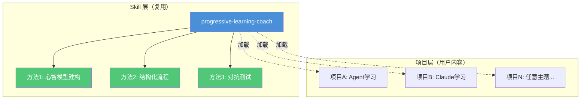
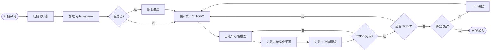
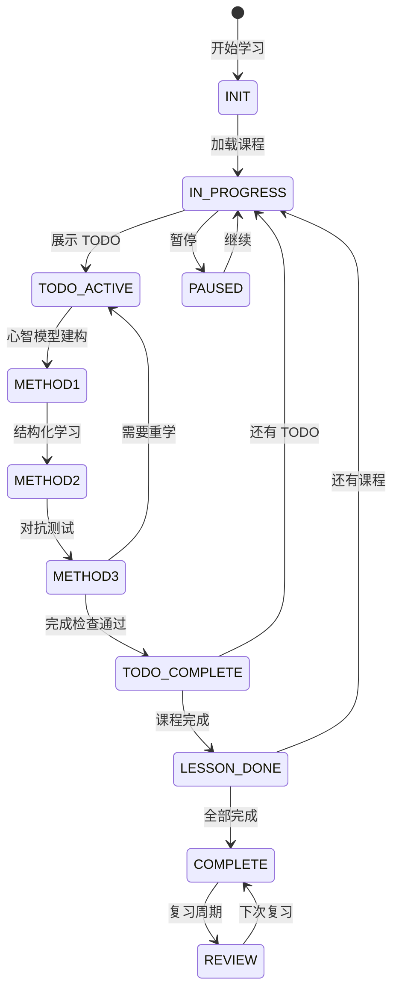
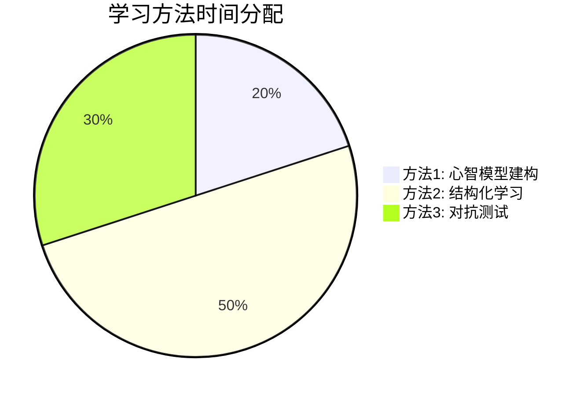
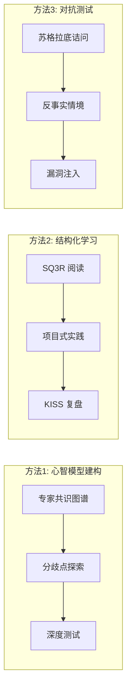
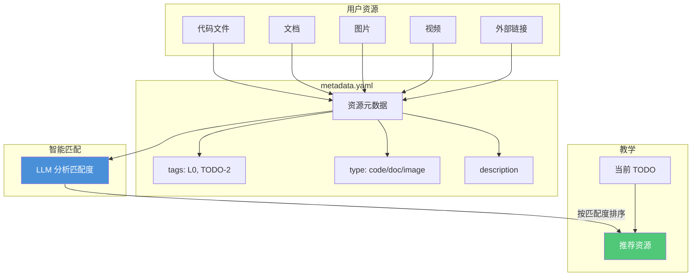
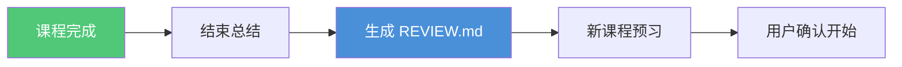

# Progressive Learning Coach

## 状态驱动的渐进式学习教练 Skill

一个通用的 AI 学习教练 Skill，实现三种渐进式学习方法：
1. **心智模型建构** - 建立专家级思维框架
2. **结构化流程管理** - SQ3R + 项目式学习 + KISS 复盘
3. **对抗性压力测试** - 苏格拉底诘问 + 反事实情境 + 漏洞注入

**核心理念**：教学方法（Skill）与课程内容（项目资源）完全分离，本 Skill 可复用于任何学习项目。

---

## 核心架构



---

## 学习流程



---

## 状态机



---

## 项目结构

```
State-driven-progressive-learning-system/    # Skill 项目
│
├── README.md                          # 本文件
├── AGENTS.md                          # 项目背景和历史
├── talk_record.md                     # 原始需求讨论记录
│
├── skills/                            # ⭐ Skill 文件（核心）
│   └── progressive-learning-coach/   # 唯一的 Skill
│       ├── SKILL.md                  # 核心协议
│       └── references/               # 方法1/2/3详细指南
│           ├── method1-mental-model.md
│           ├── method2-structured.md
│           ├── method3-adversarial.md
│           ├── coach-instructions.md
│           ├── state-machine.md      # 状态机规则
│           ├── todo-disclosure.md    # TODO 披露机制
│           ├── user-resources.md     # 用户资源处理
│           └── lesson-transition.md  # 🆕 课程过渡流程
│
├── templates/                         # 🆕 项目模板
│   └── default/
│       ├── syllabus.yaml
│       ├── lessons/
│       └── resources/                # 资源目录模板
│
├── examples/                          # 示例：如何使用本 Skill
│   └── agent-architecture-learning/  # 示例学习项目
│       ├── syllabus.yaml             # 课程大纲示例
│       └── lessons/                  # 课程内容示例
│           ├── l0-agent-essence.md
│           ├── l1-cognitive-architecture.md
│           └── l2-memory-system.md
│
├── docs/                              # Skill 设计文档
│   ├── architecture-redesign.md      # 架构设计说明
│   ├── integration-test-plan.md      # 集成测试计划
│   ├── memory-schema.md              # 存储 Schema 规范
│   └── prompts/                      # Prompt 模板参考
│
└── tests/                             # 测试（待添加）
    └── ...
```

---

## 安装方法

### 方式1：手动安装

```bash
# 复制到全局 skills 目录

# Windows
xcopy /E /I skills\progressive-learning-coach %USERPROFILE%\.config\agents\skills\

# Mac/Linux
cp -r skills/progressive-learning-coach ~/.config/agents/skills/
```

### 方式2：符号链接（开发时）

```bash
# 开发时直接链接到项目目录
ln -s $(pwd)/skills/progressive-learning-coach ~/.config/agents/skills/
```

---

## 使用方法

### 1. 创建学习项目

Skill 本身不包含课程内容，你需要创建一个学习项目：

```bash
mkdir my-learning-project
cd my-learning-project
```

### 2. 创建 syllabus.yaml

```yaml
meta:
  domain: "your-learning-topic"
  total_lessons: 3

syllabus:
  - id: "L0"
    title: "第一课"
    file: "lessons/l0-topic.md"
    prerequisites: []
    core_points:
      - "核心概念1"
      - "核心概念2"
```

### 3. 创建课程内容

```bash
mkdir lessons
cat > lessons/l0-topic.md << 'EOF'
# Lesson L0: 标题

## 学习目标
- 🔴 核心目标

## TODO 清单
### TODO-1: 任务名（🔴）
**目标**: ...
**内容**: ...
**完成检查**:
- [ ] 检查项1
EOF
```

### 4. 添加你的学习资源（可选）

将你的学习资源放入 `resources/` 目录，Skill 会在教学中智能引用：

```bash
# 创建资源目录
mkdir -p resources/code-snippets
mkdir -p resources/documents
mkdir -p resources/images

# 添加资源描述
# 编辑 resources/metadata.yaml
```

**metadata.yaml 示例**：
```yaml
resources:
  - id: "my-code-001"
    type: "code"
    path: "resources/code-snippets/my-agent.py"
    title: "我的 Agent 实现"
    description: "Python 实现的感知-思考-行动循环"
    tags: ["L0", "TODO-2"]  # 关联到 L0 的 TODO-2
    source: "user"
```

**支持的资源类型**：
- `code` - 代码文件（.py, .js, .java 等）
- `document` - 文档（.pdf, .md, .txt 等）
- `image` - 图片（.png, .jpg, .svg 等）
- `video` - 视频
- `link` - 外部链接

### 5. 开始学习

```bash
# 在项目根目录，对 AI 说：
"开始学习"
```

Skill 会：
1. 读取 `syllabus.yaml` 和 `lessons/`
2. 读取你的 `resources/`（如果有）
3. 根据当前进度展示对应的 TODO
4. 在教学中引用相关的用户资源

---

## Skill 功能

### 核心能力



| 方法 | 功能 | 占比 |
|-----|------|------|
| **方法1** | 心智模型建构（专家共识+分歧+深度测试） | ~20% |
| **方法2** | 结构化学习（SQ3R + 项目式 + KISS） | ~50% |
| **方法3** | 对抗测试（苏格拉底+反事实+漏洞注入） | ~30% |

### 三种方法详解



### 触发条件

Skill 在以下情况激活：
- 当前工作目录包含 `syllabus.yaml`
- 用户说"开始学习"、"继续"、"查看进度"

### 管理的状态

Skill 会自动创建/管理：
- `.learning/learning-state.json` - 学习进度
- `.learning/memory-store.json` - 心智模型、脆弱点日志

### 用户资源集成（特色功能）

Skill 可以读取你的学习资源并在教学中引用：



**资源类型**：代码 / 文档 / 图片 / 视频 / 链接

**智能匹配**：
- 根据 `tags` 关联到课程和 TODO
- LLM 动态分析资源与当前任务的匹配度
- 按匹配度排序展示

**引用方式**：
- 📎 直接引用用户代码进行对比分析
- 💡 提供针对性的学习建议
- 🔍 指出用户资源中的问题和改进点

**示例**：
```markdown
📎 [my-code-001] 我的 Agent 实现
   类型: Python 代码 | 匹配度: 95%

   💡 Skill 分析:
   这段代码很好地实现了感知-思考-行动循环。
   注意看第 8 行的 observe() 函数设计。

   练习：基于你的代码，添加错误处理...
```

### 课程过渡流程（新功能）

当课程完成时，自动执行过渡流程：



**流程三步骤**：

| 步骤 | 内容 | 产出 |
|------|------|------|
| 1. 结束总结 | 核心点 + 纠正点 + 心智层级评估 | 课堂总结报告 |
| 2. 快速复习 | 生成 REVIEW.md 供后续复习 | `context/{lesson}/REVIEW.md` |
| 3. 启动引导 | 预习核心问题（启发式），建立课程关联 | 新课程预习问题 |

**启发式预习原则**：
- 不暴露答案，只给思考方向
- 与上一课建立关联，帮助迁移理解
- 聚焦核心，不超过 3 个问题

---

## 示例项目

### agent-architecture-learning/

一个完整的学习项目示例，包含：

- **主题**：LLM Agent Architecture
- **课程**：L0-L2（Agent 本质论、认知架构、记忆系统）
- **格式**：syllabus.yaml + lessons/

### claude-harness-learning/

一个实际的学习项目示例，展示 Claude Code 学习：

- **主题**：Claude 混合式 Harness 学习
- **课程**：L0-L2（Claude 入门、Tool Use、Skills 与协作）
- **资源**：包含 code-snippets/ 和 documents/ 资源目录
- **特点**：完整的 metadata.yaml 资源元数据配置

### 运行示例

```bash
cd examples/agent-architecture-learning
# 对 AI 说："开始学习"
```

---

## 课程内容格式规范

### syllabus.yaml

```yaml
meta:
  domain: "学习领域"
  total_lessons: 12

syllabus:
  - id: "L0"
    title: "课程标题"
    file: "lessons/l0-topic.md"
    prerequisites: []
    core_points: ["核心点1", "核心点2"]

learning_config:
  method1_mental_model:
    enabled: true
    duration_ratio: 0.2
  method2_structured:
    enabled: true
    duration_ratio: 0.5
  method3_adversarial:
    enabled: true
    duration_ratio: 0.3
```

### lessons/*.md

```markdown
# Lesson L0: 标题

## 学习目标
- 🔴 核心目标（必须掌握）
- 🟠 重点（重要参考）
- 🟡 了解（开阔视野）

## TODO 清单

### TODO-1: 任务名（🔴）
**目标**: ...
**内容**: ...
**产出**: ...
**完成检查**:
- [ ] 检查项1

## 程度分级详情
### 🔴 核心点
| 知识点 | 为什么核心 | 不掌握的后果 |

## 对抗测试题库
### 题目 1: ...
**场景**: ...
**考点**: ...
```

---

## 设计文档

- `docs/architecture-redesign.md` - 架构设计详细说明
- `docs/memory-schema.md` - 学习状态存储规范
- `docs/integration-test-plan.md` - 集成测试计划
- `docs/prompts/` - 三种学习方法的 Prompt 模板

---

## 开发状态

| 组件 | 状态 |
|-----|------|
| Skill 核心协议 | ✅ 完成 |
| 方法1 Prompt | ✅ 完成 |
| 方法2 Prompt | ✅ 完成 |
| 方法3 Prompt | ✅ 完成 |
| 课程过渡流程 | ✅ 完成 |
| 心智模型评估 | ✅ 完成 |
| 示例项目 L0-L2 | ✅ 完成 |
| 集成测试 | 🔄 待验证 |
| L3-L11 示例 | ⏳ 可选 |

---

## 如何贡献

### 报告 Bug

如果发现 Skill 行为不符合预期，请提供：
1. 使用的 `syllabus.yaml` 内容
2. 用户输入和 Skill 输出
3. 预期行为

### 改进 Skill

1. 修改 `skills/progressive-learning-coach/SKILL.md`
2. 在示例项目中测试
3. 提交改进

### 添加示例项目

1. 在 `examples/` 创建新目录
2. 添加完整的 `syllabus.yaml` 和 `lessons/`
3. 更新本 README 的示例列表

---

## 相关项目

本 Skill 可与以下 Skills 配合使用：
- `mermaid-visualizer` - 生成学习流程图
- `excalidraw-diagram` - 绘制知识架构图
- `obsidian-canvas-creator` - 创建思维导图

---

**开始使用**：
1. 安装 Skill 到全局目录
2. 进入 `examples/agent-architecture-learning/`
3. 对 AI 说：**"开始学习"**
