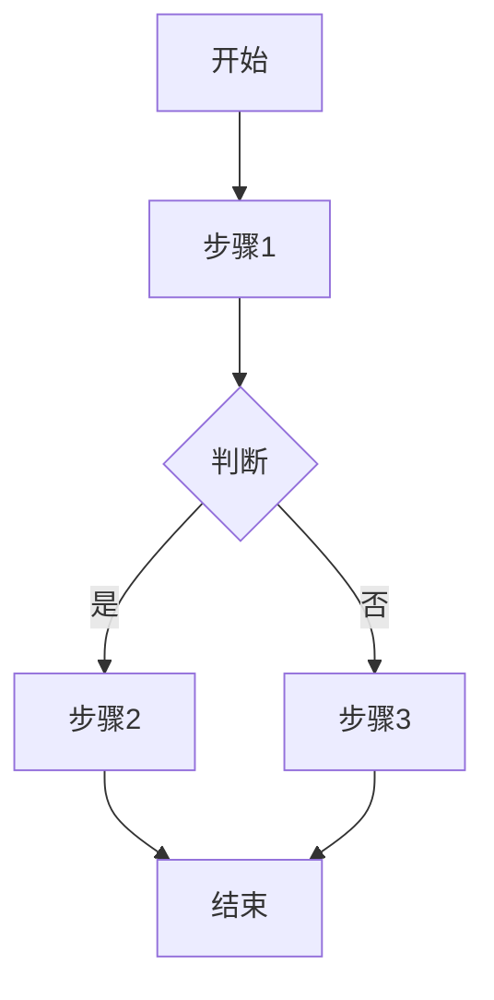
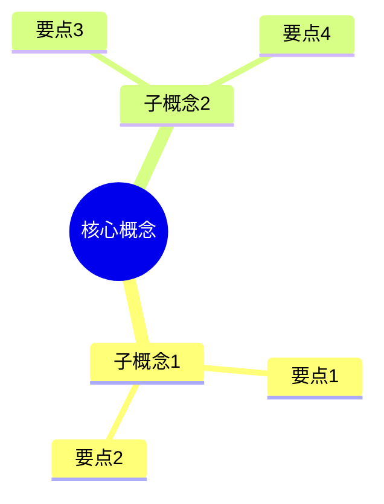

# Context 功能设计文档

> 版本：v1.2.0
> 更新日期：2026-03-29

## 概述

Context 是 Progressive Learning Coach 的核心功能之一，为每个课程生成完整的知识总结，帮助学生快速掌握核心内容并通过三种方法论的考验。

---

## 一、功能目标

Context 的设计目标是让学生看完总结后能够：

### 1. 心智模型构建

- 理解核心概念和关键要点
- 掌握专家共识与分歧
- 通过深度测试验证理解

### 2. 结构化学习

- 掌握 SQ3R 学习流程
- 完成项目式实践
- 进行 KISS 复盘

### 3. 对抗性压力测试

- 识别并修复脆弱点
- 应对反事实情境
- 通过漏洞注入检验

---

## 二、输出格式

Context 支持四种输出格式，满足不同使用场景：

| 格式 | 文件 | 用途 | 渲染平台 |
|------|------|------|----------|
| Markdown 总结 | `summary.md` | 完整知识总结 | 任意 Markdown 编辑器 |
| Mermaid 图表 | `diagrams.md` | 流程图、思维导图 | Obsidian、GitHub 等 |
| Obsidian Canvas | `mindmap.canvas.json` | 交互式思维导图 | Obsidian |
| Excalidraw 图 | `architecture.excalidraw.md` | 手绘风格架构图 | Obsidian、excalidraw.com |

---

## 三、目录结构

```
项目根目录/
├── syllabus.yaml              # 课程大纲
├── lessons/                   # 课程内容
├── resources/                 # 用户资源
│   └── metadata.yaml          # 资源索引
├── .learning/                 # 学习状态
│   ├── learning-state.json    # 进度状态
│   └── memory-store.json      # 记忆数据
│
└── context/                   # Context 输出目录
    ├── L0/                    # 课程 L0 的 Context
    │   ├── summary.md         # Markdown 总结
    │   ├── diagrams.md        # Mermaid 图表
    │   ├── mindmap.canvas.json     # Obsidian Canvas
    │   ├── architecture.excalidraw.md  # Excalidraw 架构图
    │   └── context-meta.yaml  # 元数据（增量更新）
    ├── L1/
    │   └── ...
    └── L2/
        └── ...
```

---

## 四、CLI 命令

```bash
# 为当前课程生成 Context
plc context

# 为指定课程生成 Context
plc context L0

# 强制重新生成（忽略增量检测）
plc context --force

# 检查是否需要更新
plc context --check

# 只生成特定类型
plc context --type md          # 只生成 Markdown
plc context --type mermaid     # 只生成 Mermaid
plc context --type canvas      # 只生成 Canvas
plc context --type excalidraw  # 只生成 Excalidraw
```

---

## 五、触发条件

Context 可以通过以下方式触发：

### 1. 手动触发

用户输入关键词：
- `生成 context`
- `生成课程总结`
- `create context`

### 2. 自动检测

- 检测到 `resources/` 目录有新资源添加
- 课程状态变为 `completed`
- TODO 完成数发生变化

---

## 六、内容来源映射

Context 的内容来源于多个数据源：

| Context 内容 | 数据来源 | 优先级 |
|-------------|----------|--------|
| 核心概念 | `syllabus.core_points` | 高 |
| 课程详情 | `lessons/l*.md` | 高 |
| 学习进度 | `.learning/learning-state.json` | 高 |
| 脆弱点记录 | `.learning/memory-store.json` | 高 |
| 用户资源 | `resources/metadata.yaml` | 中 |

---

## 七、Markdown 总结模板

生成的 Markdown 总结包含以下章节：

```markdown
# [课程 ID] 知识总结

## 1. 心智模型构建

### 1.1 核心概念
- 概念定义
- 关键要点
- 专家共识

### 1.2 专家分歧
- 争议点描述
- 各方观点
- 学生立场

### 1.3 深度测试
- 测试题目
- 预期陷阱
- 答案要点

## 2. 结构化学习

### 2.1 SQ3R 流程
| 阶段 | 内容 | 状态 |
|------|------|------|
| Survey | 浏览概要 | ✅ |
| Question | 提出问题 | ✅ |
| Read | 阅读材料 | 🔄 |
| Recite | 复述检验 | ⏳ |
| Review | 复习巩固 | ⏳ |

### 2.2 项目成果
- MVP 实现描述
- 关键代码片段

### 2.3 KISS 复盘
- **Keep**: 保持的做法
- **Improve**: 需要改进
- **Stop**: 应该停止
- **Start**: 开始尝试

## 3. 对抗测试

### 3.1 脆弱点诊断
| 弱点类型 | 详情 | 状态 |
|----------|------|------|
| 边界条件误解 | ... | 已修复 |

### 3.2 反事实情境
- 如果...会怎样？

### 3.3 漏洞注入
- Buggy Code 分析
```

---

## 八、Mermaid 图表

### 8.1 流程图

展示课程核心流程：



### 8.2 思维导图

展示概念层级：



---

## 九、增量更新机制

### context-meta.yaml 结构

```yaml
version: "1.0.0"
lesson_id: "L0"
generated_at: "2026-03-29T15:00:00"
generator_version: "1.2.0"

# 源数据快照
source_snapshot:
  syllabus_hash: "abc123..."
  lesson_file_hash: "def456..."
  todos_completed: 5
  learning_state_hash: "ghi789..."

# 输出文件清单
outputs:
  - type: "markdown"
    file: "summary.md"
    size: 15000
  - type: "mermaid"
    file: "diagrams.md"
    size: 5000

# 更新历史
update_history:
  - timestamp: "2026-03-29T15:00:00"
    trigger: "manual"
    changes: ["initial generation"]
```

### 变化检测逻辑

1. 检查 `context-meta.yaml` 是否存在
2. 比较源文件修改时间
3. 检测 TODO 完成数变化
4. 检测学习状态变化

---

## 十、相关文件

| 文件 | 说明 |
|------|------|
| `references/context-generation/` | 拆分后的参考文档（入口 + EXECUTION + templates + IMPLEMENTATION） |
| `bin/commands/context.js` | CLI 命令实现 (853 行) |
| `SKILL.md` | Context 章节定义 |
| `.skills/mermaid-visualizer/SKILL.md` | Mermaid 生成参考 |
| `.skills/excalidraw-diagram/SKILL.md` | Excalidraw 生成参考 |
| `.skills/obsidian-canvas-creator/SKILL.md` | Canvas 生成参考 |

---

## 十一、版本历史

| 版本 | 日期 | 变更 |
|------|------|------|
| v1.2.0 | 2026-03-29 | 新增 Context 功能 |
| v1.1.0 | 2026-03-29 | 重构 SKILL.md，添加多项目管理 |
| v1.0.0 | - | 初始版本 |

---

## 十二、后续优化

### P2 优先级（待实现）

- [ ] 自动触发确认 UI
- [ ] Context 更新通知
- [ ] 多语言支持
- [ ] 自定义模板

### P3 优先级（未来规划）

- [ ] AI 自动生成测试题
- [ ] 学习路径推荐
- [ ] 跨课程知识图谱