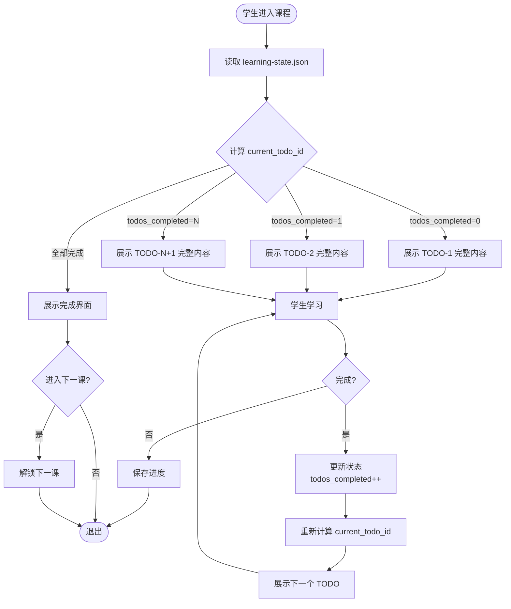
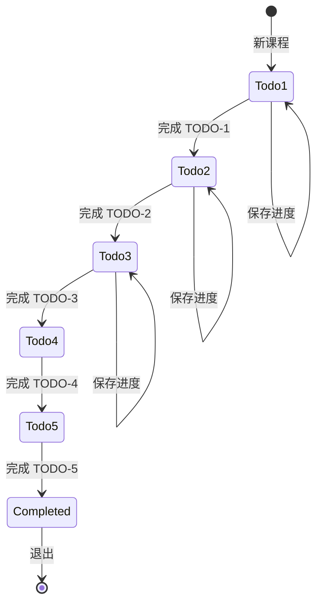
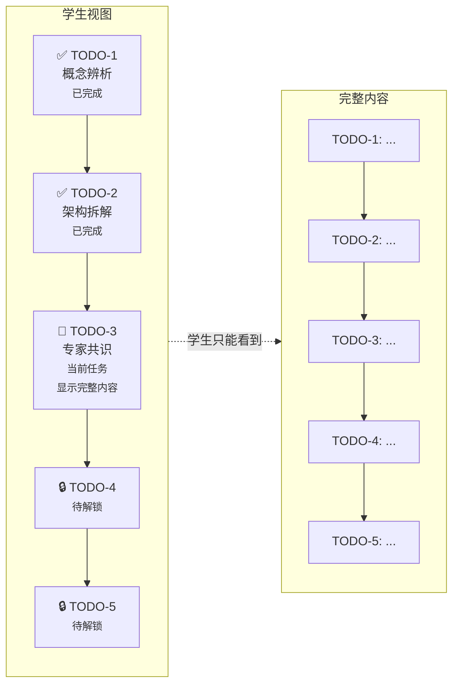
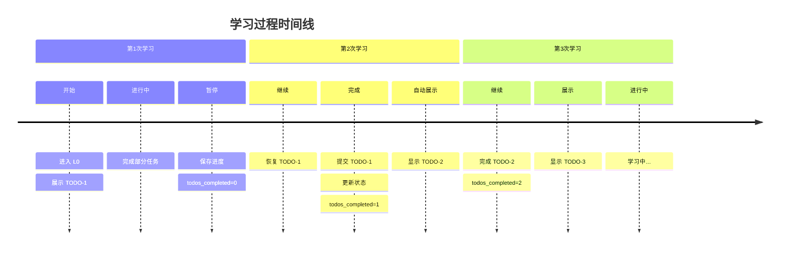
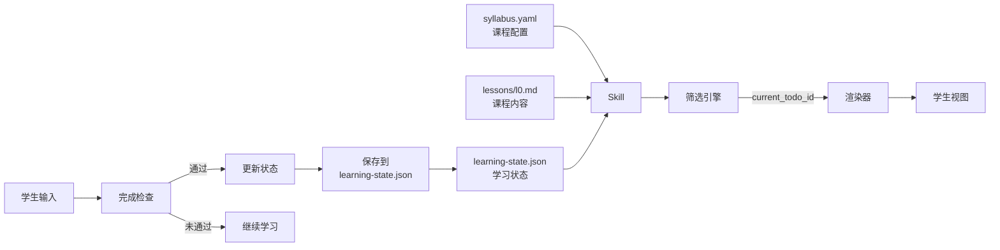

# TODO 渐进披露可视化

## 流程图

```mermaid
graph TD
    Start([学生进入课程]) --> ReadState[读取 learning-state.json]
    ReadState --> CalcCurrent{计算 current_todo_id}
    
    CalcCurrent -->|todos_completed=0| ShowTodo1[展示 TODO-1 完整内容]
    CalcCurrent -->|todos_completed=1| ShowTodo2[展示 TODO-2 完整内容]
    CalcCurrent -->|todos_completed=N| ShowTodoN[展示 TODO-N+1 完整内容]
    CalcCurrent -->|全部完成| ShowComplete[展示完成界面]
    
    ShowTodo1 --> StudentWork[学生学习]
    ShowTodo2 --> StudentWork
    ShowTodoN --> StudentWork
    
    StudentWork --> CompleteCheck{完成?}
    
    CompleteCheck -->|否| SaveProgress[保存进度]
    CompleteCheck -->|是| UpdateState[更新状态<br/>todos_completed++]
    
    SaveProgress --> Exit([退出])
    UpdateState --> ReCalc[重新计算 current_todo_id]
    
    ReCalc --> ShowNext[展示下一个 TODO]
    ShowNext --> StudentWork
    
    ShowComplete --> NextLesson{进入下一课?}
    NextLesson -->|是| Unlock[解锁下一课]
    NextLesson -->|否| Exit
    Unlock --> Exit
```

## 状态流转

```mermaid
stateDiagram-v2
    [*] --> Todo1: 新课程
    
    Todo1 --> Todo2: 完成 TODO-1
    Todo2 --> Todo3: 完成 TODO-2
    Todo3 --> Todo4: 完成 TODO-3
    Todo4 --> Todo5: 完成 TODO-4
    Todo5 --> Completed: 完成 TODO-5
    
    Completed --> [*]: 退出
    
    Todo1 --> Todo1: 保存进度
    Todo2 --> Todo2: 保存进度
    Todo3 --> Todo3: 保存进度
```

## 可见性状态

```mermaid
graph LR
    subgraph 学生视图
    direction TB
    C1[✅ TODO-1<br/>概念辨析<br/><small>已完成</small>] --> C2
    C2[✅ TODO-2<br/>架构拆解<br/><small>已完成</small>] --> Current
    
    Current[📍 TODO-3<br/>专家共识<br/><small>当前任务<br/>显示完整内容</small>]
    
    Current --> L4
    L4[🔒 TODO-4<br/><small>待解锁</small>] --> L5
    L5[🔒 TODO-5<br/><small>待解锁</small>]
    end
    
    subgraph 完整内容
    direction TB
    F1[TODO-1: ...] --> F2[TODO-2: ...]
    F2 --> F3[TODO-3: ...]
    F3 --> F4[TODO-4: ...]
    F4 --> F5[TODO-5: ...]
    end
    
    学生视图 -.->|学生只能看到| 完整内容
```

## 时间线示例

```mermaid
timeline
    title 学习过程时间线
    
    section 第1次学习
        开始 : 进入 L0
             : 展示 TODO-1
        进行中 : 完成部分任务
        暂停 : 保存进度
             : todos_completed=0
             
    section 第2次学习
        继续 : 恢复 TODO-1
        完成 : 提交 TODO-1
             : 更新状态
             : todos_completed=1
        自动展示 : 显示 TODO-2
        
    section 第3次学习
        继续 : 完成 TODO-2
             : todos_completed=2
        展示 : 显示 TODO-3
        进行中 : 学习中...
```

## 数据流

```mermaid
graph LR
    A[syllabus.yaml<br/>课程配置] --> B[Skill]
    C[lessons/l0.md<br/>课程内容] --> B
    D[learning-state.json<br/>学习状态] --> B
    
    B --> E[筛选引擎]
    E -->|current_todo_id| F[渲染器]
    
    F --> G[学生视图]
    
    H[学生输入] --> I[完成检查]
    I -->|通过| J[更新状态]
    I -->|未通过| K[继续学习]
    
    J --> L[保存到<br/>learning-state.json]
    L --> D
```
