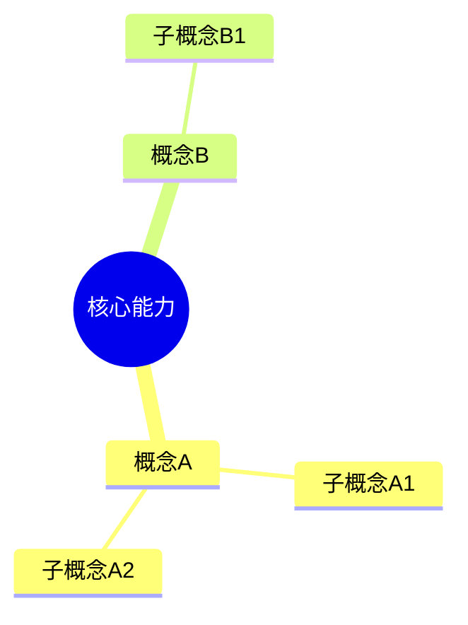

# Context 生成执行指令

本文档定义AI执行Context生成的具体步骤。

---

## 触发时机

| 条件 | 触发方式 |
|-----|---------|
| 课程完成 | 自动触发（lesson-transition流程） |
| 用户请求 | 用户说"生成 context" |

---

## 执行流程

```
Step 1: 读取输入数据（按顺序）
    │
    ▼
Step 2: 选择模板类型
    │
    ▼
Step 3: 生成输出产物
    │
    ▼
Step 4: 更新元数据
```

---

## Step 1: 输入数据（按顺序读取）

| 序号 | 文件路径 | 用途 | 必需性 |
|-----|---------|-----|--------|
| 1 | `.learning/learning-state.json` | 进度、SQ3R状态、掌握度 | 必需 |
| 2 | `.learning/memory-store.json` | 脆弱点、KISS复盘、交互历史 | 必需 |
| 3 | `syllabus.yaml` | core_points定义、课程元数据 | 必需 |
| 4 | `lessons/{current_lesson}.md` | 概念定义、专家观点、深度问题 | 必需 |

**数据提取要点**：

- 从 `learning-state.json` 获取：
  - `current_phase` / `current_lesson`
  - `syllabus_progress[{lesson}].todos_completed`
  - `syllabus_progress[{lesson}].mastery_score`

- 从 `memory-store.json` 获取：
  - `fragile_points` → 脆弱点诊断
  - `kiss_reviews` → KISS复盘
  - `mental_models` → 概念掌握度

- 从 `syllabus.yaml` 获取：
  - `core_points` → 核心概念列表
  - `meta.domain` → 学习领域

---

## Step 2: 选择模板类型

| 场景 | 模板 | 输出文件 |
|-----|-----|---------|
| 课程完成 | 完整模板 | `README.md` + `REVIEW.md` |
| 进度更新 | 快速模板 | 只更新 `README.md` |
| 用户请求"生成context" | 完整模板 | 全部文件 |

**完整模板输出**（课程完成时）：
- `context/{lesson}/README.md` - 知识总结
- `context/{lesson}/REVIEW.md` - 快速复习
- `context/{lesson}/flowchart.mermaid.md` - 学习流程图
- `context/{lesson}/mindmap.mermaid.md` - 概念思维导图
- `context/{lesson}/context-meta.yaml` - 元数据（增量更新）

**快速模板输出**（进度更新时）：
- 只更新 `README.md` 的"当前状态"部分
- 更新 `context-meta.yaml` 的 `changelog`

---

## Step 3: 生成输出产物

### README.md 结构（按 templates.md 定义）

必需章节：
1. **元信息** - 时间、阶段、进度
2. **心智模型构建** - 核心概念网络、专家视角、深度测试
3. **结构化学习** - SQ3R进度、项目成果、KISS复盘
4. **对抗测试** - 脆弱点诊断、反事实情境、漏洞注入
5. **行动指引** - 即时任务、里程碑

### flowchart.mermaid.md 结构

生成条件：SQ3R状态变化或课程完成

```mermaid
flowchart TD
    subgraph SQ3R["SQ3R 学习法"]
        S1[Survey: 浏览] --> S2[Question: 问题]
        S2 --> S3[Read: 阅读]
        S3 --> S4[Recite: 复述]
        S4 --> S5[Review: 复习]
    end

    style S1 fill:#e8f5e9  # 完成
    style S2 fill:#fff3e0  # 进行中
    style S3 fill:#e1f5fe  # 未开始
```

**节点颜色规则**：
| 状态 | 颜色 |
|-----|------|
| 完成 | `#e8f5e9`（浅绿） |
| 进行中 | `#fff3e0`（浅橙） |
| 未开始 | `#e1f5fe`（浅蓝） |
| 脆弱点 | `#ffebee`（浅红） |

### mindmap.mermaid.md 结构

生成条件：核心概念变化或课程完成



**深度控制**：不超过4层

### REVIEW.md 结构（课程完成时）

按 `lesson-transition.md` 的模板生成，包含：
- 核心代码（必背）
- 关键概念速记（一句话定义 + 记忆口诀）
- 核心原则（面试必答）
- 常见陷阱
- 自测问题

---

## Step 4: 更新元数据

更新 `context-meta.yaml`：

```yaml
changelog:
  - timestamp: "{{now}}"
    changes:
      - type: "update"
        field: "state_snapshot.overall_progress"
        old_value: 0.45
        new_value: 0.60
```

---

## 格式约束

### 必需遵守

1. **不暴露未来课程内容**
   - Context只包含当前课程和已完成课程的内容
   - 不提及未解锁课程的核心概念

2. **深度测试问题格式**
   ```markdown
   > **Q1**: [问题]
   >
   > **预期理解层级**：
   > - L0（表面）：[描述]
   > - L1（关联）：[描述]
   > - L2（深层）：[描述]
   ```

3. **概念熟练度标记**
   | 熟练度 | 标记 |
   |--------|------|
   | 高 | ✅ 已掌握 |
   | 中 | ⚠️ 需巩固 |
   | 低 | ❌ 待学习 |

### 禁止行为

- ❌ 不要生成Python代码或正则表达式
- ❌ 不要在README.md中复制lessons全文（只提取关键概念）
- ❌ 不要在REVIEW.md中暴露深度测试答案（使用 `<details>` 折叠）
- ❌ 不要跳过对抗测试章节（即使是快速模板）

---

## 与其他流程的协作

### 课程完成时（lesson-transition.md）

```
课程完成检测
    │
    ▼
生成结束总结（lesson-transition Step 1）
    │
    ▼
生成 REVIEW.md（lesson-transition Step 2）
    │
    ▼
生成 README.md + flowchart + mindmap（本流程）
    │
    ▼
更新 context-meta.yaml
    │
    ▼
解锁下一课
```

### 用户请求"生成context"

```
用户说"生成 context"
    │
    ▼
读取输入数据（本流程 Step 1）
    │
    ▼
生成全部产物（完整模板）
    │
    ▼
告知用户产物位置
```

---

## 输出目录结构

```
context/
├── {lesson}/
│   ├── README.md           # 知识总结（每次更新）
│   ├── REVIEW.md           # 快速复习（课程完成时）
│   ├── flowchart.mermaid.md # 流程图（状态变化时）
│   ├── mindmap.mermaid.md  # 思维导图（概念变化时）
│   └── context-meta.yaml   # 元数据（每次更新）
└── shared/
    └── templates/          # 共享模板（可选）
```

---

## 附录：字段来源速查

| Context字段 | 数据来源文件 | 字段路径 |
|------------|-------------|---------|
| 核心概念 | syllabus.yaml | `core_points[].name` |
| 概念定义 | lessons/*.md | 标题层级提取 |
| SQ3R状态 | learning-state.json | `syllabus_progress[{lesson}].sq3r` |
| 脆弱点 | memory-store.json | `fragile_points` |
| KISS复盘 | memory-store.json | `kiss_reviews` |
| 掌握度 | memory-store.json | `mental_models[{concept}].confidence` |

详细模板定义见 `templates.md`。