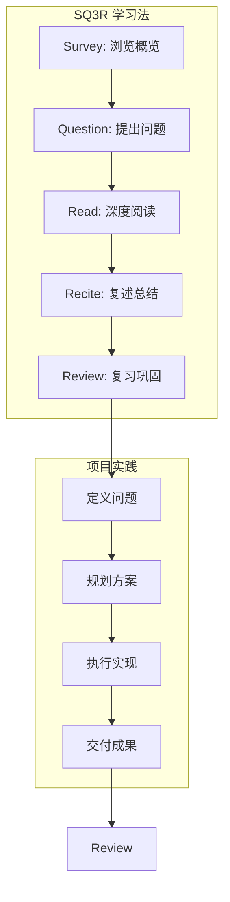
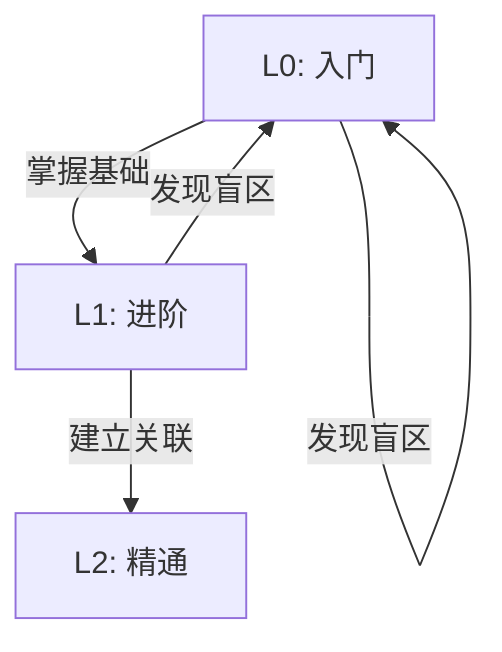
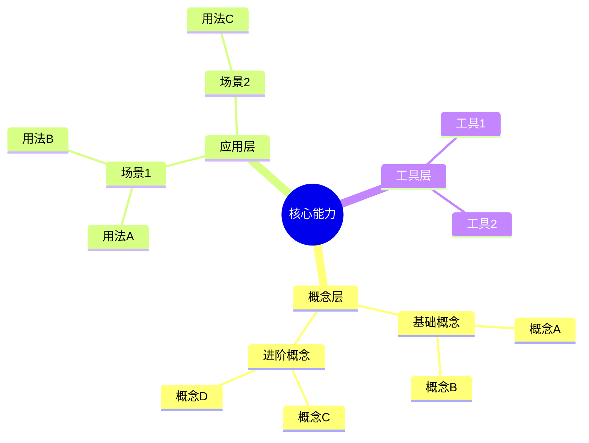
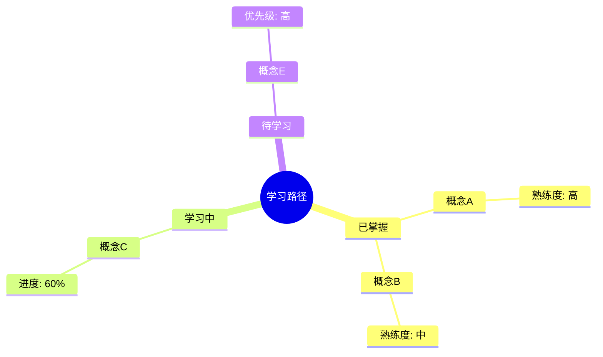

# Context 输出模板定义

本文档定义Context生成的输出格式，供AI参考。

---

## README.md 模板

### 元信息（必需）

```markdown
## 元信息
- **生成时间**：YYYY-MM-DD HH:mm
- **阶段**：[L{n}]
- **核心能力**：[从syllabus.core_points提取]
- **学习进度**：[百分比]
```

### 一、心智模型构建（必需）

```markdown
## 一、心智模型构建

### 1.1 核心概念网络

| 概念 | 定义 | 依赖关系 | 熟练度 |
|------|------|----------|--------|
| [概念1] | [从lessons提取] | → [前置概念] | ✅/⚠️/❌ |
| [概念2] | [从lessons提取] | → [前置概念] | ✅/⚠️/❌ |

### 1.2 专家视角

#### 专家共识
- **[议题]**：[从lessons专家观点提取]

#### 专家分歧
- **[议题]**：
  - 观点A：[描述]
  - 观点B：[描述]
  - 学习者理解：[当前认知]

### 1.3 深度测试问题

> **Q1**: [问题]
>
> **预期理解层级**：
> - L0（表面）：[描述]
> - L1（关联）：[描述]
> - L2（深层）：[描述]
```

**数据来源**：
| 字段 | 来源文件 | 提取方式 |
|------|---------|---------|
| 概念定义 | lessons/*.md | 标题层级解析 |
| 专家共识 | lessons/*.md | "专家观点"章节 |
| 深度问题 | lessons/*.md 或 syllabus | 对抗测试题库 |

### 二、结构化学习（必需）

```markdown
## 二、结构化学习

### 2.1 SQ3R 进度

| 阶段 | 状态 | 关键产出 | 下一步 |
|------|------|----------|--------|
| Survey | ✅/⚠️/❌ | [产出] | [行动] |
| Question | ✅/⚠️/❌ | [产出] | [行动] |
| Read | ✅/⚠️/❌ | [产出] | [行动] |
| Recite | ✅/⚠️/❌ | [产出] | [行动] |
| Review | ✅/⚠️/❌ | [产出] | [行动] |

### 2.2 项目成果

| 项目 | 状态 | 关键交付物 | 学习价值 |
|------|------|-----------|----------|
| [项目1] | [状态] | [交付物] | [价值] |

### 2.3 KISS 复盘

| 类别 | 内容 |
|------|------|
| **Keep** | [从memory-store提取] |
| **Improve** | [从memory-store提取] |
| **Start** | [从memory-store提取] |
| **Stop** | [从memory-store提取] |
```

**数据来源**：
| 字段 | 来源文件 | 字段路径 |
|------|---------|---------|
| SQ3R状态 | learning-state.json | `syllabus_progress[{lesson}].sq3r` |
| 项目成果 | memory-store.json | `artifacts` 或 `.learning/artifacts/` |
| KISS | memory-store.json | `kiss_reviews` |

### 三、对抗测试（必需）

```markdown
## 三、对抗测试

### 3.1 脆弱点诊断

| 脆弱点 | 来源 | 风险等级 | 补救措施 |
|--------|------|----------|----------|
| [从memory-store提取] | [历史错误/预测] | 高/中/低 | [措施] |

### 3.2 反事实情境

> **情境**：[假设条件]
>
> **问题**：在这种情境下，[会发生什么]？
>
> **测试目标**：验证对 [概念] 的深层理解

### 3.3 漏洞注入测试

> **以下内容包含错误，请识别并纠正**：
>
> [包含故意错误的内容]
>
> **错误类型**：概念错误/逻辑错误/事实错误
```

**数据来源**：
| 字段 | 来源文件 | 字段路径 |
|------|---------|---------|
| 脆弱点 | memory-store.json | `fragile_points` |
| 反事实 | 根据脆弱点生成 | - |
| 漏洞注入 | lessons对抗题库 | `对抗测试题库` |

### 四、费曼检验（可选，课程完成时）

```markdown
## 四、费曼检验

### 概念解释检验

| 概念 | 能简单解释 | 能类比迁移 | 能回答追问 | 检验结果 |
|------|-----------|-----------|-----------|----------|
| [概念1] | ✅ | ✅ | ✅ | 通过 |
| [概念2] | ✅ | ⚠️ | ✅ | 需巩固 |
```

### 五、行动指引（必需）

```markdown
## 五、行动指引

### 5.1 即时任务
- [ ] [任务1]
- [ ] [任务2]

### 5.2 本阶段目标
1. [目标1]
2. [目标2]

### 5.3 里程碑检查点
- [ ] [检查点1] - 预计：[日期]
```

---

## 快速模板（进度更新时）

```markdown
# [阶段] 快速 Context

## 当前状态
- **阶段**：L{n}
- **进度**：[百分比]
- **核心任务**：[当前TODO]

## 关键更新
- **已完成**：[内容]
- **进行中**：[内容]
- **待开始**：[内容]

## 脆弱点
1. [弱点1]
2. [弱点2]

## 下一步行动
1. [行动1]
2. [行动2]
```

---

## flowchart.mermaid.md 模板

### 学习流程图



### 状态转换图



### 节点样式规则

| 节点类型 | Mermaid语法 | 示例 |
|----------|-------------|------|
| 普通节点 | `A[描述]` | `A[执行操作]` |
| 决策节点 | `B{条件?}` | `B{是否通过?}` |
| 起点/终点 | `D((开始))` | `D((开始))` |
| 数据库 | `C[(存储)]` | `C[(数据库)]` |

### 颜色编码

| 状态 | 颜色代码 | 使用场景 |
|------|----------|----------|
| 完成 | `#e8f5e9` | 已完成任务、已掌握概念 |
| 进行中 | `#fff3e0` | 当前活动、学习中概念 |
| 未开始 | `#e1f5fe` | 待执行步骤 |
| 脆弱/警告 | `#ffebee` | 脆弱点、错误风险 |
| 输出/结果 | `#f3e5f5` | 交付物、成果 |

---

## mindmap.mermaid.md 模板

### 概念思维导图



### 学习进度思维导图



### 层级规则

| 层级 | 内容 | 来源 |
|------|------|------|
| root | 核心能力/主题 | syllabus.title 或 core_points汇总 |
| 一级分支 | 核心概念 | syllabus.core_points[].name |
| 二级分支 | 子概念 | lessons标题层级 或 core_points.sub_points |
| 三级分支 | 具体知识点 | lessons内容提取 |
| 四级分支（可选） | 细节 | lessons详细内容 |

**深度限制**：不超过4层，超过时折叠为 `... (更多内容已折叠)`

---

## REVIEW.md 模板（课程完成时）

按 `lesson-transition.md` 定义的结构生成，必需章节：

```markdown
# {lesson_id}: {title} - 快速复习

> **格言**: "[从syllabus或lessons提取]"

---

## 核心代码（必背）

[关键代码片段]

---

## 关键概念速记

| 概念 | 一句话定义 | 记忆口诀 |
|------|-----------|----------|
| [概念] | [定义] | "[口诀]" |

---

## 核心原则（面试必答）

### 1. [原则名]
[原则定义]

---

## 常见陷阱

| 陷阱 | 错误理解 | 正确理解 |
|------|----------|----------|
| [陷阱] | [错误] | [正确] |

---

## 自测问题

1. **[问题]**
   <details>
   <summary>点击查看答案</summary>
   [L2级答案]
   </details>
```

---

## context-meta.yaml 模板

### 基本结构

```yaml
version: "1.0"
generated_at: "YYYY-MM-DDTHH:mm:ss"
phase: "L{n}"

# 状态快照
state_snapshot:
  current_phase: "L{n}"
  overall_progress: 0.xx
  sq3r_status:
    survey: completed/in_progress/not_started
    question: ...
    read: ...
    recite: ...
    review: ...
  mastery_levels:
    "{concept_id}": 0.xx

# 脆弱点追踪
fragile_points:
  - id: "fp-xxx"
    concept_id: "cp-xxx"
    severity: high/medium/low
    last_tested: "YYYY-MM-DD"
    pass_rate: 0.xx

# 变更日志
changelog:
  - timestamp: "YYYY-MM-DDTHH:mm:ss"
    changes:
      - type: update/add/delete
        field: "字段路径"
        old_value: ...
        new_value: ...
```

### 字段定义

| 字段 | 类型 | 说明 |
|------|------|------|
| `version` | string | 元数据格式版本 |
| `generated_at` | datetime | 生成时间戳 |
| `phase` | string | 当前学习阶段 |
| `state_snapshot` | map | 状态快照 |
| `fragile_points` | list | 脆弱点列表 |
| `changelog` | list | 变更日志 |

---

## 熟练度标记规则

| 熟练度 | 图标 | Markdown | 判断标准 |
|--------|------|----------|----------|
| 高（已掌握） | ✅ | `✅` | confidence >= 0.8 或 测试通过率 >= 80% |
| 中（需巩固） | ⚠️ | `⚠️` | confidence 0.5-0.8 或 测试通过率 50-80% |
| 低（待学习） | ❌ | `❌` | confidence < 0.5 或 未测试 |

---

## 禁止写入的内容

以下内容不应出现在Context中：

1. **Python代码或正则表达式** - 这是开发者实现细节
2. **完整课程原文** - 只提取关键概念，不复制全文
3. **未解锁课程内容** - 不暴露未来课程的核心概念
4. **深度测试答案（REVIEW.md）** - 使用 `<details>` 折叠隐藏