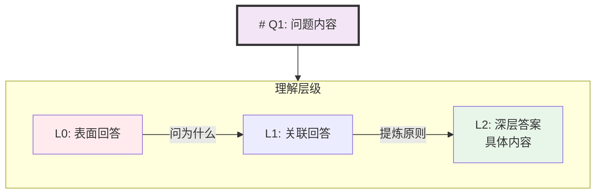
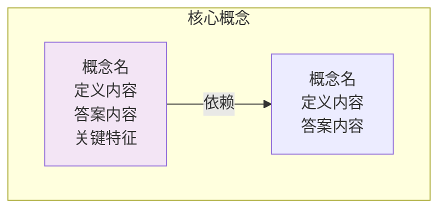
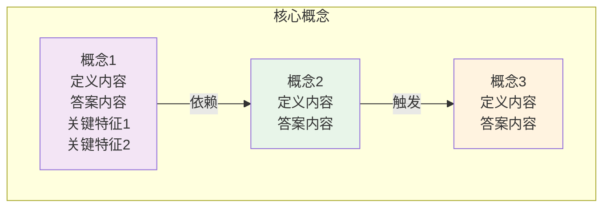
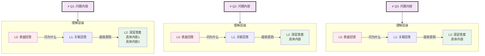
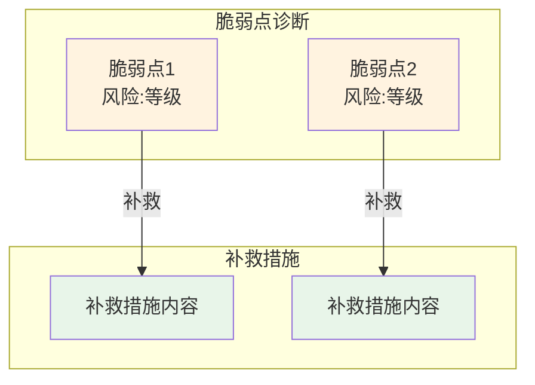
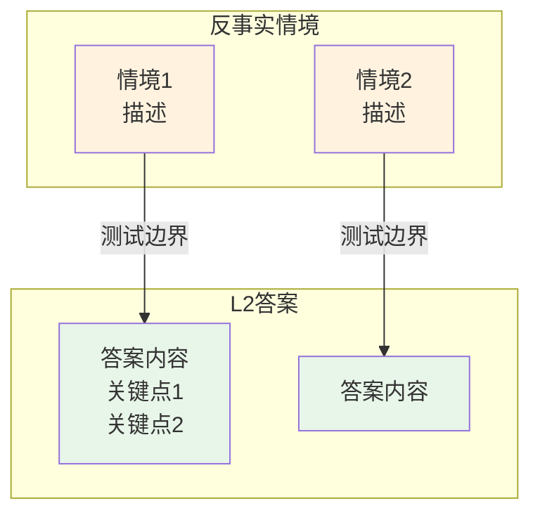
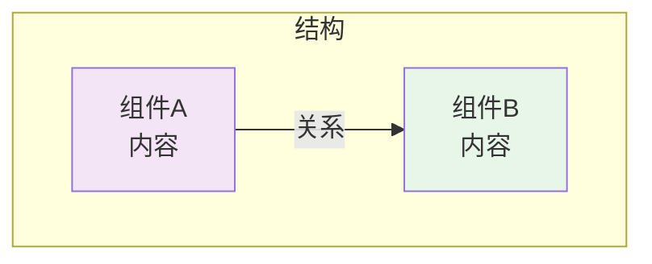

# Fast Learn Flowchart 生成器

## 目标

生成与 README.md 结构对应的 flowchart.mermaid.md，展示：
- 知识结构边界清晰
- 心智模型视角（概念网络、专家视角、测试边界）
- 工程视角（结构图、机制图、问题方案图）

---

## 必须做（Must Do）

### 1. 结构映射

| flowchart章节 | 对应README章节 | 内容来源 |
|---------------|----------------|----------|
| 一 | 1.1 核心概念网络 | 概念定义+依赖关系+熟练度 |
| 二 | 1.2 专家视角 | 共识+分歧 |
| 三 | 1.3 深度测试 | Q1-Q3的理解层级边界 |
| 四 | 3.1-3.2 对抗测试 | 脆弱点诊断+反事实情境 |
| 五 | 四 补充知识 | 验证体系/扩展知识 |
| 六-八 | 工程视角 | 从原文提取的结构图 |

### 2. 内容呈现规则

| 规则 | 说明 |
|------|------|
| **L2→答案** | 第一点的核心概念节点不显示"熟练度:L2"，显示具体答案内容 |
| **问题放大** | 第三点深度测试的问题标题用粗体+特殊样式（`**Q1: 问题**`） |
| **标题对应** | 每个图标题必须注明"对应README X.X" |
| **两部分融合** | 前五章=心智模型视角，后三章=工程视角 |

### 3. 章节标题格式

```markdown
## X、章节标题（对应README X.X）
```

**必须包含括号内的对应关系说明。**

### 4. 深度测试图格式（第三点）



**关键**：
- TITLE节点使用 `#` 符号放大显示
- TITLE节点样式：粗边框+特殊颜色
- L2节点显示具体答案内容，不只是"L2"

### 5. 核心概念图格式（第一点）



**关键**：
- 每个概念节点包含：定义+答案+关键特征
- 不包含"熟练度:✅L2"标签
- 用颜色区分不同概念类型

### 6. 颜色编码

| 状态/类型 | 颜色代码 | 使用场景 |
|----------|----------|----------|
| 核心概念 | `#f3e5f5` | Skills等核心概念节点 |
| 完成/正确 | `#e8f5e9` | L2答案、已修正、正确方案 |
| 进行中/测试 | `#fff3e0` | 脆弱点、反事实情境、分歧 |
| 未开始/表面 | `#e1f5fe` | 发现阶段、未开始状态 |
| 错误/风险 | `#ffebee` | L0理解、问题、风险点 |

### 7. 工程结构图规则（六-八）

**保留原文工程结构**：
- 六：Skills目录结构 + SKILL.md内部结构
- 七：渐进式披露三阶段流程
- 八：三问题→三方案映射

**不与README章节对应**，标注"工程视角"。

---

## 必须不做（Must Not Do）

| 禁止行为 | 原因 |
|----------|------|
| ❌ 第一点显示"熟练度:L2" | 用户要求：L2改成答案内容 |
| ❌ 第三点问题标题无样式 | 用户要求：问题字体写大一点 |
| ❌ 章节标题不写对应关系 | 必须注明"对应README X.X" |
| ❌ 复制README全文 | 只提取关键结构和边界 |
| ❌ 生成复习计划图 | README五不需要在flowchart中体现 |
| ❌ 生成产出文件图 | README六不需要在flowchart中体现 |
| ❌ 工程结构与心智模型混淆 | 六-八是工程视角，标注"工程视角" |
| ❌ L2节点只显示"L2" | 必须显示具体答案内容 |
| ❌ 使用Python代码 | 这是开发者实现细节 |
| ❌ 暴露未学习内容 | 只包含当前课程内容 |

---

## 输出文件位置

```
.learning/{project}/.learning/context/{lesson}/flowchart.mermaid.md
```

---

## 参考模板

### 模板1：核心概念网络（第一点）

```markdown
## 一、心智模型：核心概念网络（对应README 1.1）


```

---

### 模板2：深度测试（第三点）

```markdown
## 三、深度测试：理解层级边界（对应README 1.3）


```

---

### 模板3：对抗测试（第四点）

```markdown
## 四、对抗测试：脆弱点与反事实（对应README 3.1-3.2）




```

---

### 模板4：工程结构（六-八）

```markdown
## 六、工程结构：XXX结构（工程视角）



**注意**：工程结构章节标题使用"工程视角"而非"对应README X.X"。
```

---

## 执行流程

```
1. 读取README.md → 提取章节结构
    │
    ▼
2. 按模板生成一-五章（心智模型视角）
    │   - 第一点：核心概念→答案内容
    │   - 第三点：问题标题放大
    │
    ▼
3. 从原文提取六-八章（工程视角）
    │   - Skills目录结构
    │   - 渐进式披露机制
    │   - 三问题三方案
    │
    ▼
4. 应用颜色编码
    │
    ▼
5. 输出到 context/{lesson}/flowchart.mermaid.md
```

---

## 与其他Skill的关系

| Skill | 关系 |
|-------|------|
| method4-fastLearn | Fast Learn完成后触发本Skill |
| mental-model-eval | L2答案内容来源 |
| context-generation/EXECUTION.md | 整体流程参考 |
| context-generation/templates.md | 输出格式参考 |

---

## 示例输出结构

```markdown
# {lesson} 知识结构流程图

> 本流程图与 README.md 内容结构对应，同时包含工程视角的结构。

## 一、心智模型：核心概念网络（对应README 1.1）
[mermaid图]

## 二、专家视角（对应README 1.2）
[mermaid图]

## 三、深度测试：理解层级边界（对应README 1.3）
[mermaid图，问题放大]

## 四、对抗测试（对应README 3.1-3.2）
[mermaid图]

## 五、验证体系（对应README 四）
[mermaid图]

## 六、工程结构：XXX（工程视角）
[mermaid图]

## 七、工程结构：YYY（工程视角）
[mermaid图]

## 八、工程结构：ZZZ（工程视角）
[mermaid图]
```